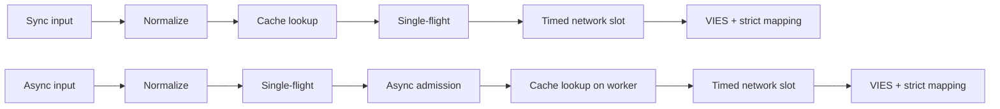
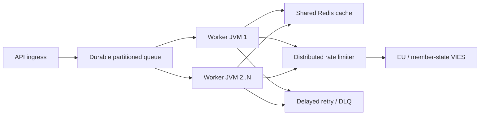

# Technikai dokumentáció / Technical documentation

## Cél és hatókör / Purpose and scope

A `vies-client` egy Java 21, nulla futásidejű függőségű klienskönyvtár az EU VIES
REST szolgáltatásához. Egy nagy rendszer feldolgozó komponense lehet; nem helyettesít
tartós üzenetsort, disztribútált rate limitert vagy megosztott cache-t.

`vies-client` is a zero-runtime-dependency Java 21 client for the EU VIES REST
service. It can be a processing component in a large system; it does not replace a
durable queue, distributed rate limiter, or shared cache.

## Modul és csomagok / Module and packages

```text
module vies.client
├── exports vies.client
│   ├── ViesClient          public synchronous/asynchronous facade
│   ├── ViesResponse        sealed result hierarchy
│   ├── ViesError           stable bilingual error catalog
│   ├── VatFormat           offline normalization/format validation
│   ├── ViesRequester       requester VAT value object
│   ├── ViesAvailability    service/member-state health snapshot
│   ├── ViesCache           external cache extension point
│   └── ViesException       availability diagnostic exception
└── vies.client.internal
    ├── MiniJson            bounded-purpose JSON parser
    └── TtlCache            default concurrent in-memory TTL cache
```

A belső csomag nincs exportálva; kompatibilitási szerződés csak a
`vies.client` publikus csomagra vonatkozik.

The internal package is not exported. Compatibility guarantees apply only to the
public `vies.client` package.

## Eredménymodell / Result model

| Típus / Type | Jelentés / Meaning | Retry | Cache |
|---|---|---:|---:|
| `Valid` | A VIES érvényesként igazolta / VIES confirmed valid | nem/no | igen/yes |
| `Invalid` | A VIES nem igazolta érvényesként / VIES did not confirm valid | nem/no | nem/no |
| `Unavailable` | Nem született érvényességi döntés / No validity decision | kódfüggő/by code | nem/no |
| `MalformedInput` | Hibás bemenet / Invalid input | nem/no | nem/no |

Kritikus invariáns: `Unavailable` soha nem alakítható `Invalid` eredménnyé.
Critical invariant: `Unavailable` must never be converted to `Invalid`.

Minden technikai/bemeneti problémához elérhető:

```java
response.error().ifPresent(error -> {
    error.code();       // stable machine code
    error.messageHu();  // Hungarian user message
    error.messageEn();  // English user message
    error.retryable();  // external delayed-retry recommendation
});
```

## Kérés életciklusa / Request lifecycle



1. A `VatFormat` eltávolítja az engedélyezett elválasztókat, nagybetűsít és
   ország-specifikus formátumot ellenőriz.
2. A sync út a hívó szálán olvas cache-t; az async út csak a bounded workerben.
3. A cache csak `Valid` eredményt tárol.
4. Az `inFlight` tábla egy JVM-en belül összevonja az azonos adószám+lekérdező kéréseket.
5. Egyedi async vezető kérés csak szabad `asyncSlots` permit mellett indul; cache hit is
   rövid ideig használja ezt a helyet.
6. A valódi HTTP-hívás időkorlátosan vár `requestSlots` permitre.
7. A válasz csak explicit boolean érvényesség és értelmezhető audit timestamp
   mellett válhat `Valid` vagy `Invalid` eredménnyé.

In English: sync reads cache on the caller thread; async establishes single-flight
and bounded admission first, then reads cache on its worker. Both use bounded network
admission and strict response mapping.

## Többszálúság / Concurrency model

- A publikus klienspéldány szálbiztos és megosztandó.
- The public client instance is thread-safe and should be shared.
- Az alap async executor virtual-thread-per-task executor.
- The default async executor creates one virtual thread per accepted task.
- `maxPendingSyncRequests` azonnal korlátozza az egyidejű sync hívókat.
- `maxPendingSyncRequests` immediately bounds concurrent synchronous callers.
- `maxPendingAsyncRequests` az egyedi async leadereket számolja, cache hit esetén is.
- `maxPendingAsyncRequests` counts unique async leaders, including cache hits.
- Egy hívó future-jének cancel-je nem törli a közös single-flight műveletet.
- Cancelling one caller's future cannot cancel the shared single-flight operation.
- `maxConcurrentRequests` példányonként korlátozza az aktív HTTP-kéréseket.
- `maxConcurrentRequests` limits active HTTP calls per client instance.
- `admissionTimeout` megakadályozza a végtelen semaphore-várakozást.
- `admissionTimeout` prevents unbounded semaphore waiting.

A single-flight, a semaphore és a memória-cache **nem disztribútált**. Több JVM
esetén közös Redis, globális limiter és tartós queue szükséges.

Single-flight, semaphores, and the in-memory cache are **not distributed**.
Multiple JVMs require shared Redis, a global limiter, and a durable queue.

## Retry szabály / Retry policy

A kliens 0–5 helyi retry-t enged. A késleltetés exponenciális és jittert tartalmaz:

```text
delay ~= retryDelay × 2^(attempt-1) + random(0 .. delay/2)
```

The client allows 0–5 local retries with exponential backoff and jitter.
Jitter prevents synchronized retry storms across worker threads.

Helyi retry csak átmeneti hálózati/VIES hibára történik. `CLIENT_OVERLOADED`,
`CLIENT_CLOSED`, inputhiba és blokkolás nem indul újra helyben. Nagyüzemben az
elsődleges retry mechanizmus tartós queue + késleltetés + maximális attempts + DLQ.

At scale, use durable delayed retries with a maximum attempt count and dead-letter
queue. Local retries are intentionally small.

## Cache szemantika / Cache semantics

- Alap cache: konkurens memória TTL, 10 000 elem, 24 óra.
- Default cache: concurrent in-memory TTL, 10,000 entries, 24 hours.
- Csak `Valid` kerül bele; `Invalid` és hibák nem.
- Only `Valid` is cached; `Invalid` and failures are not.
- A külső kulcs `vies:v1:` prefixű SHA-256 lenyomat, ezért Redis kulcslistában
  nem olvasható a cél- vagy lekérdezői adószám; a lenyomat mindkettőt köti.
- The external key is a `vies:v1:` SHA-256 digest that binds both target and
  requester without exposing either VAT number in Redis key listings.
- A cache hit `fromCache=true` jelölést kap.
- Cache hits are marked with `fromCache=true`.
- A cache-beli `requestDate`/`consultationNumber` az eredeti konzultáció adata.
- Cached `requestDate`/`consultationNumber` belongs to the original consultation.

Megosztott cache olvasási hibája `CACHE_ERROR`, nem automatikus VIES fallback.
Ez szándékos anti-stampede viselkedés. Sikeres VIES-válasz utáni cache-írási hiba
nem törli a hiteles `Valid` eredményt.

A shared-cache read failure returns `CACHE_ERROR` instead of falling through to a
VIES stampede. A cache-write failure after a confirmed response does not erase the
authoritative `Valid` result.

## Válaszvalidálás / Response validation

A külső JSON nem megbízható adat. `Valid`/`Invalid` csak akkor jöhet létre, ha:

- a gyökér JSON objektum;
- `isValid` vagy `valid` valódi boolean;
- `requestDate` ISO-8601 `Instant` vagy offset datetime;
- nincs döntést felülíró `userError`.
- az esetleges `countryCode`/`vatNumber` echo mező a kért adószámmal egyezik;
- a két validity mező és a `userError` nem mond ellent egymásnak;
- a UTF-8, a válasz (64 KiB), JSON-mélység/elemszám és szövegmezők korlátosak.

External JSON is untrusted. A missing/wrong boolean or missing/invalid timestamp
returns `MALFORMED_RESPONSE`, never a fabricated `Invalid` or local timestamp.
Conflicting decisions, duplicate JSON keys, mismatched VAT echoes, invalid UTF-8,
or any response/depth/value/field limit violation also return `MALFORMED_RESPONSE`.

## Leállítás / Shutdown

`close()` idempotens, új kérést már nem fogad, megszakítja a belső async műveleteket,
nem vár önmagára callbackből, és bezárja a HTTP klienst. Saját, kívülről átadott
executort nem zár be; annak életciklusáért a hívó felel.

`close()` is idempotent, rejects new work, cancels internal async operations without
self-waiting, and closes the HTTP client. A caller-provided executor is not closed.

A leállítás a korlátos számú belső leader future-t külön virtuális termináló szálakon
zárja le, ezért felhasználói callback nem tarthatja fogva a lifecycle lockot, és sok
nyitott művelet sem foglal műveletenként natív platformszálat. A `close()` után
indított új sync vagy async hívás szinkron `IllegalStateException`-t dob.

Shutdown terminalizes the bounded internal leader futures on separate virtual threads,
so user callbacks cannot retain the lifecycle lock and many open operations cannot
allocate one native platform thread each. New sync or async calls made after `close()`
throw `IllegalStateException` synchronously.

## Nagyléptékű topológia / Large-scale topology



Az upstream kapacitás a kemény határ. Több worker nem jogosít több VIES-forgalomra;
a lokális `32` concurrency érték nem EU-ajánlás. A globális limitet mért 429 és
`MAX_CONCURRENT` hibák, p95/p99 latency és szolgáltatói viselkedés alapján hangold.

Upstream capacity is the hard boundary. More workers do not imply more permitted
VIES traffic. Tune the global rate from observed throttling and latency.

## Megfigyelhetőség / Observability

Éles környezetben legalább ezeket mérd / Measure at minimum:

- response count by result type and `errorCode`;
- p50/p95/p99 total and upstream latency;
- cache hit ratio and `CACHE_ERROR` count;
- local active/pending count and `CLIENT_OVERLOADED` count;
- retry attempts and final outcomes;
- durable queue depth, age, delayed retry, and DLQ count;
- per-country VIES availability/error rate;
- JVM heap, GC pauses, virtual-thread count, CPU, sockets.

## Teljesítményadatok / Performance notes

A repositoryban mért lokális számok fejlesztői gépen, loopback mock szerverrel
készülnek; nem SLA és nem VIES throughput ígéret. A valódi teljesítményt a hálózat,
TLS, Redis, globális limiter és a tagállami backend határozza meg.

Repository-local benchmarks use a loopback mock server on a developer machine.
They are not an SLA or a VIES-throughput promise.

2026-07-17-i ellenőrző mérés, JDK 21, három futás mediánja / Verification run,
JDK 21, median of three runs:

| Helyi művelet / Local operation | Medián / Median |
|---|---:|
| Cache hit teljes `check()` útvonallal | 8.91 M művelet/s |
| Hibás formátum helyi elutasítása | 9.02 M művelet/s |
| Szekvenciális loopback HTTP | 4,044 kérés/s |
| 5,000 különböző async loopback kérés, concurrency 256 | 21,640 kérés/s |
| 10,000 azonos kulcsú hívó befejezése | 1.40 M hívó/s, **1 HTTP-kérés** |

Ez mikromérés, nem JMH és nem produkciós load teszt. A single-flight sor mutatja a
legfontosabb skálázási tulajdonságot: azonos kulcsnál a hívók száma nem válik
azonos számú upstream kéréssé.

This is a micro measurement, not JMH or a production load test. The single-flight
row demonstrates the key scaling property: same-key callers do not become the
same number of upstream requests.

## Biztonság / Security

- Csak HTTPS hivatalos base URL-t használj élesben.
- Use the official HTTPS base URL in production.
- Ne logolj szükségtelenül teljes adószámot, nevet vagy címet.
- Avoid unnecessary logging of VAT numbers, names, and addresses.
- A `baseUrl` felülírás teszt/mock célú; ne legyen felhasználói bemenet.
- `baseUrl` override is for controlled test/mock configuration, not user input.
- A kliens nem követ HTTP-átirányítást; sima HTTP csak pontos loopback címen engedélyezett.
- Redirects are never followed; plain HTTP is accepted only for exact loopback tests.
- A külső cache-érték adószám- és mezőlimit-ellenőrzést kap; eltérés `CACHE_ERROR`.
- External cache values are VAT-bound and field-bounded; violations return `CACHE_ERROR`.
- A gépi hibakódot logold, felhasználónak `messageHu`/`messageEn` menjen.
- Log stable error codes; return localized messages to users.
