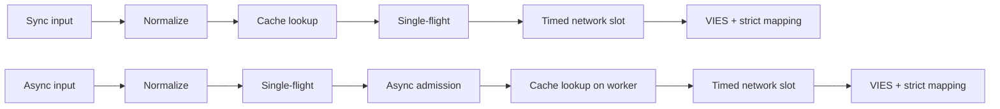
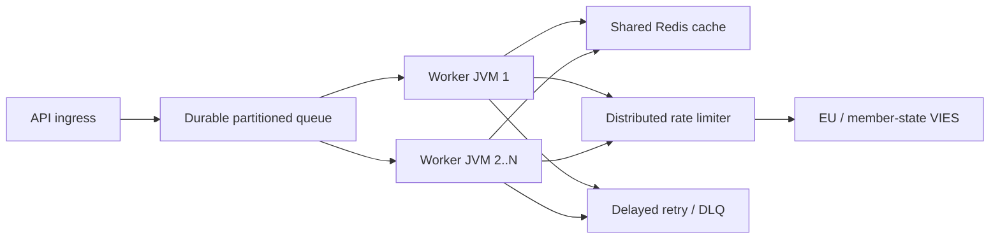

# Dansk (da) — TECHNICAL

> [Alle sprog](../../LANGUAGES.md) · Informativ oversættelse. Ved afvigelser er den kanoniske engelske tekniske eller juridiske kilde gældende. Kun `LICENSE` og `NOTICE` i roden er juridisk autoritative; oversættelsen erstatter dem ikke.

## Formål og omfang

`vies-client`er et Java 21-klientbibliotek med nul runtime-afhængigheder fra EU VIES
for din REST-service. Det kan være en behandlingskomponent i et stort system; erstatter ikke
vedvarende beskedkø, distribueret hastighedsbegrænser eller delt cache.

`vies-client`er en nul-runtime-afhængig Java 21-klient til EU VIES REST
service. Det kan være en behandlingskomponent i et stort system; den erstatter ikke en
holdbar kø, distribueret hastighedsbegrænser eller delt cache.

## Modul og pakker / Modul og pakker

```text
module vies.client
├── exports vies.client
│   ├── ViesClient          public synchronous/asynchronous facade
│   ├── ViesResponse        sealed result hierarchy
│   ├── ViesError           stable bilingual error catalog
│   ├── VatFormat           offline normalization/format validation
│   ├── ViesRequester       requester VAT value object
│   ├── ViesAvailability    service/member-state health snapshot
│   ├── ViesCache           external cache extension point
│   └── ViesException       availability diagnostic exception
└── vies.client.internal
    ├── MiniJson            bounded-purpose JSON parser
    └── TtlCache            default concurrent in-memory TTL cache
```

Den indre pakke eksporteres ikke; kun kompatibilitetsaftale a
Gælder offentlig pakke`vies.client`.

Den interne pakke eksporteres ikke. Kompatibilitetsgarantier gælder kun for
offentlig`vies.client`-pakke.

## Resultatmodel

| Skriv            | Betydning                                                           |  Prøv igen | Cache |
| ---------------- | ------------------------------------------------------------------- | ---------: | ----: |
| `Valid`          | VIES bekræftet som gyldig / VIES bekræftet gyldig                   |        nej | ja/ja |
| `Invalid`        | VIES bekræftede det ikke som gyldigt / VIES bekræftede ikke gyldigt |        nej |   nej |
| `Unavailable`    | Ingen gyldighedsbeslutning / Ingen gyldighedsbeslutning             | efter kode |   nej |
| `MalformedInput` | Ugyldigt input                                                      |        nej |   nej |

Kritisk invariant:`Unavailable`kan aldrig konverteres til`Invalid`.
Kritisk invariant:`Unavailable`må aldrig konverteres til`Invalid`.

Tilgængelig til alle tekniske/input problemer:

```java
response.error().ifPresent(error -> {
    error.code();       // stable machine code
    error.messageHu();  // Hungarian user message
    error.messageEn();  // English user message
    error.retryable();  // external delayed-retry recommendation
});
```

## Anmod om livscyklus / Anmod om livscyklus



1.`VatFormat`fjerner tilladte separatorer, bruger store bogstaver og
kontroller for landespecifikt format. 2. Synkroniseringsstien læser cache på tråden af ​​den, der ringer; den asynkrone måde er kun i bounded worker. 3. Cachen gemmer kun resultater`Valid`. 4.`inFlight`-tabellen fusionerer anmodninger med den samme skattekode + forespørgsel i en JVM. 5. En unik async-ledende anmodning startes kun med en gratis`asyncSlots`-tilladelse; også cache hit
bruge denne placering i en kort periode. 6. Det rigtige HTTP-kald venter på en`requestSlots`-tilladelse med en tidsbegrænsning. 7. Svaret er kun eksplicit boolesk validitet og fortolkbart revisionstidsstempel
kan resultere i`Valid`eller`Invalid`.

På engelsk: sync læser cache på opkaldstråden; async etablerer enkeltflyvning
og afgrænset indlæggelse først, læser derefter cache på sin arbejder. Begge bruger afgrænset netværk
optagelse og stram responskortlægning.

## Multithreading / Concurrency model

- Den offentlige klientinstans er sikker og skal deles.
- Den offentlige klientinstans er trådsikker og bør deles.
- Az alap async executor virtuel-thread-per-task executor.
- Standard async executor opretter én virtuel tråd pr. accepteret opgave.
- `maxPendingSyncRequests`begrænser øjeblikkeligt samtidige synkroniseringsopkald.
- `maxPendingSyncRequests`afgrænser øjeblikkeligt samtidige synkrone opkald.
- `maxPendingAsyncRequests`tæller unikke async-ledere, også i tilfælde af et cache-hit.
- `maxPendingAsyncRequests`tæller unikke async-ledere, inklusive cache-hits.
- Annullering af en opkalds fremtid annullerer ikke den fælles enkeltflyvning.
- Annullering af en opkalds fremtid kan ikke annullere den delte enkeltflyvning.
- `maxConcurrentRequests`begrænser aktive HTTP-anmodninger pr. instans.
- `maxConcurrentRequests`begrænser aktive HTTP-kald pr. klientforekomst.
- `admissionTimeout`forhindrer uendelig semafor-venting.
- `admissionTimeout`forhindrer ubegrænset semafor-venting.

Enkeltflyvning, semafor og memory-cache er **ikke distribueret**. Flere JVM'er
fælles Redis, en global limiter og en vedvarende kø er påkrævet.

Enkeltflyvning, semaforer og cachen i hukommelsen er **ikke distribueret**.
Flere JVM'er kræver delte Redis, en global limiter og en holdbar kø.

## Prøv igen regel / Prøv igen politik

Klienten tillader 0-5 lokale genforsøg. Forsinkelsen er eksponentiel og inkluderer jitter:

```text
delay ~= retryDelay × 2^(attempt-1) + random(0 .. delay/2)
```

Klienten tillader 0-5 lokale genforsøg med eksponentiel backoff og jitter.
Jitter forhindrer synkroniseret genforsøg, der stormer på tværs af arbejdertråde.

Lokalt genforsøg udføres kun for en midlertidig netværks-/VIES-fejl.`CLIENT_OVERLOADED`,
`CLIENT_CLOSED`, inputfejl og blokering genstarter ikke lokalt. Det er i stor skala
primær genforsøgsmekanisme vedvarende kø + forsinkelse + maksimale forsøg + DLQ.

I skala, brug holdbare forsinkede genforsøg med maksimalt antal forsøg og dødt bogstav
kø. Lokale genforsøg er bevidst små.

## Cache semantik / Cache semantik

- Grundlæggende cache: samtidig hukommelse TTL, 10.000 elementer, 24 timer.
- Standard cache: samtidig TTL i hukommelsen, 10.000 poster, 24 timer.
- Kun`Valid`er inkluderet;`Invalid`og fejl nr.
- Kun`Valid`er cachelagret;`Invalid`og fejl er ikke.
- Nøglen indeholder også afgiftsnummer og afgiftsnummer på spørger.
- Nøglen omfatter både målmoms og rekvirentmoms.
- Cachehittet er mærket`fromCache=true`.
- Cache-hits er markeret med`fromCache=true`.
- `requestDate`/`consultationNumber`i cachen er dataene fra den oprindelige konsultation.
- Cached`requestDate`/`consultationNumber`hører til den oprindelige konsultation.

Delt cache-læsefejl`CACHE_ERROR`, ikke-automatisk VIES-faldback.
Dette er bevidst anti-stampede adfærd. Cache skrivefejl efter vellykket VIES-svar
det sletter ikke det autentiske resultat`Valid`.

En læsefejl i delt cache returnerer`CACHE_ERROR`i stedet for at falde igennem til en
VIES stampede. En cache-skrivefejl efter et bekræftet svar sletter ikke
autoritativt`Valid`resultat.

## Svarvalidering / Svarvalidering

Ekstern JSON er ikke pålidelige data.`Valid`/`Invalid`kan kun oprettes, hvis:

- root JSON-objektet;
- `isValid`eller`valid`ægte boolean;
- `requestDate`ISO-8601`Instant`eller offset datetime;
- ingen tilsidesættende beslutning`userError`.

Ekstern JSON er ikke tillid til. Et manglende/forkert boolesk eller manglende/ugyldigt tidsstempel
returnerer`MALFORMED_RESPONSE`, aldrig et fabrikeret`Invalid`eller lokalt tidsstempel.

## Stop/Sluk

`close()`er idempotent, accepterer ikke længere nye anmodninger, afbryder interne async-operationer,
den venter ikke på sig selv fra tilbagekaldet og lukker HTTP-klienten. Eget, afleveret udefra
lukker ikke bobestyrer; den, der ringer, er ansvarlig for sin livscyklus.

`close()`er idempotent, afviser nyt arbejde, annullerer interne asynkroniseringsoperationer uden
selvafventende og lukker HTTP-klienten. En opkalds-leveret eksekutør er ikke lukket.

Stop det begrænsede antal interne lederfutures på separate virtuelle terminaltråde
lukke, så brugertilbagekald ikke kan holde livscykluslås, og mange
en åben operation optager heller ikke en indbygget platformstråd pr. operation. Efter`close()`
lanceret nye synkronisering eller async opkald kaster synkron`IllegalStateException`.

Shutdown terminaliserer de afgrænsede interne lederfutures på separate virtuelle tråde,
så brugertilbagekald kan ikke bevare livscykluslåsen, og mange åbne operationer kan ikke
tildel én indbygget platformstråd hver. Nye synkroniserings- eller asynkroniseringsopkald foretaget efter`close()`
kaste`IllegalStateException`synkront.

## Storskala topologi / Storskala topologi



Opstrøms kapacitet er den hårde grænse. Flere arbejdere giver dig ikke ret til mere VIES-trafik;
den lokale`32`samtidighedsværdi er ikke en EU-anbefaling. Den globale grænse målte 429 og
Tunes baseret på`MAX_CONCURRENT`-fejl, p95/p99-latens og transportøradfærd.

Opstrøms kapacitet er den hårde grænse. Flere arbejdere betyder ikke flere tilladte
VIES trafik. Juster den globale hastighed fra observeret drosling og latens.

## Observerbarhed / Observerbarhed

I et levende miljø, mål mindst disse / Mål mindst:

- antal svar efter resultattype og`errorCode`;
- p50/p95/p99 total og opstrøms latenstid;
- cache hit ratio og`CACHE_ERROR`tæller;
- lokal aktiv/afventende tælling og`CLIENT_OVERLOADED`tælling;
- Forsøg igen og endelige resultater;
- holdbar kødybde, alder, forsinket genforsøg og DLQ-antal;
- VIES tilgængelighed/fejlrate pr. land;
- JVM-heap, GC-pauser, virtuel trådtælling, CPU, sockets.

## Performance data / Performance notes

Lokale tal målt i depotet på en udviklingsmaskine med en loopback mock-server
er ved at blive forberedt; ingen SLA og intet VIES-gennemløbsløfte. Netværkets reelle ydeevne,
Det bestemmes af TLS, Redis, global limiter og medlemsstatens backend.

Repository-lokale benchmarks bruger en loopback mock-server på en udviklermaskine.
De er ikke en SLA eller et løfte om VIES-gennemstrømning.

Verifikationsmåling af 2026-07-17, JDK 21, median af tre kørsler / Verifikationskørsel,
JDK 21, median af tre kørsler:

| Lokal drift / Lokal drift                                           |                       Median / Median |
| ------------------------------------------------------------------- | ------------------------------------: |
| Cache ramt med fuld sti`check()`                                    |                  8,91 M operationer/s |
| Lokal afvisning af dårligt format                                   |                  9,02 M operationer/s |
| Sekventiel loopback HTTP                                            |                   4.044 anmodninger/s |
| 5.000 forskellige anmodninger om asynkron loopback, samtidighed 256 |                  21.640 anmodninger/s |
| Gennemfør 10.000 opkald med den samme nøgle                         | 1,40 M opkald/s, **1 HTTP-anmodning** |

Dette er en mikromåling, ikke en JMH og ikke en produktionsbelastningstest. Enkeltflyvningslinjen viser
vigtigste skaleringsfunktion: antallet af opkald ændres ikke med den samme tast
ind i det samme antal upstream-anmodninger.

Dette er en mikromåling, ikke JMH eller en produktionsbelastningstest. Enkeltflyvningen
række demonstrerer egenskaben for nøgleskalering: opkaldere med samme tast bliver ikke til
samme antal upstream-anmodninger.

## Sikkerhed / Sikkerhed

- Brug kun HTTPS officielle basis-URL live.
- Brug den officielle HTTPS-base-URL i produktionen.
- Log ikke på dit fulde skattenummer, navn eller adresse unødigt.
- Undgå unødvendig logning af momsnumre, navne og adresser.
- `baseUrl`-tilsidesættelsen er til test-/mock-formål; ingen brugerinput.
- `baseUrl`-tilsidesættelse er til kontrolleret test/mock-konfiguration, ikke brugerinput.
- Log maskinens fejlkode, gå til bruger`messageHu`/`messageEn`.
- Log stabile fejlkoder; returnere lokaliserede beskeder til brugerne.
