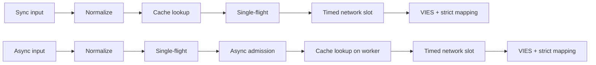
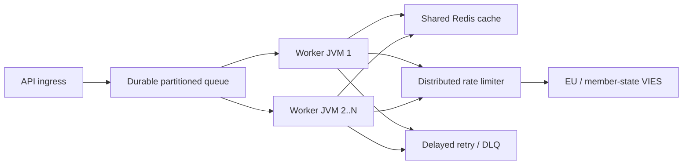

# English (en) — Technical documentation

> [Language selector](../../LANGUAGES.md) · This localization is provided for accessibility. If it differs from the canonical English technical or legal source, the English source governs. The root `LICENSE` and `NOTICE` remain legally authoritative and are not replaced by translations.

## Purpose and scope

`vies-client` is a Java 21 client library with zero runtime dependencies from EU VIES
for your REST service. It can be a processing component of a large system; does not replace
persistent message queue, distributed rate limiter or shared cache.
`vies-client` is a zero-runtime-dependency Java 21 client for the EU VIES REST
service. It can be a processing component in a large system; it does not replace a
durable queue, distributed rate limiter, or shared cache.

## Module and packages

```text
module vies.client
├── exports vies.client
│   ├── ViesClient          public synchronous/asynchronous facade
│   ├── ViesResponse        sealed result hierarchy
│   ├── ViesError           stable bilingual error catalog
│   ├── VatFormat           offline normalization/format validation
│   ├── ViesRequester       requester VAT value object
│   ├── ViesAvailability    service/member-state health snapshot
│   ├── ViesCache           external cache extension point
│   └── ViesException       availability diagnostic exception
└── vies.client.internal
    ├── MiniJson            bounded-purpose JSON parser
    └── TtlCache            default concurrent in-memory TTL cache
```

The inner package is not exported; compatibility agreement only a
Applies to public package `vies.client`.
The internal package is not exported. Compatibility guarantees apply only to the
public `vies.client` package.

## Result model

| Type             | Meaning                                                       |   Retry |   Cache |
| ---------------- | ------------------------------------------------------------- | ------: | ------: |
| `Valid`          | VIES confirmed as valid / VIES confirmed valid                |      no | yes/yes |
| `Invalid`        | VIES did not confirm it as valid / VIES did not confirm valid |      no |      no |
| `Unavailable`    | No validity decision / No validity decision                   | by code |      no |
| `MalformedInput` | Invalid input                                                 |      no |      no |

Critical invariant:`Unavailable` can never be converted to`Invalid`.
Critical invariant:`Unavailable` must never be converted to`Invalid`.
Available for all technical/input issues:

```java
response.error().ifPresent(error -> {
    error.code();       // stable machine code
    error.messageHu();  // Hungarian user message
    error.messageEn();  // English user message
    error.retryable();  // external delayed-retry recommendation
});
```

## Request lifecycle



1. `VatFormat` removes permitted separators, uppercases the input, and validates
   its country-specific shape.
2. The synchronous path reads the cache on the caller thread. The asynchronous
   path establishes bounded admission first and reads the cache on its worker.
3. Only authoritative `Valid` results are cached.
4. The JVM-local `inFlight` map coalesces identical VAT/requester requests.
5. A unique asynchronous leader starts only when an `asyncSlots` permit is
   available; a cache hit occupies that slot only briefly.
6. A real HTTP call waits for a `requestSlots` permit for at most the configured
   admission timeout.
7. A result becomes `Valid` or `Invalid` only when the response contains an
   explicit Boolean validity value and a valid audit timestamp.

## Concurrency model

- The public client instance is thread-safe and should be shared.
- The default async executor creates one virtual thread per accepted task.
- `maxPendingSyncRequests` immediately bounds concurrent synchronous callers.
- `maxPendingAsyncRequests` counts unique async leaders, including cache hits.
- Canceling one caller's future cannot cancel the shared single-flight operation.
- `maxConcurrentRequests` limits active HTTP calls per client instance.
- `admissionTimeout` prevents unbounded semaphore waiting.

Single-flight, semaphores, and the in-memory cache are **not distributed**.
Multiple JVMs require shared Redis, a global limiter, and a durable queue.

## Retry policy

The client allows zero to five local retries. Delay grows exponentially and
includes jitter:

```text
delay ~= retryDelay × 2^(attempt-1) + random(0 .. delay/2)
```

Jitter prevents synchronized retry storms across workers. Local retries apply only
to eligible transient network or VIES failures. `CLIENT_OVERLOADED`,
`CLIENT_CLOSED`, input errors, and blocked requests are not restarted locally. At
scale, use durable delayed retries with a maximum attempt count and a dead-letter
queue; keep the client's local retry count small.

## Cache semantics

- Default cache: concurrent in-memory TTL, 10,000 entries, 24 hours.
- Only `Valid` is cached; `Invalid` and failures are not.
- The key includes both target VAT and requester VAT.
- Cache hits are marked with `fromCache=true`.
- Cached `requestDate`/`consultationNumber` belongs to the original consultation.

A shared-cache read failure returns `CACHE_ERROR` instead of falling through to a
VIES request stampede. A cache-write failure after a confirmed response does not
erase the authoritative `Valid` result.

## Response validation

External JSON is untrusted. `Valid` or `Invalid` can be created only when:

- the root value is a JSON object;
- `isValid` or `valid` is a real Boolean;
- `requestDate` is an ISO-8601 `Instant` or offset date-time; and
- no `userError` overrides the validity decision.

A missing or malformed validity value or timestamp returns
`MALFORMED_RESPONSE`, never a fabricated `Invalid` result or local timestamp.

## Shutdown

`close()` is idempotent, rejects new work, cancels internal async operations without
self-waiting, and closes the HTTP client. A caller-provided executor is not closed.
Shutdown terminalizes the bounded internal leader futures away from the lifecycle
thread, so user callbacks cannot retain its lock. New synchronous or asynchronous
calls made after `close()` throw `IllegalStateException` synchronously.

## Large-scale topology



Upstream capacity is the hard limit. More workers do not entitle you to more VIES traffic;
the local `32` concurrency value is not an EU recommendation. The global limit measured 429 and
Tunes based on `MAX_CONCURRENT` errors, p95/p99 latency and carrier behavior.
Upstream capacity is the hard boundary. More workers do not imply more permitted
VIES traffic. Tune the global rate from observed throttling and latency.

## Observability

In a live environment, measure at least these / Measure at minimum:

- response count by result type and `errorCode`;
- p50/p95/p99 total and upstream latency;
- cache hit ratio and `CACHE_ERROR` count;
- local active/pending count and `CLIENT_OVERLOADED` count;
- retry attempts and final outcomes;
- durable queue depth, age, delayed retry, and DLQ count;
- per-country VIES availability/error rate;
- JVM heap, GC pauses, virtual-thread count, CPU, sockets.

## Performance notes

Local numbers measured in the repository on a development machine with a loopback mock server
are being prepared; no SLA and no VIES throughput promise. The real performance of the network,
It is determined by TLS, Redis, global limiter and the member state backend.
Repository-local benchmarks use a loopback mock server on a developer machine.
They are not an SLA or a VIES-throughput promise.
Verification measurement of 2026-07-17, JDK 21, median of three runs / Verification run,
JDK 21, median of three runs:
| Local operation / Local operation | Median / Median |
|---|---:|
| Cache hit with full path `check()`| 8.91 M operations/s |
| Local rejection of bad format | 9.02 M operations/s |
| Sequential loopback HTTP | 4.044 requests/s |
| 5,000 different async loopback requests, concurrency 256 | 21,640 requests/s |
| Complete 10,000 callers with the same key | 1.40 M callers/s, **1 HTTP request** |
This is a micro measurement, not a JMH and not a production load test. The single-flight line shows the
most important scaling feature: the number of callers does not change with the same key
into the same number of upstream requests.
This is a micro measurement, not JMH or a production load test. The single-flight
row demonstrates the key scaling property: same-key callers do not become the
same number of upstream requests.

## Security

- Only use HTTPS official base URL live.
- Use the official HTTPS base URL in production.
- Do not log in your full tax number, name or address unnecessarily.
- Avoid unnecessary logging of VAT numbers, names, and addresses.
- The `baseUrl` override is for test/mock purposes; no user input.
- `baseUrl` override is for controlled test/mock configuration, not user input.
- Log the machine error code, go to user `messageHu`/`messageEn`.
- Log stable error codes; return localized messages to users.
