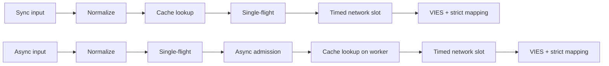
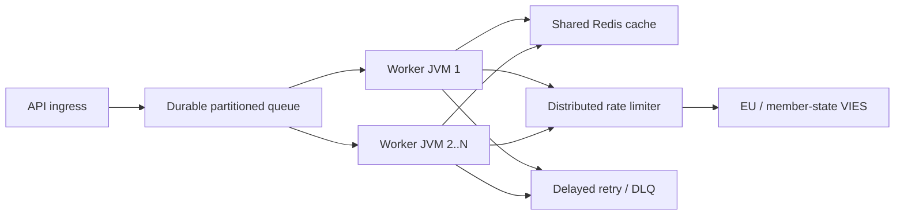

# Eesti (et) — Technical documentation

> [Keelevalik](../../LANGUAGES.md) · See lokaliseering parandab ligipääsetavust. Lahknevuse korral kehtib kanooniline ingliskeelne tehniline või õiguslik allikas. Juure `LICENSE` ja`NOTICE` jäävad õiguslikult määravaks.

## Eesmärk ja ulatus

`vies-client` on Java 21 klienditeek, millel ei ole EU VIES-i käitusaegset sõltuvust
teie REST teenuse eest. See võib olla suure süsteemi töötlemiskomponent; ei asenda
püsiv sõnumijärjekord, hajutatud kiiruse piiraja või jagatud vahemälu.
`vies-client` on null-tööajast sõltuv Java 21 klient EU VIES REST jaoks
teenus. See võib olla suure süsteemi töötlemiskomponent; see ei asenda a
vastupidav järjekord, hajutatud kiiruse piiraja või jagatud vahemälu.

## Moodul ja paketid / Moodul ja paketid

```text
module vies.client
├── exports vies.client
│   ├── ViesClient          public synchronous/asynchronous facade
│   ├── ViesResponse        sealed result hierarchy
│   ├── ViesError           stable bilingual error catalog
│   ├── VatFormat           offline normalization/format validation
│   ├── ViesRequester       requester VAT value object
│   ├── ViesAvailability    service/member-state health snapshot
│   ├── ViesCache           external cache extension point
│   └── ViesException       availability diagnostic exception
└── vies.client.internal
    ├── MiniJson            bounded-purpose JSON parser
    └── TtlCache            default concurrent in-memory TTL cache
```

Sisepakendit ei ekspordita; ainult ühilduvusleping a
Kehtib avalikule pakendile `vies.client`.
Sisepaketti ei ekspordita. Ühilduvusgarantiid kehtivad ainult
avalik `vies.client` pakett.

## Tulemusmudel

| Tüüp             | Tähendus                                                        | Proovi uuesti | Vahemälu |
| ---------------- | --------------------------------------------------------------- | ------------: | -------: |
| `Valid`          | VIES kinnitatud kehtivaks / VIES kinnitatud kehtiv              |            ei |  jah/jah |
| `Invalid`        | VIES ei kinnitanud seda kehtivaks / VIES ei kinnitanud kehtivat |            ei |       ei |
| `Unavailable`    | Kehtivusotsus puudub / Kehtivusotsus puudub                     |   koodi järgi |       ei |
| `MalformedInput` | Vigane sisend                                                   |            ei |       ei |

Kriitiline invariant:`Unavailable`-d ei saa kunagi teisendada`Invalid`-ks.
Kriitiline invariant:`Unavailable`-d ei tohi kunagi teisendada`Invalid`-ks.
Saadaval kõigi tehniliste/sisestusprobleemide korral:

```java
response.error().ifPresent(error -> {
    error.code();       // stable machine code
    error.messageHu();  // Hungarian user message
    error.messageEn();  // English user message
    error.retryable();  // external delayed-retry recommendation
});
```

## Taotluse elutsükkel / Taotle elutsükkel



1.`VatFormat` eemaldab lubatud eraldajad, kasutab suurtähti ja
kontrollib riigipõhist vormingut. 2. Sünkroonimistee loeb helistaja lõime vahemälu; asünkroonimisviis on ainult piiratud töötajas. 3. Vahemällu salvestatakse ainult tulemused `Valid`. 4. Tabel`inFlight`liidab JVM-is sama maksukoodiga päringud ja päringud. 5. Unikaalne asünkroniseerimistaotlus algab ainult tasuta`asyncSlots` loaga; ka vahemälu tabas
kasutage seda asukohta lühikest aega. 6. Tõeline HTTP-kõne ootab `requestSlots`-luba tähtajaga. 7. Vastus on ainult selgesõnaline tõeväärtuse kehtivus ja tõlgendatav auditi ajatempel
koos võib tulemuseks olla `Valid` või`Invalid`.
Inglise keeles: sync loeb helistaja lõime vahemälu; async loob ühe lennu
ja esmalt piiratud sissepääs, seejärel loeb oma töötaja vahemälu. Mõlemad kasutavad piiratud võrku
sissepääs ja range vastuse kaardistamine.

## Mitme lõimega / samaaegsusmudel

- Avalik kliendi eksemplar on turvaline ja seda tuleb jagada.
- Avalik kliendi eksemplar on lõimekindel ja seda tuleks jagada.
- Põhiline asünkroonimise täitur on virtuaalse lõime ülesande täitja.
- Vaikimisi asünkroonimistäitja loob ühe virtuaalse lõime iga aktsepteeritud ülesande kohta.
- `maxPendingSyncRequests` piirab koheselt samaaegseid sünkroonimishelistajaid.
- `maxPendingSyncRequests` piirab koheselt samaaegsed sünkroonsed helistajad.
- `maxPendingAsyncRequests` arvestab unikaalseid asünkroonimise juhte, ka vahemälu tabamuse korral.
- `maxPendingAsyncRequests` loeb unikaalseid asünkroonimise juhte, sealhulgas vahemälu tabamusi.
- Helistaja tuleviku tühistamine ei tühista ühist ühe lennu operatsiooni.
- Ühe helistaja tuleviku tühistamine ei saa tühistada jagatud ühe lennu toimingut.
- `maxConcurrentRequests` piirab aktiivseid HTTP-päringuid eksemplari kohta.
- `maxConcurrentRequests` piirab aktiivseid HTTP-kõnesid kliendi eksemplari kohta.
- `admissionTimeout` takistab lõputut semafori ootamist.
- `admissionTimeout` takistab piiramatut semafori ootamist.
  Ühe lennu, semafori ja mälu vahemälu **ei levita**. Mitu JVM-i
  Tavaline Redis, globaalne piiraja ja püsiv järjekord on vajalikud.
  Üks lend, semaforid ja mälusisene vahemälu on **ei levitata**.
  Mitu JVM-i nõuavad jagatud Redist, globaalset piirajat ja püsivat järjekorda.

## Uuesti proovimise reegel / Uuesti proovimise eeskiri

Klient lubab 0-5 kohalikku korduskatset. Viivitus on eksponentsiaalne ja sisaldab värinat:

```text
delay ~= retryDelay × 2^(attempt-1) + random(0 .. delay/2)
```

Klient lubab 0–5 kohalikku korduskatset eksponentsiaalse tagasilöögi ja värinaga.
Värin hoiab ära sünkroonitud korduskatsete tormid töötajate lõimede vahel.
Kohalik korduskatse tehakse ainult ajutise võrgu/VIES-tõrke korral.`CLIENT_OVERLOADED`,`CLIENT_CLOSED`, sisendviga ja blokeerimine ei taaskäivitu kohapeal. See on suures mahus
esmane korduskatse mehhanism püsiv järjekord + viivitus + maksimaalne katsete arv + DLQ.
Skaalal kasutage püsivaid viivitatud korduskatseid maksimaalse katsete arvu ja surnud tähega
järjekorda. Kohalikud korduskatsed on tahtlikult väikesed.

## Vahemälu semantika / vahemälu semantika

- Põhiline vahemälu: samaaegne mälu TTL, 10 000 elementi, 24 tundi.
- Vaikevahemälu: samaaegne mälusisene TTL, 10 000 kirjet, 24 tundi.
- Kaasas on ainult `Valid`;`Invalid` ja vead nr.
- Vahemällu salvestatakse ainult `Valid`;`Invalid` ja tõrkeid ei ole.
- Võtmes on ka maksunumber ja päringu esitaja maksunumber.
- Võti sisaldab nii siht- kui ka taotleja käibemaksu.
- Vahemälu tabamus on tähistatud `fromCache=true`.
- Vahemälu tabamused on tähistatud tähisega `fromCache=true`.
- `requestDate`/`consultationNumber` vahemälus on algse konsultatsiooni andmed.
- Vahemällu salvestatud `requestDate`/`consultationNumber` kuulub algsesse konsultatsiooni.
  Jagatud vahemälu lugemisviga `CACHE_ERROR`, mitteautomaatne VIES-i varuvaru.
  See on tahtlik rünnakuvastane käitumine. Vahemällu kirjutamise ebaõnnestumine pärast edukat VIES-vastust
  see ei kustuta autentset tulemust `Valid`.
  Jagatud vahemälu lugemise tõrge tagastab `CACHE_ERROR`, selle asemel et langeda väärtusele a
  VIES tõmblused. Vahemällu kirjutamise tõrge pärast kinnitatud vastust ei kustuta
  autoriteetne `Valid` tulemus.

## Vastuse kinnitamine / vastuse kinnitamine

Väline JSON ei ole usaldusväärsed andmed.`Valid`/`Invalid` saab luua ainult siis, kui:

- juur-JSON-objekt;
- `isValid` või`valid` tõeline tõeväärtus;
- `requestDate` ISO-8601`Instant` või kuupäeva-kellaaja nihutamine;
- ülekaaluka otsuse puudumine `userError`.
  Väline JSON on ebausaldusväärne. Puuduv/vale tõeväärtus või puuduv/kehtetu ajatempel
  tagastab `MALFORMED_RESPONSE`, mitte kunagi väljamõeldud`Invalid` või kohalikku ajatemplit.

## Peata / Seiska

`close()` on idempotentne, ei võta enam vastu uusi taotlusi, katkestab sisemised asünkroonimistoimingud,
see ei oota end tagasihelistamisest ja sulgeb HTTP kliendi. Oma, väljast üle antud
ei sulge testamenditäitjat; helistaja vastutab oma elutsükli eest.
`close()` on idempotentne, lükkab tagasi uue töö, tühistab sisemised asünkroonimistoimingud ilma
ise ootama ja sulgeb HTTP-kliendi. Helistaja poolt antud testamenditäitja ei ole suletud.
Piiratud arvu sisemiste liiderfutuuride peatamine eraldi deemoni terminali lõimedel
sulgege see, nii et kasutaja tagasihelistamine ei saa elutsükli lukku hoida. A
Uus sünkroonimis- või asünkroonimiskõne algas pärast seda, kui `close()` viskab sünkroonse `IllegalStateException`.
Shutdown lõpetab piiratud sisemise liidri futuurid elutsüklist eemale
lõime, nii et kasutajate tagasihelistamised ei saa oma lukku säilitada. Pärast seda tehtud uued sünkroonimis- või asünkroonimiskõned `close()` viska `IllegalStateException` sünkroonselt.

## Suuremahuline topoloogia / Suuremõõtmeline topoloogia



Ülesvoolu läbilaskevõime on range piir. Rohkem töötajaid ei anna teile õigust suuremale VIES-liiklusele;
kohalik `32` samaaegsusväärtus ei ole EL-i soovitus. Globaalne piirmäär mõõdeti 429 ja
Lood põhinevad `MAX_CONCURRENT` vigadel, p95/p99 latentsusajal ja kandja käitumisel.
Ülesvoolu läbilaskevõime on kõva piir. Rohkem töötajaid ei tähenda, et rohkem on lubatud
VIES liiklus. Reguleerige globaalset kiirust täheldatud drosseldamis- ja latentsusaja järgi.

## Vaadeldavus / vaadeldavus

Mõõtke elavas keskkonnas vähemalt neid / Mõõtke vähemalt:

- vastuste arv tulemuse tüübi ja `errorCode` järgi;
- p50/p95/p99 kogu- ja ülesvoolu latentsusaeg;
- vahemälu tabamuste suhe ja `CACHE_ERROR` arv;
- kohalik aktiivsete/ootel arv ja `CLIENT_OVERLOADED` arv;
- korduskatsed ja lõpptulemused;
- vastupidav järjekorra sügavus, vanus, viivitatud uuesti proovimine ja DLQ-de arv;
- VIES-i saadavus/veamäär riigiti;
- JVM-i hunnik, GC-pausid, virtuaalsete lõimede arv, protsessor, pistikupesad.

## Jõudlusandmed / Toimivusmärkmed

Hoidlas mõõdetud kohalikud numbrid tagasisilmusserveriga arendusmasinas
valmistatakse ette; puudub SLA ja VIES läbilaskevõime lubadus. Võrgu tegelik jõudlus,
Selle määravad TLS, Redis, globaalne piiraja ja liikmesriigi taustaprogramm.
Hoidla-kohalikud etalonid kasutavad arendaja masinas tagasisilmusserverit.
Need ei ole SLA ega VIES-i läbilaskevõime lubadus.
Kontrollmõõtmine 2026-07-17, JDK 21, kolme käitamise mediaan / kontrollkäik,
JDK 21, kolme jooksu mediaan:
| Kohalik käitamine / Kohalik käitamine | Mediaan / Mediaan |
|---|---:|
| Vahemälu tabas kogu teega `check()`| 8,91 miljonit operatsiooni/s |
| Halva vormingu kohalik tagasilükkamine | 9,02 miljonit operatsiooni/s |
| Järjestikune tagasisilmus HTTP | 4 044 taotlust/s |
| 5000 erinevat asünkroonimise tagasisilmuse taotlust, samaaegsus 256 | 21 640 taotlust/s |
| Lõpetage 10 000 helistaja sama klahviga | 1,40 miljonit helistajat/s, **1 HTTP päring** |
See on mikromõõtmine, mitte JMH ega tootmiskoormuse test. Ühe lennu joon näitab
kõige olulisem skaleerimisfunktsioon: helistajate arv ei muutu sama klahviga
samale arvule ülesvoolu päringutele.
See on mikromõõtmine, mitte JMH või tootmiskoormuse test. Ühekordne lend
rida näitab võtme skaleerimise omadust: sama klahviga helistajatest ei saa
sama palju ülesvoolu päringuid.

## Turvalisus / Turvalisus

- Kasutage reaalajas ainult HTTPS-i ametlikku baas-URL-i.
- Kasutage tootmises ametlikku HTTPS-i baas-URL-i.
- Ärge logige asjatult sisse oma täielikku maksunumbrit, nime ega aadressi.
- Vältige käibemaksukohustuslase numbrite, nimede ja aadresside asjatut logimist.
- `baseUrl` alistamine on testimise/näitamise eesmärgil; kasutaja sisestus puudub.
- `baseUrl` alistamine on mõeldud kontrollitud testimiseks/proovi konfigureerimiseks, mitte kasutaja sisendiks.
- Logige masina veakood sisse, minge kasutajale `messageHu`/`messageEn`.
- Logige stabiilsed veakoodid; tagastada kasutajatele lokaliseeritud sõnumeid.
