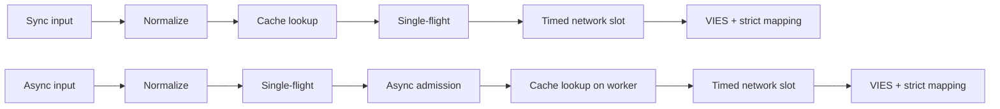
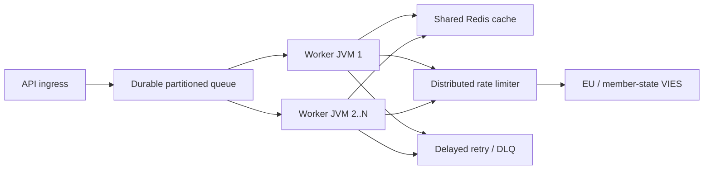

# Suomi (fi) — Technical documentation

> [Kielivalitsin](../../LANGUAGES.md) · Tämä lokalisointi parantaa saavutettavuutta. Jos se poikkeaa kanonisesta englanninkielisestä teknisestä tai oikeudellisesta lähteestä, englanninkielinen lähde määrää. Juuren `LICENSE` ja`NOTICE` ovat oikeudellisesti määrääviä.

## Tarkoitus ja laajuus

`vies-client` on Java 21 -asiakaskirjasto, jolla ei ole ajonaikaista riippuvuutta EU VIES:stä
REST-palveluasi varten. Se voi olla suuren järjestelmän käsittelykomponentti; ei korvaa
jatkuva viestijono, hajautettu nopeuden rajoitin tai jaettu välimuisti.
`vies-client` on nolla-ajonaikainen riippuvuus Java 21 -asiakasohjelma EU VIES RESTille
palvelua. Se voi olla käsittelykomponentti suuressa järjestelmässä; se ei korvaa a
kestävä jono, hajautettu nopeuden rajoitin tai jaettu välimuisti.

## Moduuli ja paketit / Moduuli ja paketit

```text
module vies.client
├── exports vies.client
│   ├── ViesClient          public synchronous/asynchronous facade
│   ├── ViesResponse        sealed result hierarchy
│   ├── ViesError           stable bilingual error catalog
│   ├── VatFormat           offline normalization/format validation
│   ├── ViesRequester       requester VAT value object
│   ├── ViesAvailability    service/member-state health snapshot
│   ├── ViesCache           external cache extension point
│   └── ViesException       availability diagnostic exception
└── vies.client.internal
    ├── MiniJson            bounded-purpose JSON parser
    └── TtlCache            default concurrent in-memory TTL cache
```

Sisäpakkausta ei viedä; vain yhteensopivuussopimus a
Koskee julkista pakettia `vies.client`.
Sisäistä pakettia ei viedä. Yhteensopivuustakuu koskee vain
julkinen `vies.client`-paketti.

## Tulosmalli

| Tyyppi           | Merkitys                                                                 | Yritä uudelleen |     Välimuisti |
| ---------------- | ------------------------------------------------------------------------ | --------------: | -------------: |
| `Valid`          | VIES vahvistettu voimassa / VIES vahvistettu voimassa                    |              ei | kyllä/kyllä ​​ |
| `Invalid`        | VIES ei vahvistanut sitä päteväksi / VIES ei vahvistanut voimassa olevaa |              ei |             ei |
| `Unavailable`    | Ei pätevyyspäätöstä / Ei voimassaolopäätöstä                             |        koodilla |             ei |
| `MalformedInput` | Virheellinen syöte                                                       |              ei |             ei |

Kriittinen invariantti:`Unavailable`:tä ei voi koskaan muuntaa`Invalid`:ksi.
Kriittinen invariantti:`Unavailable`:tä ei saa koskaan muuntaa`Invalid`:ksi.
Saatavilla kaikkiin teknisiin/syöttöongelmiin:

```java
response.error().ifPresent(error -> {
    error.code();       // stable machine code
    error.messageHu();  // Hungarian user message
    error.messageEn();  // English user message
    error.retryable();  // external delayed-retry recommendation
});
```

## Pyynnön elinkaari / Pyydä elinkaari



1.`VatFormat` poistaa sallitut erottimet, kirjoittaa isoilla kirjaimilla ja
tarkistaa maakohtaisen muodon. 2. Synkronointipolku lukee soittajan säikeen välimuistin; asynkroninen tapa on vain rajoitetussa työntekijässä. 3. Välimuisti tallentaa vain tulokset `Valid`. 4.`inFlight`-taulukko yhdistää pyynnöt, joilla on sama verokoodi + kysely JVM:ssä. 5. Ainutlaatuinen async-johtava pyyntö alkaa vain ilmaisella`asyncSlots`-luvalla; myös välimuisti osui
käytä tätä paikkaa lyhyen aikaa. 6. Todellinen HTTP-puhelu odottaa `requestSlots`-lupaa aikarajalla. 7. Vastaus on vain eksplisiittinen boolen kelpoisuus ja tulkittavissa oleva tarkastuksen aikaleima
kanssa voi johtaa `Valid` tai`Invalid`.
Englanniksi: sync lukee soittajan säikeen välimuistia; async muodostaa yhden lennon
ja ensin rajoitettu pääsy, sitten lukee työntekijänsä välimuistin. Molemmat käyttävät rajattua verkkoa
sisäänpääsy ja tiukka vastauskartoitus.

## Monisäikeinen / Samanaikaisuusmalli

- Julkinen asiakasinstanssi on suojattu ja se on jaettava.
- Julkinen asiakasinstanssi on säikeen turvallinen ja se tulisi jakaa.
- Perusasync-suoritin on virtuaalinen säie-per-tehtävä suorittaja.
- Oletusasync-suorittaja luo yhden virtuaalisen säikeen hyväksyttyä tehtävää kohti.
- `maxPendingSyncRequests` rajoittaa välittömästi samanaikaisia ​​synkronointipuheluita.
- `maxPendingSyncRequests` rajoittaa välittömästi samanaikaiset synkroniset soittajat.
- `maxPendingAsyncRequests` laskee ainutlaatuiset async-johtajat, myös välimuistin osuman tapauksessa.
- `maxPendingAsyncRequests` laskee ainutlaatuiset async-johtajat, mukaan lukien välimuistin osumat.
- Soittajan tulevaisuuden peruuttaminen ei peruuta yhteistä yhden lennon operaatiota.
- Yhden soittajan tulevaisuuden peruuttaminen ei voi peruuttaa jaettua yhden lennon toimintoa.
- `maxConcurrentRequests` rajoittaa aktiivisia HTTP-pyyntöjä esiintymää kohden.
- `maxConcurrentRequests` rajoittaa aktiivisia HTTP-kutsuja asiakasinstanssia kohti.
- `admissionTimeout` estää äärettömän semaforin odottamisen.
- `admissionTimeout` estää rajattoman semaforin odottamisen.
  Yksittäistä lentoa, semaforia ja muistivälimuistia **ei jaeta**. Useita JVM:itä
  common Redis, globaali rajoitin ja pysyvä jono vaaditaan.
  Yksittäinen lento, semaforit ja muistin välimuisti ovat **ei jaettu**.
  Useat JVM:t vaativat jaetun Rediksen, globaalin rajoittimen ja kestävän jonon.

## Yritä uudelleen sääntö / Yritä uudelleen -käytäntö

Asiakas sallii 0-5 paikallista uudelleenyritystä. Viive on eksponentiaalinen ja sisältää värinää:

```text
delay ~= retryDelay × 2^(attempt-1) + random(0 .. delay/2)
```

Asiakas sallii 0–5 paikallista uudelleenyritystä eksponentiaalisella perääntymisellä ja värinällä.
Jitter estää synkronoidut uudelleenyritysmyrskyt työntekijäsäikeissä.
Paikallinen uudelleenyritys suoritetaan vain tilapäisen verkko-/VIES-virheen vuoksi.`CLIENT_OVERLOADED`,`CLIENT_CLOSED`, syöttövirhe ja esto ei käynnisty uudelleen paikallisesti. Se on suuressa mittakaavassa
ensisijainen uudelleenyritysmekanismi pysyvä jono + viive + enimmäisyritysten määrä + DLQ.
Käytä mittakaavassa kestäviä viivästettyjä uudelleenyrityksiä, joissa on suurin yritysmäärä ja kuollut kirjain
jonossa. Paikalliset uudelleenyritykset ovat tarkoituksella pieniä.

## Välimuistin semantiikka / Välimuistin semantiikka

- Perusvälimuisti: samanaikainen muisti TTL, 10 000 elementtiä, 24 tuntia.
- Oletusvälimuisti: samanaikainen muistissa oleva TTL, 10 000 merkintää, 24 tuntia.
- Vain `Valid` on mukana;`Invalid` ja virheet nro.
- Vain `Valid` on välimuistissa;`Invalid` ja viat eivät ole.
- Avain sisältää myös tiedustelun veronumeron ja veronumeron.
- Avain sisältää sekä kohdearvonlisäveron että hakijan ALV:n.
- Välimuistiosuma on merkitty `fromCache=true`.
- Välimuistin osumat on merkitty `fromCache=true`.
- `requestDate`/`consultationNumber` välimuistissa ovat alkuperäisen kuulemisen tiedot.
- Välimuistissa oleva `requestDate`/`consultationNumber` kuuluu alkuperäiseen kuulemiseen.
  Jaetun välimuistin lukuvirhe `CACHE_ERROR`, ei-automaattinen VIES-varaus.
  Tämä on tahallista iskujen vastaista toimintaa. Välimuistin kirjoitus epäonnistui onnistuneen VIES-vastauksen jälkeen
  se ei poista autenttista tulosta `Valid`.
  Jaetun välimuistin lukuvirhe palauttaa `CACHE_ERROR`:n sen sijaan, että se putoaisi kohtaan a
  VIES-myrsky. Vahvistetun vastauksen jälkeinen välimuistin kirjoitusvirhe ei poista tiedostoa
  arvovaltainen `Valid` tulos.

## Vastauksen validointi / vastauksen validointi

Ulkoinen JSON ei ole luotettavaa tietoa.`Valid`/`Invalid` voidaan luoda vain, jos:

- JSON-juuriobjekti;
- `isValid` tai`valid` todellinen boolean;
- `requestDate` ISO-8601`Instant` tai offset datetime;
- ei ylivoimaista päätöstä `userError`.
  Ulkoinen JSON on epäluotettava. Puuttuva/väärä looginen arvo tai puuttuva/virheellinen aikaleima
  palauttaa `MALFORMED_RESPONSE`, ei koskaan valmistettua`Invalid` tai paikallista aikaleimaa.

## Pysäytä / Sammuta

`close()` on idempotentti, ei enää hyväksy uusia pyyntöjä, keskeyttää sisäiset asynkronointitoiminnot,
se ei odota itseään takaisinsoitosta ja sulkee HTTP-asiakkaan. Oma, luovutettu ulkopuolelta
ei sulje toimeenpanijaa; soittaja on vastuussa sen elinkaaresta.
`close()` on idempotentti, hylkää uuden työn, peruuttaa sisäiset asynkronointitoiminnot ilman
odottaa itseään ja sulkee HTTP-asiakkaan. Soittajan tarjoama toimeenpanija ei ole suljettu.
Pysäyttää rajoitetun määrän sisäisiä johtajafutuureja erillisissä demonpäätesäikeissä
sulje se, jotta käyttäjän takaisinsoitto ei voi pitää elinkaarilukkoa. A
Uusi synkronointi- tai asynkronointikutsu aloitettiin sen jälkeen, kun `close()` heittää synkronisen `IllegalStateException`:n.
Shutdown terminaalit rajoittavat sisäiset johtajafutuurit pois elinkaaresta
lanka, joten käyttäjien takaisinsoitto ei voi säilyttää lukitustaan. Sen jälkeen soitetut uudet synkronointi- tai asynkronointipuhelut `close()` heittää `IllegalStateException` synkronisesti.

## Large-scale topology / Large-scale topology



Ylävirran kapasiteetti on kova raja. Useammat työntekijät eivät oikeuta sinua lisäämään VIES-liikennettä;
paikallinen samanaikaisuusarvo `32` ei ole EU:n suositus. Maailmanlaajuinen raja mitattiin 429 ja
Sävelet perustuvat `MAX_CONCURRENT`-virheisiin, p95/p99-latenssiin ja kantoaallon käyttäytymiseen.
Ylävirran kapasiteetti on kova raja. Enemmän työntekijöitä ei tarkoita enemmän sallittuja
VIES liikennettä. Säädä globaalia nopeutta havaitun kuristuksen ja latenssin perusteella.

## Havaittavuus / Havaittavuus

Mittaa elävässä ympäristössä ainakin nämä / Mittaa vähintään:

- vastausten määrä tulostyypin ja `errorCode` mukaan;
- p50/p95/p99 kokonais- ja ylävirran latenssi;
- välimuistin osumasuhde ja `CACHE_ERROR`-määrä;
- paikallinen aktiivisten/odottavien määrä ja `CLIENT_OVERLOADED`-luku;
- Uudelleenyritykset ja lopulliset tulokset;
- kestävä jonon syvyys, ikä, viivästetty uudelleenyritys ja DLQ-määrä;
- maakohtainen VIES:n saatavuus/virheprosentti;
- JVM-keko, GC-tauko, virtuaaliketjujen määrä, suoritin, pistorasiat.

## Suorituskykytiedot / Suoritustiedot

Paikalliset luvut mitattuna arkistossa kehityskoneessa, jossa on silmukkamallipalvelin
valmistellaan; ei SLA:ta eikä VIES:n suorituskyvyn lupausta. Verkon todellinen suorituskyky,
Sen määräävät TLS, Redis, globaali rajoitin ja jäsenvaltion taustajärjestelmä.
Tietovaraston paikalliset vertailuarvot käyttävät takaisinsilmukkamallipalvelinta kehittäjäkoneessa.
Ne eivät ole SLA- tai VIES-lupaus.
Varmistusmittaus 2026-07-17, JDK 21, kolmen ajon mediaani / varmistusajo,
JDK 21, kolmen ajon mediaani:
| Paikallinen käyttö / Paikallinen käyttö | Mediaani / Mediaani |
|---|---:|
| Välimuisti osuma koko polulla `check()`| 8,91 milj. operaatiota/s |
| Paikallinen huonon muodon hylkääminen | 9,02 milj. operaatiota/s |
| Peräkkäinen loopback HTTP | 4 044 pyyntöä/s |
| 5 000 erilaista async-palautuspyyntöä, samanaikaisuus 256 | 21 640 pyyntöä/s |
| Täydennä 10 000 soittajaa samalla avaimella | 1,40 miljoonaa soittajaa/s, **1 HTTP-pyyntö** |
Tämä on mikromittaus, ei JMH eikä tuotannon kuormitustesti. Yhden lennon viiva näyttää
tärkein skaalausominaisuus: soittajien määrä ei muutu samalla näppäimellä
samaan määrään alkupään pyyntöjä.
Tämä on mikromittaus, ei JMH tai tuotannon kuormitustesti. Yksi lento
rivi osoittaa avaimen skaalausominaisuuden: saman avaimen soittajista ei tule
saman määrän alkupään pyyntöjä.

## Turvallisuus / Turvallisuus

- Käytä vain virallista HTTPS-perus-URL-osoitetta livenä.
- Käytä virallista HTTPS-perus-URL-osoitetta tuotannossa.
- Älä kirjaudu sisään tarpeettomasti koko veronumeroasi, nimeäsi tai osoitettasi.
- Vältä ALV-numeroiden, nimien ja osoitteiden tarpeetonta kirjaamista.
- `baseUrl`:n ohitus on testaus-/tekemistarkoituksiin; ei käyttäjän syöttöä.
- `baseUrl`:n ohitus on tarkoitettu ohjattuun testi-/mock-konfigurointiin, ei käyttäjän syötteeseen.
- Kirjaa koneen virhekoodi, siirry käyttäjälle `messageHu`/`messageEn`.
- Loki vakaat virhekoodit; palauttaa lokalisoituja viestejä käyttäjille.
