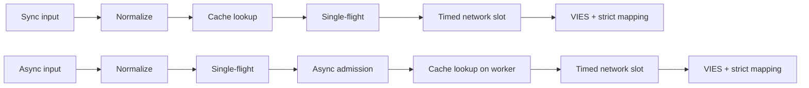
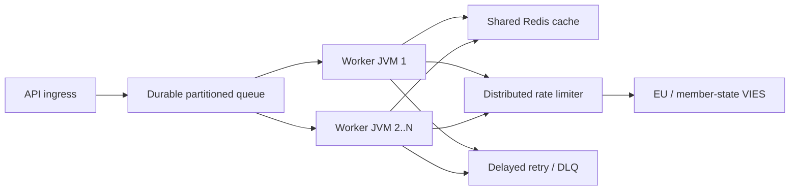

# Gaeilge (ga) — Technical documentation

> [Roghnóir teanga](../../LANGUAGES.md) · Cuirtear an logánú seo ar fáil ar mhaithe le hinrochtaineacht. Má bhíonn difríocht ann, is í an fhoinse chanónach theicniúil nó dhlíthiúil Bhéarla atá i réim. Fanann `LICENSE` agus`NOTICE` na fréimhe ceangailteach.

## Cuspóir agus raon feidhme

Is leabharlann cliant Java 21 é `vies-client` nach bhfuil aon spleáchas ar am rite aici ó EU VIES
le haghaidh do sheirbhís REST. Is féidir é a bheith ina chomhpháirt phróiseála de chóras mór; ní ionad
scuaine teachtaireachta leanúnach, teorannóir ráta dáilte nó taisce roinnte.
Is cliant Java 21 le spleáchas nialasach-ama rite é `vies-client` don EU VIES REST
seirbhíse. Is féidir é a bheith ina chomhpháirt phróiseála i gcóras mór; ní chuireann sé ionad a
scuaine buan, teorannóir ráta dáilte, nó taisce roinnte.

## Modúl agus pacáistí / Module and packages

```text
module vies.client
├── exports vies.client
│   ├── ViesClient          public synchronous/asynchronous facade
│   ├── ViesResponse        sealed result hierarchy
│   ├── ViesError           stable bilingual error catalog
│   ├── VatFormat           offline normalization/format validation
│   ├── ViesRequester       requester VAT value object
│   ├── ViesAvailability    service/member-state health snapshot
│   ├── ViesCache           external cache extension point
│   └── ViesException       availability diagnostic exception
└── vies.client.internal
    ├── MiniJson            bounded-purpose JSON parser
    └── TtlCache            default concurrent in-memory TTL cache
```

Ní onnmhairítear an pacáiste istigh; comhaontú comhoiriúnachta amháin a
Baineann sé seo le pacáiste poiblí `vies.client`.
Ní onnmhairítear an pacáiste inmheánach. Ní bhaineann ráthaíochtaí comhoiriúnachta ach leis an
pacáiste poiblí `vies.client`.

## Múnla torthaí

| Cineál           | Brí                                                                 | Bain triail eile as | Taisce |
| ---------------- | ------------------------------------------------------------------- | ------------------: | -----: |
| `Valid`          | VIES dearbhaithe mar bhailí / VIES confirmed valid                  |                 níl |  tá/tá |
| `Invalid`        | Níor dheimhnigh VIES go raibh sé bailí / níor dheimhnigh VIES bailí |                 níl |    níl |
| `Unavailable`    | Gan chinneadh bailíochta / No validity decision                     |         de réir cód |    níl |
| `MalformedInput` | Ionchur neamhbhailí                                                 |                 níl |    níl |

Athróg chriticiúil: Ní féidir `Unavailable` a thiontú go`Invalid` riamh.
Athróg chriticiúil: níor cheart `Unavailable` a thiontú go`Invalid` riamh .
Ar fáil do gach saincheist theicniúil/ionchuir:

```java
response.error().ifPresent(error -> {
    error.code();       // stable machine code
    error.messageHu();  // Hungarian user message
    error.messageEn();  // English user message
    error.retryable();  // external delayed-retry recommendation
});
```

## Saolré iarratais / Saolré iarratais



1.`VatFormat` bhaint deighilteoirí ceadaithe, caipitlithe agus
seiceálacha le haghaidh formáid a bhaineann go sonrach le tír. 2. Léann an cosán sioncronaithe taisce ar snáithe an ghlaoiteora; Níl an bealach async ach amháin i oibrí teoranta. 3. Ní stórálann an taisce ach torthaí `Valid`. 4. Cumascann an tábla`inFlight`iarratais leis an gcód cánach céanna + ceist laistigh de JVM. 5. Ní thosaíonn iarratas tosaigh async uathúil ach amháin le cead`asyncSlots` saor in aisce; freisin bhuail taisce
úsáid a bhaint as an suíomh seo ar feadh tréimhse ghearr ama. 6. Fanann an fíorghlao HTTP ar chead `requestSlots` le teorainn ama. 7. Níl sa fhreagra ach bailíocht boolean fhollasach agus stampa ama iniúchta inmhínithe
agus is féidir `Valid` nó`Invalid` a bheith mar thoradh air.
I mBéarla: léann sioncrónú taisce ar snáithe an ghlaoiteora; bunaíonn async eitilt aonair
agus cead isteach teoranta ar dtús, ansin léann taisce ar a oibrí. Úsáideann an dá líonra teoranta
mapáil iontrála agus freagartha docht.

## Múnla Multithreading / Concurrency

- Tá cás an chliaint phoiblí slán agus ní mór é a roinnt.
- Tá cás an chliaint phoiblí slán sábháilte agus ba cheart é a roinnt.
- Is é an seiceadóir async bunúsach ná seiceadóir fíorúil-snáithe-in aghaidh an tasc.
- Cruthaíonn an seiceadóir async réamhshocraithe snáithe fíorúil amháin in aghaidh an taisc a nglactar leis.
- Cuireann `maxPendingSyncRequests` teorainn láithreach le glaoiteoirí sioncronaithe comhuaineacha.
- Cuireann `maxPendingSyncRequests` teorainn láithreach le glaoiteoirí sioncrónacha comhthráthacha.
- Comhaireamh `maxPendingAsyncRequests` ceannairí uathúla async, freisin i gcás buailte taisce.
- Déanann `maxPendingAsyncRequests` ceannairí uathúla async a chomhaireamh, lena n-áirítear amas taisce.
- Má chuirtear todhchaí glaoiteora ar ceal, ní chealaítear an oibríocht chomhpháirteach aon-eitilte.
- Má chuirtear todhchaí glaoiteora amháin ar ceal, ní féidir an oibríocht aon-eitilte roinnte a chealú.
- Cuireann `maxConcurrentRequests` teorainn le hiarratais HTTP gníomhacha in aghaidh na huaire.
- Cuireann `maxConcurrentRequests` teorainn le glaonna gníomhacha HTTP de réir cás an chliaint.
- Coscann `admissionTimeout` feithimh seimeafóir gan teorainn.
- Coscann `admissionTimeout` feithimh leathcheann gan teorainn.
  Ní dháiltear eitiltí singil, seimeafóir agus taisce cuimhne **. JVManna iolracha
  Teastaíonn Redis coitianta, teorannóir domhanda agus scuaine leanúnach.
  Ní dháiltear eitiltí singil, seimeafair, agus an taisce cuimhneacháin **.
  Teastaíonn Redis roinnte, teorannóir domhanda, agus scuaine marthanach ó roinnt JVManna.

## Riail atriail / Beartas atriail

Ceadaíonn an cliant 0-5 athiarracht áitiúil. Tá an mhoill easpónantúil agus cuimsíonn sí giodam:

```text
delay ~= retryDelay × 2^(attempt-1) + random(0 .. delay/2)
```

Ceadaíonn an cliant 0-5 athiarracht áitiúil le cúl-aschur easpónantúil agus Giodam.
Cuireann Giodar cosc ​​ar stoirmeacha athiarrachta sioncronaithe trasna snáitheanna oibrithe.
Ní dhéantar atriail áitiúil ach amháin i gcás earráid líonra shealadach/VIES.`CLIENT_OVERLOADED`,`CLIENT_CLOSED`, ní atosaíonn an earráid ionchuir agus an bhlocáil go háitiúil. Tá sé ar scála mór
meicníocht retry bunscoile scuaine leanúnach + moill + iarrachtaí uasta + DLQ.
De réir scála, bain úsáid as trialacha buana mhoillithe le huaschomhaireamh iarrachta agus litir marbh
scuaine. Is beag an t-iarratas áitiúil d'aon ghnó.

## Séimeantaic Cache / Cache semantics

- Taisce bunúsach: cuimhne comhthráthach TTL, 10,000 eilimint, 24 uair an chloig.
- Taisce réamhshocraithe: TTL i gcuimhne comhthráthach, 10,000 iontráil, 24 uair an chloig.
- Níl ach `Valid` san áireamh;`Invalid` agus earráidí uimh.
- Níl ach `Valid` i dtaisce;`Invalid` agus nach bhfuil teipeanna.
- Tá uimhir chánach agus uimhir chánach an fhiosraitheora san eochair freisin.
- Áirítear leis an eochair CBL sprice agus CBL iarrthóra.
- Tá an hit taisce marcáilte `fromCache=true`.
- Marcáiltear amas taisce le `fromCache=true`.
- Is é `requestDate`/`consultationNumber` sa taisce ná sonraí an chomhairliúcháin bhunaidh.
- Baineann Cached `requestDate`/`consultationNumber` leis an gcomhairliúchán bunaidh.
  Earráid léite taisce comhroinnte `CACHE_ERROR`, aisíocaíocht VIES neamh-uathoibríoch.
  Is iompar frith-stampede d'aon ghnó é seo. Teip scríobh taisce tar éis freagra rathúil VIES
  ní scriosann sé an toradh barántúil `Valid`.
  Filleann teip léite taisce roinnte `CACHE_ERROR` seachas titim tríd go dtí a
  VIES stampede. Ní scriosann teip ar scríobh taisce tar éis freagra deimhnithe an
  toradh údarásach `Valid`.

## Bailíochtú freagraí / Response validation

Ní sonraí iontaofa iad JSON seachtrach. Ní féidir `Valid`/`Invalid` a chruthú ach amháin:

- an fhréamh réad JSON;
- `isValid` nó`valid` boolean fíor;
- `requestDate` ISO-8601`Instant` nó am dáta fhritháireamh;
- gan aon chinneadh sáraitheach `userError`.
  Ní chuirtear muinín i leith JSON seachtrach. Stampa ama in easnamh/mícheart nó in easnamh/neamhbhailí
  tuairisceáin `MALFORMED_RESPONSE`, ní`Invalid` monaraithe nó stampa ama áitiúil riamh.

## Stop / Múchadh

Tá `close()` mífhoighneach, ní ghlacann sé le hiarratais nua a thuilleadh, cuireann sé isteach ar oibríochtaí inmheánacha sioncronaithe,
ní fhanann sé leis féin ón aisghlao agus dúnann sé an cliant HTTP. Féin, ar láimh ón taobh amuigh
ní dhúnann seiceadóir; tá an glaoiteoir freagrach as a shaolré.
Tá `close()` díomhaoin, diúltaíonn sé d’obair nua, cealaíonn sé oibríochtaí asyncronaithe inmheánacha gan
féin-feitheamh, agus dúnann an cliant HTTP. Ní dhúntar seiceadóir a sholáthraíonn an glaoiteoir.
Stop a chur le líon teoranta todhchaíochtaí ceannaire inmheánacha ar snáitheanna críochfoirt daemon ar leithligh
dún é, ionas nach féidir leis an aisghlaoch úsáideora an glas saolré a choinneáil. A
Cuireadh tús le glao sioncronaithe nó sioncronaithe nua tar éis do `close()``IllegalStateException` sioncronach a chaitheamh.
Cuireann múchadh deireadh le todhchaíochtaí ceannaire inmheánacha teoranta ón saolré
snáithe, mar sin ní féidir le aisghlaonna úsáideoirí a ghlas a choinneáil. Glaonna sioncronaithe nó sioncronaithe nua déanta tar éis `close()` caith `IllegalStateException` synchronously.

## Topology ar scála mór / Topology ar scála mór



Is é an acmhainn in aghaidh an tsrutha an teorainn chrua. Ní thugann níos mó oibrithe tú i dteideal níos mó tráchta VIES;
ní moladh de chuid an AE é luach comhairgeadra áitiúil `32`. Tomhaiseadh an teorainn dhomhanda 429 agus
Foinn bunaithe ar earráidí `MAX_CONCURRENT`, latency p95/p99 agus iompar iompróra.
Is é an cumas in aghaidh an tsrutha an teorainn chrua. Ní cheadaíonn níos mó oibrithe níos mó
VIES tráchta. Tiúin an ráta domhanda ó sníomh agus foighne breathnaithe.

## Inbhraite / Observability

I dtimpeallacht bheo, déan iad seo a thomhas ar a laghad / Tomhais ar a laghad:

- comhaireamh freagartha de réir cineáil toraidh agus `errorCode`;
- p50/p95/p99 san iomlán agus faoi fhoighne in aghaidh an tsrutha;
- cóimheas buailte taisce agus comhaireamh `CACHE_ERROR`;
- comhaireamh áitiúil gníomhach/ar feitheamh agus comhaireamh `CLIENT_OVERLOADED`;
- iarrachtaí atriallta agus torthaí deiridh;
- doimhneacht scuaine marthanach, aois, moill ar atriail, agus comhaireamh DLQ;
- infhaighteacht/ráta earráide VIES in aghaidh na tíre;
- Carn JVM, sosanna GC, comhaireamh snáithe fíorúil, LAP, soicéid.

## Sonraí feidhmíochta / Nótaí feidhmíochta

Uimhreacha áitiúla tomhaiste sa stór ar mheaisín forbartha le freastalaí bréige loopback
á n-ullmhú; gan aon SLA agus gan aon gealltanas tréchur VIES. Fíorfheidhmíocht an líonra,
Is iad TLS, Redis, teorannóir domhanda agus inneall na mballstát a chinneann é.
Úsáideann tagarmharcanna stórtha-áitiúla freastalaí bréige loopback ar mheaisín forbróra.
Ní SLA ná gealltanas VIES-thréchur iad.
Tomhas fíoraithe 2026-07-17, JDK 21, airmheán trí rith / Rith fíoraithe,
JDK 21, airmheán trí rith:
| Oibríocht áitiúil / Oibríocht áitiúil | Airmheán / Airmheán |
|---|---:|
| Buail taisce le cosán iomlán `check()`| 8.91 M oibríochtaí/s |
| Diúltú áitiúil don drochfhormáid | 9.02 M oibríochtaí/s |
| Lúb siar seicheamhach HTTP | 4.044 iarratas/s |
| 5,000 iarratas loopback éagsúla async, comhairgeadra 256 | 21,640 iarratas/s |
| Comhlánaigh 10,000 glaoiteoir leis an eochair chéanna | 1.40 M glaoiteoir/í, **1 iarratas HTTP** |
Is tomhas micrea é seo, ní JMH agus ní tástáil ualach táirgeachta. Taispeánann an líne aon-eitilte an
gné scálaithe is tábhachtaí: ní athraíonn líon na nglaoiteoirí leis an eochair chéanna
isteach sa líon céanna iarratas réamhtheachtacha.
Is tomhas micrea é seo, ní JMH nó tástáil ualach táirgeachta. An eitilt aonair
as a chéile a léiríonn an t-airí príomhscála: ní éiríonn glaoiteoirí aon-eochair
an líon céanna iarratas réamhtheachtacha.

## Slándáil / Security

- Ná húsáid ach URL bonn oifigiúil HTTPS beo.
- Bain úsáid as an URL bonn HTTPS oifigiúil i dtáirgeadh.
- Ná logáil isteach d’uimhir chánach iomlán, d’ainm nó do sheoladh gan ghá.
- Seachain logáil neamhriachtanach ar uimhreacha, ainmneacha agus seoltaí CBL.
- Tá an sárú `baseUrl` chun críocha tástála/bréagacha; gan ionchur úsáideora.
- Baineann sáraíocht `baseUrl` le triail rialaithe/chumraíocht bhréige, ní ionchur úsáideora.
- Logáil an cód earráide meaisín, téigh go dtí an t-úsáideoir `messageHu`/`messageEn`.
- Cóid earráide cobhsaí a logáil; teachtaireachtaí logánta a sheoladh ar ais chuig úsáideoirí.
