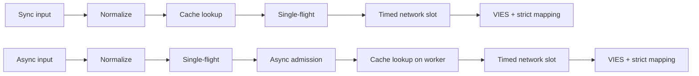
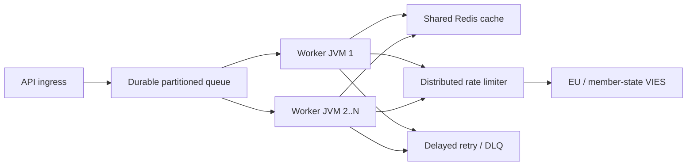

# Hrvatski (hr) — Tehnička dokumentacija

> [Svi jezici](../../LANGUAGES.md) · Informativni prijevod. U slučaju razlike mjerodavan je kanonski engleski tehnički ili pravni izvor. Samo su korijenski `LICENSE` i `NOTICE` pravno mjerodavni; prijevod ih ne zamjenjuje.

## Svrha i opseg

`vies-client` je Java 21 klijentska biblioteka s nula ovisnosti o vremenu izvođenja od EU VIES-a
za vašu REST uslugu. Može biti procesna komponenta velikog sustava; ne zamjenjuje
trajni red čekanja poruka, distribuirani limitator brzine ili dijeljena predmemorija.

`vies-client` je Java 21 klijent bez ovisnosti o vremenu izvođenja za EU VIES REST
servis. Može biti procesna komponenta u velikom sustavu; ne zamjenjuje a
izdržljivi red čekanja, distribuirani limitator brzine ili dijeljena predmemorija.

## Modul i paketi

```text
module vies.client
├── exports vies.client
│   ├── ViesClient          public synchronous/asynchronous facade
│   ├── ViesResponse        sealed result hierarchy
│   ├── ViesError           stable bilingual error catalog
│   ├── VatFormat           offline normalization/format validation
│   ├── ViesRequester       requester VAT value object
│   ├── ViesAvailability    service/member-state health snapshot
│   ├── ViesCache           external cache extension point
│   └── ViesException       availability diagnostic exception
└── vies.client.internal
    ├── MiniJson            bounded-purpose JSON parser
    └── TtlCache            default concurrent in-memory TTL cache
```

Unutarnji paket se ne izvozi; samo sporazum o kompatibilnosti a
Odnosi se na javni paket `vies.client`.

Interni paket se ne izvozi. Jamstva kompatibilnosti odnose se samo na
javni paket `vies.client`.

## Model rezultata

| Upišite          | Značenje                                                       | Pokušaj ponovno | Predmemorija |
| ---------------- | -------------------------------------------------------------- | --------------: | -----------: |
| `Valid`          | VIES potvrđen kao važeći / VIES potvrđeno važeći               |              ne |        da/da |
| `Invalid`        | VIES nije potvrdio da je valjan / VIES nije potvrdio valjanost |              ne |           ne |
| `Unavailable`    | Odluka bez valjanosti / Odluka bez valjanosti                  |     prema šifri |           ne |
| `MalformedInput` | Neispravan unos                                                |              ne |           ne |

Kritična invarijanta:`Unavailable` se nikada ne može pretvoriti u`Invalid`.
Kritična invarijanta:`Unavailable` se nikada ne smije pretvoriti u`Invalid`.

Dostupno za sva tehnička/unosna pitanja:

```java
response.error().ifPresent(error -> {
    error.code();       // stable machine code
    error.messageHu();  // Hungarian user message
    error.messageEn();  // English user message
    error.retryable();  // external delayed-retry recommendation
});
```

## Životni ciklus zahtjeva



1.`VatFormat` uklanja dopuštene razdjelnike, velika slova i
provjerava format specifičan za zemlju. 2. Sinkronizacijski put čita predmemoriju na niti pozivatelja; asinkroni način je samo u ograničenom radniku. 3. Predmemorija pohranjuje samo rezultate `Valid`. 4.`inFlight`tablica spaja zahtjeve s istim poreznim brojem + upit unutar JVM-a. 5. Jedinstveni asinkroni vodeći zahtjev pokreće se samo s besplatnom dozvolom`asyncSlots`; također cache pogodak
koristiti ovu lokaciju na kratko vrijeme. 6. Pravi HTTP poziv čeka `requestSlots` dozvolu s vremenskim ograničenjem. 7. Odgovor je samo eksplicitna Booleova valjanost i interpretabilna vremenska oznaka revizije
može rezultirati u `Valid` ili `Invalid`.

Na engleskom: sinkronizacija čita predmemoriju na niti pozivatelja; async uspostavlja jednokratni let
i ograničeni pristup prvo, zatim čita predmemoriju na svom radniku. Oba koriste ograničenu mrežu
prijem i striktno mapiranje odgovora.

## Model konkurentnosti

- Instanca javnog klijenta je sigurna i mora se dijeliti.
- Instanca javnog klijenta sigurna je za niti i treba je dijeliti.
- Az alap async izvršitelj virtualne niti po zadatku izvršitelj.
- Zadani asinkroni izvršitelj stvara jednu virtualnu nit po prihvaćenom zadatku.
- `maxPendingSyncRequests` odmah ograničava istodobne sinkronizirane pozivatelje.
- `maxPendingSyncRequests` odmah ograničava istodobne sinkrone pozivatelje.
- `maxPendingAsyncRequests` broji jedinstvene asinkrone lidere, također u slučaju pogotka predmemorije.
- `maxPendingAsyncRequests` broji jedinstvene asinkrone vodeće, uključujući pogotke predmemorije.
- Otkazivanje budućnosti pozivatelja ne poništava zajedničku operaciju jednog leta.
- Otkazivanje budućnosti jednog pozivatelja ne može otkazati dijeljenu operaciju jednog leta.
- `maxConcurrentRequests` ograničava aktivne HTTP zahtjeve po instanci.
- `maxConcurrentRequests` ograničava aktivne HTTP pozive po klijentskoj instanci.
- `admissionTimeout` sprječava beskonačno čekanje semafora.
- `admissionTimeout` sprječava neograničeno čekanje semafora.

Single-flight, semaphore i memory-cache **nisu distribuirani**. Više JVM-ova
potreban je uobičajeni Redis, globalni limiter i trajni red čekanja.

Single-flight, semafori i predmemorija u memoriji **nisu distribuirani**.
Višestruki JVM-ovi zahtijevaju zajednički Redis, globalni limiter i izdržljivi red čekanja.

## Pravilo ponovnog pokušaja

Klijent dopušta 0-5 lokalnih ponovnih pokušaja. Kašnjenje je eksponencijalno i uključuje podrhtavanje:

```text
delay ~= retryDelay × 2^(attempt-1) + random(0 .. delay/2)
```

Klijent dopušta 0–5 lokalnih ponovnih pokušaja s eksponencijalnim odmakom i podrhtavanjem.
Podrhtavanje sprječava sinkronizirane oluje ponovnih pokušaja preko radnih niti.

Lokalni ponovni pokušaj izvodi se samo za privremenu mrežnu/VIES grešku.`CLIENT_OVERLOADED`,
`CLIENT_CLOSED`, pogreška pri unosu i blokiranje se ne pokreće ponovno lokalno. To je u velikim razmjerima
primarni mehanizam ponovnog pokušaja trajni red čekanja + odgoda + najveći broj pokušaja + DLQ.

U velikom broju, koristite trajne odgođene ponovne pokušaje s maksimalnim brojem pokušaja i mrtvim pismom
red. Lokalni ponovni pokušaji su namjerno mali.

## Semantika predmemorije

- Osnovna predmemorija: istovremena memorija TTL, 10 000 elemenata, 24 sata.
- Zadana predmemorija: istovremeni TTL u memoriji, 10 000 unosa, 24 sata.
- Uključen je samo `Valid`;`Invalid`i greške br.
- Samo `Valid` je u predmemoriji;`Invalid` a kvarovi nisu.
- Ključ također sadrži porezni broj i porezni broj pitatelja.
- Ključ uključuje ciljani PDV i PDV podnositelja zahtjeva.
- Pogodak predmemorije označen je `fromCache=true`.
- Pogoci predmemorije označeni su sa `fromCache=true`.
- `requestDate`/`consultationNumber`u cacheu su podaci izvorne konzultacije.
- Spremljeno u predmemoriju `requestDate`/`consultationNumber` pripada izvornom savjetovanju.

Pogreška čitanja dijeljene predmemorije `CACHE_ERROR`, neautomatski VIES povrat.
Ovo je namjerno ponašanje protiv stampeda. Neuspješno pisanje u predmemoriju nakon uspješnog VIES odgovora
ne briše autentičan rezultat `Valid`.

Neuspjeh čitanja dijeljene predmemorije vraća `CACHE_ERROR` umjesto pada do a
VIES stampedo. Neuspjeh pisanja u predmemoriju nakon potvrđenog odgovora ne briše
mjerodavan rezultat `Valid`.

## Provjera valjanosti odgovora

Vanjski JSON nije pouzdan podatak.`Valid`/`Invalid`može se kreirati samo ako:

- korijenski JSON objekt;
- `isValid` ili`valid` pravi booleov;
- `requestDate`ISO-8601`Instant`ili pomak datuma i vremena;
- nema prevažne odluke `userError`.

Vanjski JSON nije pouzdan. Nedostaje/pogrešna booleova vrijednost ili nedostaje/nevažeća vremenska oznaka
vraća `MALFORMED_RESPONSE`, nikada izmišljenu `Invalid`ili lokalnu vremensku oznaku.

## Zaustavljanje

`close()` je idempotentan, više ne prihvaća nove zahtjeve, prekida interne asinkrone operacije,
ne čeka sam sebe od povratnog poziva i zatvara HTTP klijenta. Vlastito, vanjska primopredaja
ne zatvara izvršitelja; pozivatelj je odgovoran za njegov životni ciklus.

`close()` je idempotentan, odbija novi rad, otkazuje interne asinkrone operacije bez
samo-čekanje i zatvara HTTP klijent. Izvršitelj koji je dao pozivatelj nije zatvoren.

Zaustavljanje ograničenog broja internih vodećih fjučersa na odvojenim nitima virtualnog terminala
zatvoriti, tako da povratni poziv korisnika ne može zadržati zaključavanje životnog ciklusa i mnoge
otvorena operacija također ne zauzima izvornu nit platforme po operaciji. Nakon `close()`
pokrenut novi sinkroni ili asinkroni poziv baca sinkroni `IllegalStateException`.

Isključivanje terminalizira ograničenu unutarnju budućnost lidera na zasebnim virtualnim nitima,
tako da korisnički povratni pozivi ne mogu zadržati zaključavanje životnog ciklusa i mnoge otvorene operacije ne mogu
dodijelite po jednu nit matične platforme svakoj. Novi sinkroni ili asinkroni pozivi napravljeni nakon `close()`
bacati `IllegalStateException` sinkrono.

## Topologija velikih razmjera



Uzvodni kapacitet teško je ograničenje. Više radnika vam ne daje pravo na veći VIES promet;
lokalna vrijednost paralelnosti `32` nije preporuka EU-a. Globalna granica iznosila je 429 i
Melodije temeljene na pogreškama `MAX_CONCURRENT`, kašnjenju p95/p99 i ponašanju nosača.

Upstream kapacitet je tvrda granica. Više radnika ne znači i više dopuštenih
VIES prometa. Podesite globalnu stopu prema uočenom usporavanju i latenciji.

## Uočljivost

U živom okruženju izmjerite najmanje ovo / izmjerite najmanje:

- broj odgovora prema vrsti rezultata i `errorCode`;
- p50/p95/p99 ukupna i uzvodna latencija;
- omjer pogodaka predmemorije i broj `CACHE_ERROR`;
- lokalni broj aktivnih/na čekanju i broj `CLIENT_OVERLOADED`;
- ponovni pokušaji i konačni ishodi;
- izdržljiva dubina čekanja, starost, odgođeni ponovni pokušaj i DLQ broj;
- dostupnost/stopa pogreške VIES-a po zemlji;
- JVM gomila, GC pauze, virtualni broj niti, CPU, utičnice.

## Podaci o izvedbi

Lokalni brojevi izmjereni u repozitoriju na razvojnom stroju s lažnim poslužiteljem povratne petlje
pripremaju se; bez SLA i bez obećanja VIES propusnosti. Prava izvedba mreže,
Određuje ga TLS, Redis, globalni limiter i backend države članice.

Repozitorij-lokalni referentni testovi koriste loopback lažni poslužitelj na stroju razvojnog programera.
Oni nisu SLA ili VIES obećanje propusnosti.

Verifikacijsko mjerenje od 2026-07-17, JDK 21, medijan od tri izvođenja / Verifikacijsko izvođenje,
JDK 21, medijan tri vožnje:

| Lokalni rad / Lokalni rad                                                   |                               Medijan / Medijan |
| --------------------------------------------------------------------------- | ----------------------------------------------: |
| Predmemorija pogodak s punom stazom `check()`                               |                              8,91 M operacija/s |
| Lokalno odbijanje lošeg formata                                             |                              9,02 M operacija/s |
| Sekvencijalni povratni HTTP                                                 |                                4.044 zahtjeva/s |
| 5000 različitih asinkronih zahtjeva za povratnom petljom, istovremenost 256 |                               21.640 zahtjeva/s |
| Dovršite 10 000 pozivatelja s istim ključem                                 | 1,40 milijuna pozivatelja/s, **1 HTTP zahtjev** |

Ovo je mikro mjerenje, a ne JMH i test proizvodnog opterećenja. Linija jednog leta prikazuje
najvažnija značajka skaliranja: broj pozivatelja ne mijenja se istom tipkom
u isti broj uzvodnih zahtjeva.

Ovo je mikro mjerenje, a ne JMH ili test proizvodnog opterećenja. Jednostruki let
prikazuje svojstvo skaliranja ključa: pozivatelji s istim ključem ne postaju
isti broj uzvodnih zahtjeva.

## Sigurnost

- Koristite samo HTTPS službeni osnovni URL uživo.
- Koristite službeni HTTPS osnovni URL u proizvodnji.
- Nemojte nepotrebno upisivati ​​svoj puni porezni broj, ime ili adresu.
- Izbjegavajte nepotrebno bilježenje PDV brojeva, imena i adresa.
- `baseUrl` nadjačavanje je za test/mok svrhe; nema korisničkog unosa.
- `baseUrl` nadjačavanje je za kontrolirani test/mok konfiguraciju, a ne korisnički unos.
- Zabilježite šifru pogreške stroja, idite na korisnika `messageHu`/`messageEn`.
- Prijavite stabilne kodove grešaka; vratiti lokalizirane poruke korisnicima.
