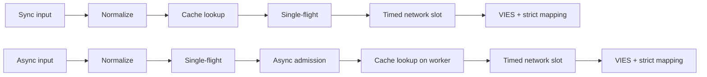
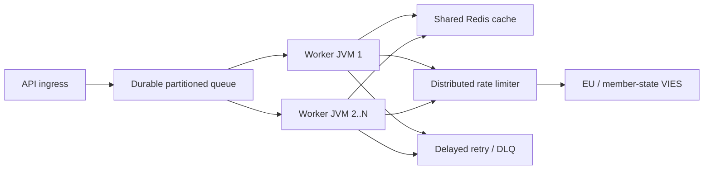

# Magyar (hu) — Technical documentation

> [Nyelvválasztó](../../LANGUAGES.md) · Ez a lokalizáció az elérhetőséget szolgálja. Eltérés esetén a kanonikus angol technikai vagy jogi forrás az irányadó. A gyökér `LICENSE` és`NOTICE` jogilag irányadó, fordítás nem helyettesíti.

## Cél és hatókör / Purpose and scope

A `vies-client` egy Java 21, nulla futásidejű függőségű klienskönyvtár az EU VIES
REST szolgáltatásához. Egy nagy rendszer feldolgozó komponense lehet; nem helyettesít
tartós üzenetsort, disztribútált rate limitert vagy megosztott cache-t.
A `vies-client` egy nulla futásidejű függőségi Java 21 kliens az EU VIES REST számára
szolgáltatást. Ez lehet egy nagy rendszer feldolgozó komponense; nem helyettesíti a
tartós várakozási sor, elosztott sebességkorlátozó vagy megosztott gyorsítótár.

## Modul és csomagok / Module and packages

```text
module vies.client
├── exports vies.client
│   ├── ViesClient          public synchronous/asynchronous facade
│   ├── ViesResponse        sealed result hierarchy
│   ├── ViesError           stable bilingual error catalog
│   ├── VatFormat           offline normalization/format validation
│   ├── ViesRequester       requester VAT value object
│   ├── ViesAvailability    service/member-state health snapshot
│   ├── ViesCache           external cache extension point
│   └── ViesException       availability diagnostic exception
└── vies.client.internal
    ├── MiniJson            bounded-purpose JSON parser
    └── TtlCache            default concurrent in-memory TTL cache
```

A belső csomag nincs exportálva; kompatibilitási szerződés csak a `vies.client` publikus csomagra vonatkozik.
A belső csomag nem kerül exportálásra. A kompatibilitási garanciák csak a
nyilvános `vies.client` csomag.

## Eredménymodell / Result model

| Típus / Type     | Jelentés / Meaning                                            |            Retry |    Cache |
| ---------------- | ------------------------------------------------------------- | ---------------: | -------: |
| `Valid`          | A VIES érvényesként igazolta / VIES confirmed valid           |           nem/no | igen/yes |
| `Invalid`        | A VIES nem igazolta érvényesként / VIES did not confirm valid |           nem/no |   nem/no |
| `Unavailable`    | Nem született érvényességi döntés / No validity decision      | kódfüggő/by code |   nem/no |
| `MalformedInput` | Hibás bemenet / Invalid input                                 |           nem/no |   nem/no |

Kritikus invariáns:`Unavailable` soha nem alakítható`Invalid` eredménnyé.
Critical invariant:`Unavailable` must never be converted to`Invalid`.
Minden technikai/bemeneti problémához elérhető:

```java
response.error().ifPresent(error -> {
    error.code();       // stable machine code
    error.messageHu();  // Hungarian user message
    error.messageEn();  // English user message
    error.retryable();  // external delayed-retry recommendation
});
```

## Kérés életciklusa / Request lifecycle



1. A `VatFormat` eltávolítja az engedélyezett elválasztókat, nagybetűsít és
   ország-specifikus formátumot ellenőriz.
2. A sync út a hívó szálán olvas cache-t; az async út csak a bounded workerben.
3. A cache csak `Valid` eredményt tárol.
4. Az `inFlight` tábla egy JVM-en belül összevonja az azonos adószám+lekérdező kéréseket.
5. Egyedi async vezető kérés csak szabad `asyncSlots` permit mellett indul; cache hit is
   rövid ideig használja ezt a helyet.
6. A valódi HTTP-hívás időkorlátosan vár `requestSlots` permitre.
7. A válasz csak explicit boolean érvényesség és értelmezhető audit timestamp
   mellett válhat `Valid` vagy`Invalid` eredménnyé.
   Magyarul: sync beolvassa a gyorsítótárat a hívó szálon; Az async egyetlen repülést hoz létre
   és először a korlátozott belépést, majd beolvassa a gyorsítótárat a dolgozóján. Mindkettő korlátos hálózatot használ
   felvételi és szigorú válaszleképezés.

## Többszálúság / Concurrency model

- A publikus klienspéldány szálbiztos és megosztandó.
- The public client instance is thread-safe and should be shared.
- Az alap async executor virtual-thread-per-task executor.
- The default async executor creates one virtual thread per accepted task.
- `maxPendingSyncRequests` azonnal korlátozza az egyidejű sync hívókat.
- `maxPendingSyncRequests` immediately bounds concurrent synchronous callers.
- `maxPendingAsyncRequests` az egyedi async leadereket számolja, cache hit esetén is.
- `maxPendingAsyncRequests` counts unique async leaders, including cache hits.
- Egy hívó future-jének cancel-je nem törli a közös single-flight műveletet.
- Cancelling one caller's future cannot cancel the shared single-flight operation.
- `maxConcurrentRequests` példányonként korlátozza az aktív HTTP-kéréseket.
- `maxConcurrentRequests` limits active HTTP calls per client instance.
- `admissionTimeout` megakadályozza a végtelen semaphore-várakozást.
- `admissionTimeout` prevents unbounded semaphore waiting.
  A single-flight, a semaphore és a memória-cache **nem disztribútált**. Több JVM
  esetén közös Redis, globális limiter és tartós queue szükséges.
  Az egyszeri repülés, a szemaforok és a memóriában lévő gyorsítótár **nincs terjesztve**.
  Több JVM megosztott Redis-t, globális korlátozót és tartós sort igényel.

## Retry szabály / Retry policy

A kliens 0–5 helyi retry-t enged. A késleltetés exponenciális és jittert tartalmaz:

```text
delay ~= retryDelay × 2^(attempt-1) + random(0 .. delay/2)
```

A kliens 0–5 helyi újrapróbálkozást tesz lehetővé exponenciális hátrálással és jitterrel.
A remegés megakadályozza a szinkronizált újrapróbálkozási viharokat a munkaszálak között.
Helyi retry csak átmeneti hálózati/VIES hibára történik.`CLIENT_OVERLOADED`,`CLIENT_CLOSED`, inputhiba és blokkolás nem indul újra helyben. Nagyüzemben az
elsődleges retry mechanizmus tartós queue + késleltetés + maximális attempts + DLQ.
Nagy méretben használjon tartós késleltetett újrapróbálkozásokat maximális kísérletszámmal és halott betűvel
sorban. A helyi újrapróbálkozások szándékosan kicsik.

## Cache szemantika / Cache semantics

- Alap cache: konkurens memória TTL, 10 000 elem, 24 óra.
- Default cache: concurrent in-memory TTL, 10,000 entries, 24 hours.
- Csak `Valid` kerül bele;`Invalid` és hibák nem.
- Only `Valid` is cached;`Invalid` and failures are not.
- A kulcs az adószámot és a lekérdező adószámát is tartalmazza.
- The key includes both target VAT and requester VAT.
- A cache hit `fromCache=true` jelölést kap.
- Cache hits are marked with `fromCache=true`.
- A cache-beli `requestDate`/`consultationNumber` az eredeti konzultáció adata.
- Cached `requestDate`/`consultationNumber` belongs to the original consultation.
  Megosztott cache olvasási hibája `CACHE_ERROR`, nem automatikus VIES fallback.
  Ez szándékos anti-stampede viselkedés. Sikeres VIES-válasz utáni cache-írási hiba
  nem törli a hiteles `Valid` eredményt.
  A megosztott gyorsítótár olvasási hibája a `CACHE_ERROR` fájlt adja vissza, ahelyett, hogy a-ra esik
  VIES roham. A megerősített válasz utáni gyorsítótár-írási hiba nem törli a
  mérvadó `Valid` eredmény.

## Válaszvalidálás / Response validation

A külső JSON nem megbízható adat.`Valid`/`Invalid` csak akkor jöhet létre, ha:

- a gyökér JSON objektum;
- `isValid` vagy`valid` valódi boolean;
- `requestDate` ISO-8601`Instant` vagy offset datetime;
- nincs döntést felülíró `userError`.
  A külső JSON nem megbízható. Hiányzó/rossz logikai érték vagy hiányzó/érvénytelen időbélyeg `MALFORMED_RESPONSE` értéket ad vissza, soha nem gyártott`Invalid`-t vagy helyi időbélyeget.

## Leállítás / Shutdown

`close()` idempotens, új kérést már nem fogad, megszakítja a belső async műveleteket,
nem vár önmagára callbackből, és bezárja a HTTP klienst. Saját, kívülről átadott
executort nem zár be; annak életciklusáért a hívó felel.
A `close()` idempotens, elutasítja az új munkát, törli a belső aszinkron műveleteket anélkül
önvárakozik, és bezárja a HTTP-klienst. A hívó által biztosított végrehajtó nincs lezárva.
A leállítás a korlátos számú belső leader future-t külön daemon termináló szálakon
zárja le, ezért felhasználói callback nem tarthatja fogva a lifecycle lockot. A `close()` után indított új sync vagy async hívás szinkron `IllegalStateException`-t dob.
A leállítás az életciklustól távolabb zárja le a korlátozott belső vezető határidőket
szál, így a felhasználói visszahívások nem tudják megőrizni a zárolását. Ezt követően kezdeményezett új szinkronizálási vagy aszinkron hívások `close()` szinkronban dobja a `IllegalStateException`-t.

## Nagyléptékű topológia / Large-scale topology



Az upstream kapacitás a kemény határ. Több worker nem jogosít több VIES-forgalomra;
a lokális `32` concurrency érték nem EU-ajánlás. A globális limitet mért 429 és`MAX_CONCURRENT` hibák, p95/p99 latency és szolgáltatói viselkedés alapján hangold.
Az upstream kapacitás a kemény határ. A több dolgozó nem jelenti azt, hogy több engedélyezett
VIES forgalom. Hangolja be a globális sebességet a megfigyelt fojtásból és késleltetésből.

## Megfigyelhetőség / Observability

Éles környezetben legalább ezeket mérd / Measure at minimum:

- válaszok száma eredménytípus és `errorCode` szerint;
- p50/p95/p99 teljes és upstream latencia;
- gyorsítótár találati aránya és `CACHE_ERROR` száma;
- helyi aktív/függőben lévő szám és `CLIENT_OVERLOADED` szám;
- újrapróbálkozási kísérletek és végeredmények;
- tartós sormélység, életkor, késleltetett újrapróbálkozás és DLQ-szám;
- országonkénti VIES elérhetőség/hibaarány;
- JVM kupac, GC szünetek, virtuális szálak száma, CPU, foglalatok.

## Teljesítményadatok / Performance notes

A repositoryban mért lokális számok fejlesztői gépen, loopback mock szerverrel
készülnek; nem SLA és nem VIES throughput ígéret. A valódi teljesítményt a hálózat,
TLS, Redis, globális limiter és a tagállami backend határozza meg.
A repository-local benchmarkok egy visszacsatolási álszervert használnak egy fejlesztői gépen.
Ezek nem SLA vagy VIES-áteresztőképesség ígéretei.
2026-07-17-i ellenőrző mérés, JDK 21, három futás mediánja / Verification run,
JDK 21, median of three runs:
| Helyi művelet / Local operation | Medián / Median |
|---|---:|
| Cache hit teljes `check()` útvonallal | 8.91 M művelet/s |
| Hibás formátum helyi elutasítása | 9.02 M művelet/s |
| Szekvenciális loopback HTTP | 4,044 kérés/s |
| 5,000 különböző async loopback kérés, concurrency 256 | 21,640 kérés/s |
| 10,000 azonos kulcsú hívó befejezése | 1.40 M hívó/s, **1 HTTP-kérés** |
Ez mikromérés, nem JMH és nem produkciós load teszt. A single-flight sor mutatja a
legfontosabb skálázási tulajdonságot: azonos kulcsnál a hívók száma nem válik
azonos számú upstream kéréssé.
Ez egy mikromérés, nem JMH vagy gyártási terhelési teszt. Az egyrepülés
sor a kulcsméretezési tulajdonságot mutatja be: az azonos kulcsú hívók nem válnak a
ugyanannyi upstream kérés.

## Biztonság / Security

- Csak HTTPS hivatalos base URL-t használj élesben.
- Use the official HTTPS base URL in production.
- Ne logolj szükségtelenül teljes adószámot, nevet vagy címet.
- Avoid unnecessary logging of VAT numbers, names, and addresses.
- A `baseUrl` felülírás teszt/mock célú; ne legyen felhasználói bemenet.
- `baseUrl` override is for controlled test/mock configuration, not user input.
- A gépi hibakódot logold, felhasználónak `messageHu`/`messageEn` menjen.
- Log stable error codes; return localized messages to users.
