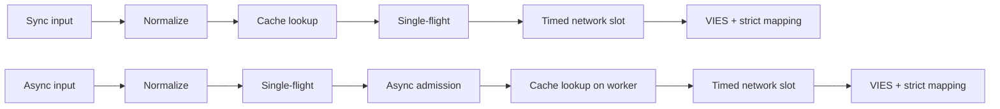
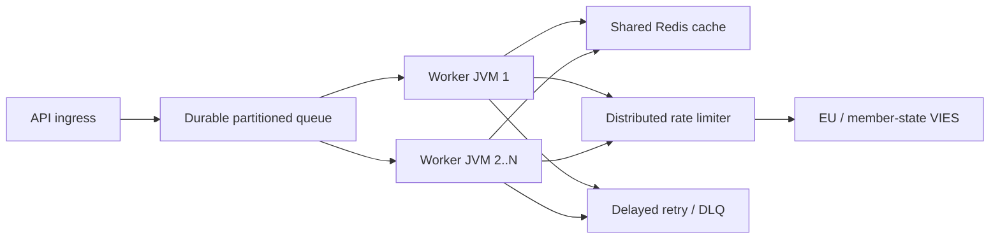

# Lietuvių (lt) — Technical documentation

> [Kalbų pasirinkimas](../../LANGUAGES.md) · Ši lokalizacija skirta prieinamumui. Esant neatitikimui, pirmenybę turi kanoninis angliškas techninis ar teisinis šaltinis. Šakniniai `LICENSE` ir`NOTICE` lieka teisiškai privalomi.

## Tikslas ir apimtis

`vies-client` yra „Java 21“ kliento biblioteka, neturinti jokios vykdymo trukmės priklausomybės nuo EU VIES
Jūsų REST paslaugai. Tai gali būti didelės sistemos apdorojimo komponentas; nepakeičia
nuolatinė pranešimų eilė, paskirstytas greičio ribotuvas arba bendrinama talpykla.
`vies-client` yra nulinės vykdymo trukmės priklausomybės Java 21 klientas, skirtas EU VIES REST
paslauga. Tai gali būti apdorojimo komponentas didelėje sistemoje; jis nepakeičia a
patvari eilė, paskirstytas greičio ribotuvas arba bendra talpykla.

## Modulis ir paketai / Modulis ir paketai

```text
module vies.client
├── exports vies.client
│   ├── ViesClient          public synchronous/asynchronous facade
│   ├── ViesResponse        sealed result hierarchy
│   ├── ViesError           stable bilingual error catalog
│   ├── VatFormat           offline normalization/format validation
│   ├── ViesRequester       requester VAT value object
│   ├── ViesAvailability    service/member-state health snapshot
│   ├── ViesCache           external cache extension point
│   └── ViesException       availability diagnostic exception
└── vies.client.internal
    ├── MiniJson            bounded-purpose JSON parser
    └── TtlCache            default concurrent in-memory TTL cache
```

Vidinė pakuotė neeksportuojama; tik suderinamumo sutartis a
Taikoma viešajam paketui `vies.client`.
Vidinis paketas neeksportuojamas. Suderinamumo garantijos taikomos tik
viešas `vies.client` paketas.

## Rezultato modelis

| Tipas            | Reikšmė                                                            | Bandyti dar kartą |  Talpykla |
| ---------------- | ------------------------------------------------------------------ | ----------------: | --------: |
| `Valid`          | VIES patvirtintas kaip galiojantis / VIES patvirtintas galiojantis |                ne | taip/taip |
| `Invalid`        | VIES nepatvirtino, kad jis galioja / VIES nepatvirtino galiojančio |                ne |        ne |
| `Unavailable`    | Sprendimo dėl galiojimo nėra / Sprendimo dėl galiojimo nėra        |        pagal kodą |        ne |
| `MalformedInput` | Neteisinga įvestis                                                 |                ne |        ne |

Kritinis invariantas:`Unavailable` niekada negali būti konvertuojamas į`Invalid`.
Kritinis invariantas:`Unavailable` niekada neturi būti konvertuojamas į`Invalid`.
Galima spręsti dėl visų techninių / įvesties problemų:

```java
response.error().ifPresent(error -> {
    error.code();       // stable machine code
    error.messageHu();  // Hungarian user message
    error.messageEn();  // English user message
    error.retryable();  // external delayed-retry recommendation
});
```

## Užklausos gyvavimo ciklas / Užklausos gyvavimo ciklas



1.`VatFormat` pašalina leidžiamus skyriklius, rašo didžiosiomis raidėmis ir
tikrina, ar nėra šalies formato. 2. Sinchronizavimo kelias nuskaito skambinančiojo gijos talpyklą; asinchroninis būdas yra tik ribotam darbuotojui. 3. Talpykloje saugomi tik rezultatai `Valid`. 4. Lentelė`inFlight`sujungia užklausas su tuo pačiu mokesčių kodu ir užklausa JVM. 5. Unikali asinchronizavimo užklausa pradedama tik gavus nemokamą`asyncSlots` leidimą; taip pat pataikė į talpyklą
naudokite šią vietą trumpą laiką. 6. Tikrasis HTTP skambutis laukia `requestSlots` leidimo su laiko limitu. 7. Atsakymas yra tik aiškus loginis galiojimas ir interpretuojama audito laiko žyma
gali sukelti `Valid` arba`Invalid`.
Anglų kalba: sync skaito talpyklą skambinančiojo gijoje; async nustato vieną skrydį
ir pirmiausia ribojamas priėmimas, tada nuskaito savo darbuotojo talpyklą. Abu naudoja ribotą tinklą
priėmimo ir griežto atsako kartografavimo.

## Kelių gijų / lygiagretumo modelis

- Viešasis kliento egzempliorius yra saugus ir turi būti bendrinamas.
- Viešasis kliento egzempliorius yra saugus gijų ir turėtų būti bendrinamas.
- Pagrindinis asinchroninis vykdytojas yra virtualiosios gijos vienai užduočiai vykdytojas.
- Numatytasis asinchronizavimo vykdytojas sukuria vieną virtualią giją kiekvienai priimtai užduočiai.
- `maxPendingSyncRequests` iš karto apriboja tuo pačiu metu sinchronizuojamus skambintojus.
- `maxPendingSyncRequests` iš karto apriboja sinchroninius skambintojus.
- `maxPendingAsyncRequests` skaičiuoja unikalius asinchronizavimo lyderius, taip pat ir talpyklos smūgio atveju.
- `maxPendingAsyncRequests` skaičiuoja unikalius asinchronizavimo lyderius, įskaitant talpyklos hitus.
  – Atšaukus skambinančiojo ateitį, neatšaukiama bendra vieno skrydžio operacija.
- Vieno skambinančiojo ateities atšaukimas negali atšaukti bendros vieno skrydžio operacijos.
- `maxConcurrentRequests` riboja aktyvias HTTP užklausas vienam egzemplioriui.
- `maxConcurrentRequests` riboja aktyvius HTTP skambučius kiekvienam kliento egzemplioriui.
- `admissionTimeout` neleidžia begaliniam semaforo laukimui.
- `admissionTimeout` apsaugo nuo neriboto semaforo laukimo.
  Vienas skrydis, semaforas ir atminties talpykla **neplatinami**. Keli JVM
  reikalingas bendras Redis, visuotinis ribotuvas ir nuolatinė eilė.
  Vienas skrydis, semaforai ir talpykla atmintyje **neplatinami**.
  Keliems JVM reikalingas bendras Redis, visuotinis ribotuvas ir patvari eilė.

## Bandymo dar kartą taisyklė / Bandymo dar kartą politika

Klientas leidžia 0–5 vietinius pakartotinius bandymus. Vėlavimas yra eksponentinis ir apima drebėjimą:

```text
delay ~= retryDelay × 2^(attempt-1) + random(0 .. delay/2)
```

Klientas leidžia 0–5 vietinius pakartotinius bandymus su eksponentiniu atsitraukimu ir drebėjimu.
Drebėjimas neleidžia sinchronizuoti pakartotinių bandymų audrų darbuotojo gijose.
Vietinis pakartotinis bandymas atliekamas tik dėl laikino tinklo / VIES klaidos.`CLIENT_OVERLOADED`,`CLIENT_CLOSED`, įvesties klaida ir blokavimas nepaleidžiamas iš naujo vietoje. Tai didelio masto
pirminis pakartotinio bandymo mechanizmas nuolatinė eilė + delsa + maksimalus bandymų skaičius + DLQ.
Esant dideliam mastui, naudokite patvarius atidėtus bandymus su maksimaliu bandymų skaičiumi ir mirties raide
eilė. Vietiniai pakartotiniai bandymai yra sąmoningai maži.

## Talpyklos semantika / Talpyklos semantika

- Pagrindinė talpykla: lygiagrečios atminties TTL, 10 000 elementų, 24 valandos.
- Numatytoji talpykla: vienu metu esantis TTL atmintyje, 10 000 įrašų, 24 valandos.
- Komplekte tik `Valid`;`Invalid` ir klaidų Nr.
- Talpykloje saugomas tik `Valid`;`Invalid` ir gedimų nėra.
- Rakte taip pat yra mokesčių mokėtojo kodas ir mokesčių mokėtojo kodas.
- Raktas apima ir tikslinį PVM, ir prašytojo PVM.
- Talpyklos įvykis pažymėtas `fromCache=true`.
- Talpyklos įvykiai pažymėti `fromCache=true`.
- `requestDate`/`consultationNumber` talpykloje yra pradinės konsultacijos duomenys.
- Talpykloje išsaugotas `requestDate`/`consultationNumber` priklauso pradinei konsultacijai.
  Bendrinamos talpyklos skaitymo klaida `CACHE_ERROR`, neautomatinis VIES atsarginis variantas.
  Tai tyčinis elgesys prieš spaudimą. Po sėkmingo VIES atsakymo nepavyko rašyti talpyklos
  jis nepanaikina autentiško rezultato `Valid`.
  Bendrinamos talpyklos skaitymo klaida grąžina `CACHE_ERROR`, o ne patenka į a
  VIES spūstis. Įrašymo talpykloje klaida po patvirtinto atsakymo neištrina
  autoritetingas `Valid` rezultatas.

## Atsakymo patvirtinimas / atsakymo patvirtinimas

Išorinis JSON nėra patikimi duomenys.`Valid`/`Invalid` galima sukurti tik jei:

- šakninis JSON objektas;
- `isValid` arba`valid` tikroji loginė vertė;
- `requestDate` ISO-8601`Instant` arba datos laiko poslinkis;
- nėra viršesnio sprendimo `userError`.
  Išorinis JSON yra nepatikimas. Trūksta / neteisinga loginė reikšmė arba trūksta / netinkama laiko žymė
  grąžina `MALFORMED_RESPONSE`, niekada nepagamintą`Invalid` arba vietinę laiko žymą.

## Sustabdyti / Išjungti

`close()` yra idempotentas, nebepriima naujų užklausų, pertraukia vidines asinchronizavimo operacijas,
jis nelaukia savęs iš atgalinio skambučio ir uždaro HTTP klientą. Nuosavas, perduotas iš išorės
neuždaro vykdytojo; skambinantis asmuo yra atsakingas už jo gyvavimo ciklą.
`close()` yra idempotentas, atmeta naują darbą, atšaukia vidines asinchronizavimo operacijas be
savaime laukia ir uždaro HTTP klientą. Skambintojo suteiktas vykdytojas nėra uždarytas.
Sustabdomas ribotas vidinių lyderių ateities sandorių skaičius atskirose demono terminalo gijose
uždarykite jį, kad vartotojo atgalinis skambutis negalėtų išlaikyti gyvavimo ciklo užrakto. A
Naujas sinchronizavimo arba asinchronizavimo skambutis prasidėjo po to, kai `close()` išmeta sinchroninį `IllegalStateException`.
Išjungimas pašalina ribotą vidinį lyderio ateities sandorį nuo gyvavimo ciklo
giją, todėl naudotojo atgaliniai skambučiai negali išlaikyti užrakto. Nauji sinchronizuoti arba asinchronizuoti skambučiai, atlikti vėliau `close()` sinchroniškai mesti `IllegalStateException`.

## Didelio masto topologija / didelio masto topologija



Pajėgumai prieš srovę yra griežta riba. Daugiau darbuotojų nesuteikia teisės į didesnį VIES srautą;
vietinė `32` lygiagretumo reikšmė nėra ES rekomendacija. Pasaulinė riba išmatuota 429 ir
Melodijos, pagrįstos `MAX_CONCURRENT` klaidomis, p95 / p99 delsa ir operatoriaus elgesiu.
Pajėgumai prieš srovę yra griežta riba. Daugiau darbuotojų nereiškia, kad daugiau leidžiama
VIES eismas. Sureguliuokite visuotinį greitį pagal pastebėtą ribojimą ir delsą.

## Stebimumas / Stebimumas

Gyvoje aplinkoje išmatuokite bent šiuos dalykus / Išmatuokite mažiausiai:

- atsakymų skaičius pagal rezultato tipą ir `errorCode`;
- p50/p95/p99 bendras ir prieš srovę nukreiptas vėlavimas;
- talpyklos pataikymo koeficientas ir `CACHE_ERROR` skaičius;
- vietinis aktyvių / laukiančių skaičius ir `CLIENT_OVERLOADED` skaičius;
- bandymai pakartotinai ir galutiniai rezultatai;
- ilgalaikis eilės gylis, amžius, atidėtas pakartotinis bandymas ir DLQ skaičius;
- VIES prieinamumo/klaidų dažnis pagal šalį;
- JVM krūva, GC pauzės, virtualių gijų skaičius, CPU, lizdai.

## Našumo duomenys / našumo pastabos

Vietiniai skaičiai, išmatuoti saugykloje kūrimo mašinoje su atgalinio ryšio imitaciniu serveriu
yra ruošiami; jokio SLA ir VIES pralaidumo pažado. Tikrasis tinklo veikimas,
Jį nustato TLS, Redis, globalus ribotuvas ir valstybės narės backend.
Vietinės saugyklos etalonuose kūrėjo įrenginyje naudojamas bandomasis serveris.
Tai nėra SLA ar VIES pralaidumo pažadas.
Patikrinimo matavimas 2026-07-17, JDK 21, trijų paleidimų mediana / patvirtinimo paleidimas,
JDK 21, trijų paleidimų mediana:
| Vietinis valdymas / Vietinis valdymas | Mediana / Mediana |
|---|---:|
| Talpykla pasiekta per visą kelią `check()`| 8,91 mln. operacijų/s |
| Vietinis netinkamo formato atmetimas | 9,02 mln. operacijų/s |
| Nuosekliosios kilpos HTTP | 4 044 prašymai/s |
| 5 000 skirtingų asinchroninio atgalinio ryšio užklausų, lygiagretumas 256 | 21 640 prašymų/s |
| Užbaikite 10 000 skambintojų naudodami tą patį raktą | 1,40 mln. skambintojų/s, **1 HTTP užklausa** |
Tai mikro matavimas, o ne JMH ir ne gamybos apkrovos testas. Vieno skrydžio linija rodo
svarbiausia mastelio keitimo funkcija: skambinančiųjų skaičius nesikeičia tuo pačiu klavišu
į tiek pat užklausų prieš srautą.
Tai yra mikro matavimas, o ne JMH ar gamybos apkrovos testas. Vienkartinis skrydis
eilutėje parodyta rakto mastelio keitimo savybė: skambinantieji tuo pačiu klavišu netampa
tiek pat užklausų prieš srautą.

## Saugumas / Saugumas

– Tiesiogiai naudokite tik oficialų HTTPS bazinį URL.

- Gamyboje naudokite oficialų pagrindinį HTTPS URL.
- Be reikalo neprisijunkite viso savo mokesčių numerio, vardo ar adreso.
- Venkite nereikalingo PVM numerių, vardų ir adresų registravimo.
- `baseUrl` nepaisymas skirtas bandymo / imitacijos tikslais; jokio vartotojo įvesties.
- `baseUrl` nepaisymas skirtas kontroliuojamam bandymo / imitaciniam konfigūravimui, o ne vartotojo įvestis.
- Užregistruokite mašinos klaidos kodą, eikite į vartotoją `messageHu`/`messageEn`.
- Registruoti stabilius klaidų kodus; grąžinti vartotojams lokalizuotus pranešimus.
