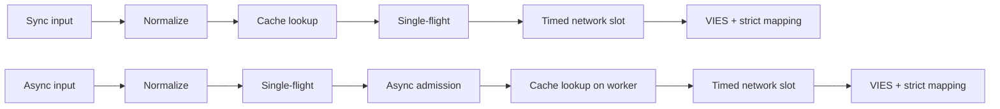
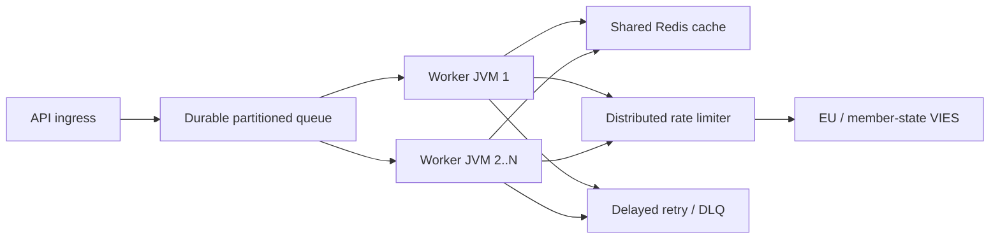

# Latviešu (lv) — Technical documentation

> [Valodu izvēle](../../LANGUAGES.md) · Šī lokalizācija uzlabo pieejamību. Atšķirību gadījumā noteicošais ir kanoniskais angļu tehniskais vai juridiskais avots. Saknes `LICENSE` un`NOTICE` paliek juridiski saistoši.

## Mērķis un darbības joma

`vies-client` ir Java 21 klienta bibliotēka ar nulles izpildlaika atkarību no EU VIES
par jūsu REST pakalpojumu. Tā var būt lielas sistēmas apstrādes sastāvdaļa; neaizstāj
pastāvīga ziņojumu rinda, izplatīts ātruma ierobežotājs vai koplietota kešatmiņa.
`vies-client` ir bez izpildlaika atkarības Java 21 klients ES VIES REST
pakalpojumu. Tas var būt apstrādes komponents lielā sistēmā; tas neaizstāj a
ilgstoša rinda, sadalīts ātruma ierobežotājs vai koplietota kešatmiņa.

## Modulis un paketes / Modulis un paketes

```text
module vies.client
├── exports vies.client
│   ├── ViesClient          public synchronous/asynchronous facade
│   ├── ViesResponse        sealed result hierarchy
│   ├── ViesError           stable bilingual error catalog
│   ├── VatFormat           offline normalization/format validation
│   ├── ViesRequester       requester VAT value object
│   ├── ViesAvailability    service/member-state health snapshot
│   ├── ViesCache           external cache extension point
│   └── ViesException       availability diagnostic exception
└── vies.client.internal
    ├── MiniJson            bounded-purpose JSON parser
    └── TtlCache            default concurrent in-memory TTL cache
```

Iekšējais iepakojums netiek eksportēts; tikai saderības līgums a
Attiecas uz publisko iepakojumu `vies.client`.
Iekšējā pakete netiek eksportēta. Saderības garantijas attiecas tikai uz
publiskā `vies.client` pakotne.

## Rezultāta modelis

| Tips             | Nozīme                                                        | Mēģināt vēlreiz | Kešatmiņa |
| ---------------- | ------------------------------------------------------------- | --------------: | --------: |
| `Valid`          | VIES apstiprināts kā derīgs / VIES apstiprināts derīgs        |              nē |     jā/jā |
| `Invalid`        | VIES neapstiprināja to kā derīgu / VIES neapstiprināja derīgu |              nē |        nē |
| `Unavailable`    | Lēmuma par derīgumu nav / Lēmuma par derīgumu nav             |        pēc koda |        nē |
| `MalformedInput` | Nederīga ievade                                               |              nē |        nē |

Kritiskais invariants:`Unavailable` nekad nevar pārveidot par`Invalid`.
Kritiskais invariants:`Unavailable` nekad nedrīkst pārveidot par`Invalid`.
Pieejams visiem tehniskajiem/ievades jautājumiem:

```java
response.error().ifPresent(error -> {
    error.code();       // stable machine code
    error.messageHu();  // Hungarian user message
    error.messageEn();  // English user message
    error.retryable();  // external delayed-retry recommendation
});
```

## Pieprasījuma dzīves cikls / Pieprasījuma dzīves cikls



1.`VatFormat` noņem atļautos atdalītājus, raksta lielos burtus un
pārbauda valstij raksturīgu formātu. 2. Sinhronizācijas ceļš nolasa kešatmiņu zvanītāja pavedienā; asinhronais veids ir tikai ierobežots darbinieks. 3. Kešatmiņā tiek saglabāti tikai rezultāti `Valid`.
4. Tabula `inFlight` apvieno pieprasījumus ar vienu un to pašu nodokļu kodu un vaicājumu JVM. 5. Unikāls asinhronais vadošais pieprasījums sākas tikai ar bezmaksas`asyncSlots` atļauju; arī kešatmiņas trāpījums
izmantojiet šo vietu īsu laiku. 6. Īstais HTTP zvans gaida `requestSlots` atļauju ar laika ierobežojumu. 7. Atbilde ir tikai skaidra Būla derīgums un interpretējams audita laikspiedols
ar var radīt `Valid` vai`Invalid`.
Angļu valodā: sync nolasa kešatmiņu zvanītāja pavedienā; async izveido vienu lidojumu
un vispirms ir ierobežota uzņemšana, pēc tam nolasa sava darbinieka kešatmiņu. Abi izmanto ierobežotu tīklu
uzņemšana un stingra atbildes kartēšana.

## Daudzpavedienu / Vienlaicības modelis

- Publiskā klienta instance ir droša, un tā ir jākoplieto.
- Publiskā klienta instance ir droša pavedienam, un tā ir koplietojama.
- Pamata asinhronais izpildītājs ir virtuālā pavediena izpildītājs vienam uzdevumam.
  - Noklusējuma asinhronais izpildītājs izveido vienu virtuālo pavedienu katram pieņemtajam uzdevumam.
- `maxPendingSyncRequests` nekavējoties ierobežo vienlaicīgus sinhronizācijas zvanītājus.
- `maxPendingSyncRequests` nekavējoties ierobežo vienlaicīgus sinhronos zvanītājus.
- `maxPendingAsyncRequests` uzskaita unikālos asinhronās līderus, arī kešatmiņas trāpījuma gadījumā.
- `maxPendingAsyncRequests` uzskaita unikālus asinhronizācijas līderus, tostarp kešatmiņas trāpījumus.
- Atceļot zvanītāja nākotni, netiek atcelta kopīgā viena lidojuma operācija.
- Viena zvanītāja nākotnes atcelšana nevar atcelt koplietojamo viena lidojuma darbību.
- `maxConcurrentRequests` ierobežo aktīvos HTTP pieprasījumus katrā instancē.
- `maxConcurrentRequests` ierobežo aktīvos HTTP zvanus katram klienta instancē.
- `admissionTimeout` novērš bezgalīgu semaforu gaidīšanu.
- `admissionTimeout` novērš neierobežotu semafora gaidīšanu.
  Viens lidojums, semafors un atmiņas kešatmiņa **nav izplatīti**. Vairāki JVM
  ir nepieciešams kopīgs Redis, globālais ierobežotājs un pastāvīga rinda.
  Viens lidojums, semafori un atmiņā esošā kešatmiņa **nav izplatīti**.
  Vairākiem JVM ir nepieciešams kopīgs Redis, globālais ierobežotājs un ilgstoša rinda.

## Atkārtoti mēģinājuma noteikums / politika vēlreiz

Klients pieļauj 0–5 vietējos atkārtojumus. Aizkave ir eksponenciāla un ietver nervozitāti:

```text
delay ~= retryDelay × 2^(attempt-1) + random(0 .. delay/2)
```

Klients pieļauj 0–5 lokālus atkārtotus mēģinājumus ar eksponenciālu atkāpšanos un nervozitāti.
Džitter novērš sinhronizētas atkārtošanas vētras darbinieku pavedienos.
Vietējais atkārtotais mēģinājums tiek veikts tikai pagaidu tīkla/VIES kļūdas gadījumā.`CLIENT_OVERLOADED`,`CLIENT_CLOSED`, ievades kļūda un bloķēšana netiek restartēta lokāli. Tas ir plašā mērogā
primārais atkārtošanas mehānisms pastāvīgā rinda + aizkave + maksimālais mēģinājumu skaits + DLQ.
Mērogā izmantojiet ilgstošus aizkavētus atkārtojumus ar maksimālo mēģinājumu skaitu un beigu burtu
rindā. Vietējie atkārtojumi ir apzināti mazi.

## Kešatmiņas semantika / Kešatmiņas semantika

- Pamata kešatmiņa: vienlaicīga atmiņa TTL, 10 000 elementu, 24 stundas.
- Noklusējuma kešatmiņa: vienlaicīga TTL atmiņā, 10 000 ierakstu, 24 stundas.
- iekļauts tikai `Valid`;`Invalid` un kļūdas Nr.
- Kešatmiņā ir tikai `Valid`;`Invalid` un neveiksmes nav.
- Atslēgā ir arī nodokļu maksātāja numurs un pieprasītāja nodokļu maksātāja numurs.
- Atslēga ietver gan mērķa PVN, gan pieprasītāja PVN.
- Kešatmiņas trāpījums ir atzīmēts ar `fromCache=true`.
- Kešatmiņas trāpījumi ir atzīmēti ar `fromCache=true`.
- `requestDate`/`consultationNumber` kešatmiņā ir sākotnējās konsultācijas dati.
- Kešatmiņā saglabātais `requestDate`/`consultationNumber` pieder sākotnējai konsultācijai.
  Koplietotās kešatmiņas lasīšanas kļūda `CACHE_ERROR`, neautomātiska VIES atkāpšanās.
  Tā ir tīša rīcība, kas vērsta pret uzbrukumiem. Kešatmiņas rakstīšanas kļūme pēc veiksmīgas VIES atbildes
  tas neizdzēš autentisko rezultātu `Valid`.
  Koplietotās kešatmiņas lasīšanas kļūme atgriež `CACHE_ERROR`, nevis nonāk līdz a
  VIES satricinājums. Kešatmiņas rakstīšanas kļūme pēc apstiprinātas atbildes neizdzēš
  autoritatīvs `Valid` rezultāts.

## Atbilžu validācija / Atbilžu validācija

Ārējie JSON dati nav uzticami.`Valid`/`Invalid` var izveidot tikai tad, ja:

- saknes JSON objekts;
- `isValid` vai`valid` patiesais Būla vērtība;
- `requestDate` ISO-8601`Instant` vai datuma laika nobīde;
- nav primāra lēmuma `userError`.
  Ārējais JSON nav uzticams. Trūkst/nepareizs Būla vai trūkst/nederīgs laikspiedols
  atgriež `MALFORMED_RESPONSE`, nekad nav izgatavots`Invalid` vai vietējais laikspiedols.

## Apturēt/izslēgt

`close()` ir idempotens, vairs nepieņem jaunus pieprasījumus, pārtrauc iekšējās asinhronās darbības,
tas negaida sevi no atzvanīšanas un aizver HTTP klientu. Savs, nodots no ārpuses
neaizver izpildītāju; zvanītājs ir atbildīgs par tā dzīves ciklu.
`close()` ir idempotents, noraida jaunu darbu, atceļ iekšējās asinhronās darbības bez
pats gaida un aizver HTTP klientu. Izsaucēja nodrošināts izpildītājs nav slēgts.
Ierobežotā iekšējā līdera fjūčeru skaita apturēšana atsevišķos dēmona termināļa pavedienos
aizveriet to, lai lietotāja atzvanīšana nevarētu turēt dzīves cikla bloķēšanu. A
Pēc `close()` sinhronizācijas `IllegalStateException` tika sākts jauns sinhronizācijas vai asinhronais zvans.
Shutdown terminalizē ierobežoto iekšējo līderu nākotnes darījumus prom no dzīves cikla
pavediens, tāpēc lietotāju atzvani nevar saglabāt savu bloķēšanu. Pēc tam veikti jauni sinhronizācijas vai asinhronie zvani `close()` met `IllegalStateException` sinhroni.

## Liela mēroga topoloģija / liela mēroga topoloģija



Augšējā jauda ir stingrais ierobežojums. Vairāk darbinieku nedod tiesības uz lielāku VIES trafiku;
vietējā `32` vienlaicības vērtība nav ES ieteikums. Globālā robeža mērīta 429 un
Melodijas, kuru pamatā ir `MAX_CONCURRENT` kļūdas, p95/p99 latentums un nesēja darbība.
Augšpuses jauda ir cietā robeža. Vairāk darbinieku nenozīmē vairāk atļauto
VIES satiksme. Pielāgojiet globālo ātrumu, izmantojot novēroto droseles un latentuma līmeni.

## Novērojamība / Novērojamība

Dzīvā vidē izmēriet vismaz šos / Izmēriet vismaz:

- atbilžu skaits pēc rezultāta veida un `errorCode`;
- p50/p95/p99 kopējais un augšupējais latentums;
- kešatmiņas trāpījumu attiecība un `CACHE_ERROR` skaits;
- lokālais aktīvo/neapstiprināto skaits un `CLIENT_OVERLOADED` skaits;
- atkārtota mēģinājuma mēģinājumi un gala rezultāti;
- izturīgs rindas dziļums, vecums, aizkavēts atkārtots mēģinājums un DLQ skaits;
- VIES pieejamība/kļūdu līmenis katrā valstī;
- JVM kaudze, GC pauzes, virtuālo pavedienu skaits, centrālais procesors, ligzdas.

## Veiktspējas dati / Veiktspējas piezīmes

Vietējie skaitļi, kas mērīti repozitorijā izstrādes mašīnā ar cilpas imitācijas serveri
tiek gatavoti; nav SLA un VIES caurlaides solījuma. reālā tīkla veiktspēja,
To nosaka TLS, Redis, globālais ierobežotājs un dalībvalsts aizmugursistēma.
Repozitorija lokālie etaloni izstrādātāja mašīnā izmanto cilpas imitācijas serveri.
Tie nav SLA vai VIES caurlaidības solījums.
Verifikācijas mērījums 2026-07-17, JDK 21, trīs braucienu mediāna / verifikācijas palaišana,
JDK 21, mediāna no trim piegājieniem:
| Vietējā darbība / Vietējā darbība | Mediāna / Mediāna |
|---|---:|
| Kešatmiņas trāpījums ar pilnu ceļu `check()`| 8,91 miljoni operāciju/s |
| Vietējais slikta formāta noraidīšana | 9,02 miljoni operāciju/s |
| Secīgā cilpa HTTP | 4 044 pieprasījumi/s |
| 5000 dažādu asinhronās cilpas pieprasījumu, vienlaikus 256 | 21 640 pieprasījumu/s |
| Pabeidziet 10 000 zvanītāju ar vienu un to pašu taustiņu | 1,40 miljoni zvanītāju/s, **1 HTTP pieprasījums** |
Šis ir mikromērījums, nevis JMH un nav ražošanas slodzes tests. Viena lidojuma līnija parāda
vissvarīgākā mērogošanas funkcija: zvanītāju skaits nemainās ar vienu un to pašu taustiņu
tādā pašā skaitā augšupējo pieprasījumu.
Šis ir mikromērījums, nevis JMH vai ražošanas slodzes tests. Viens lidojums
rinda parāda atslēgas mērogošanas īpašību: vienas atslēgas zvanītāji nekļūst par
vienāds skaits augšupējo pieprasījumu.

## Drošība / Drošība

- Izmantojiet tikai HTTPS oficiālo bāzes URL tiešraidē.
- Ražošanā izmantojiet oficiālo HTTPS bāzes URL.
- Nepiesakieties bez vajadzības pilnā nodokļu maksātāja numura, vārda vai adreses.
- Izvairieties no nevajadzīgas PVN numuru, nosaukumu un adrešu reģistrēšanas.
- `baseUrl` ignorēšana ir paredzēta pārbaudes/izspēles nolūkiem; nav lietotāja ievades.
- `baseUrl` ignorēšana ir paredzēta kontrolētai testa/izspēles konfigurācijai, nevis lietotāja ievadei.
- Reģistrējiet mašīnas kļūdas kodu, dodieties uz lietotāju `messageHu`/`messageEn`.
- Reģistrēt stabilus kļūdu kodus; atgriezt lietotājiem lokalizētus ziņojumus.
