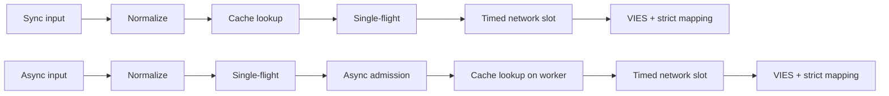
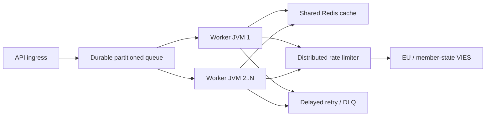

# Malti (mt) — Technical documentation

> [Għażla tal-lingwa](../../LANGUAGES.md) · Din il-lokalizzazzjoni hija għall-aċċessibbiltà. F’każ ta’ differenza, is-sors kanoniku tekniku jew legali bl-Ingliż jipprevali. `LICENSE` u `NOTICE` fir-root jibqgħu legalment awtorevoli.

## Għan u skop

`vies-client` hija librerija klijent Java 21 b'zero dipendenzi runtime mill-EU VIES
għas-servizz ta’ REST tiegħek. Jista 'jkun komponent ta' pproċessar ta 'sistema kbira; ma jissostitwixxix
kju tal-messaġġi persistenti, limitatur tar-rata mqassma jew cache kondiviż.
`vies-client` huwa klijent Java 21 ta' dipendenza żero għall-EU VIES REST
servizz. Jista 'jkun komponent tal-ipproċessar f'sistema kbira; ma tissostitwixxix a
kju durabbli, limitatur tar-rata distribwita, jew cache kondiviż.

## Modulu u pakketti / Modulu u pakketti

```text
module vies.client
├── exports vies.client
│   ├── ViesClient          public synchronous/asynchronous facade
│   ├── ViesResponse        sealed result hierarchy
│   ├── ViesError           stable bilingual error catalog
│   ├── VatFormat           offline normalization/format validation
│   ├── ViesRequester       requester VAT value object
│   ├── ViesAvailability    service/member-state health snapshot
│   ├── ViesCache           external cache extension point
│   └── ViesException       availability diagnostic exception
└── vies.client.internal
    ├── MiniJson            bounded-purpose JSON parser
    └── TtlCache            default concurrent in-memory TTL cache
```

Il-pakkett ta 'ġewwa mhux esportat; ftehim ta' kompatibilità biss a
Japplika għall-pakkett pubbliku `vies.client`.
Il-pakkett intern mhuwiex esportat. Il-garanziji tal-kompatibbiltà japplikaw biss għall-
pakkett pubbliku `vies.client`.

## Mudell tar-riżultat

| Tip              | Tifsira                                                          | Ipprova mill-ġdid |   Cache |
| ---------------- | ---------------------------------------------------------------- | ----------------: | ------: |
| `Valid`          | VIES ikkonfermat bħala validu / VIES ikkonfermat validu          |                le | iva/iva |
| `Invalid`        | Il-VIES ma kkonfermahiex bħala valida/VIES ma kkonfermatx valida |                le |      le |
| `Unavailable`    | L-ebda deċiżjoni ta' validità / L-ebda deċiżjoni ta' validità    |        bil-kodiċi |      le |
| `MalformedInput` | Input mhux validu                                                |                le |      le |

Invarjant kritiku:`Unavailable` qatt ma jista 'jiġi kkonvertit għal`Invalid`.
Invarjant kritiku:`Unavailable` qatt m'għandu jiġi kkonvertit għal`Invalid`.
Disponibbli għall-kwistjonijiet tekniċi/input kollha:

```java
response.error().ifPresent(error -> {
    error.code();       // stable machine code
    error.messageHu();  // Hungarian user message
    error.messageEn();  // English user message
    error.retryable();  // external delayed-retry recommendation
});
```

## Itlob iċ-ċiklu tal-ħajja / Itlob iċ-ċiklu tal-ħajja



1.`VatFormat` tneħħi separaturi permessi, tikkapitalizza u
kontrolli għal format speċifiku għall-pajjiż. 2. Il-mogħdija tas-sinkronizzazzjoni jaqra cache fuq il-ħajta ta 'min iċempel; il-mod async huwa biss fil-ħaddiem bounded. 3. Il-cache taħżen biss ir-riżultati `Valid`. 4. It-tabella`inFlight`tgħaqqad it-talbiet bl-istess kodiċi tat-taxxa + mistoqsija fi ħdan JVM. 5. Talba ewlenija asinkronika unika tibda biss b'permess`asyncSlots` b'xejn; wkoll cache hit
uża dan il-post għal perjodu qasir ta 'żmien. 6. Is-sejħa HTTP reali tistenna permess `requestSlots` b'limitu ta 'żmien. 7. It-tweġiba hija biss validità booleana espliċita u timestamp tal-verifika interpretabbli
bi jista 'jirriżulta f'`Valid` jew`Invalid`.
Bl-Ingliż: sync jaqra cache fuq il-ħajt tas-sejjieħ; async jistabbilixxi titjira waħda
u bounded ammissjoni l-ewwel, imbagħad jaqra cache fuq ħaddiem tagħha. It-tnejn jużaw netwerk limitat
ammissjoni u mmappjar strett tar-rispons.

## Multithreading / Mudell tal-konkorrenza

- L-istanza tal-klijent pubbliku hija sigura u trid tkun kondiviża.
- L-istanza tal-klijent pubbliku hija bla periklu u għandha tiġi kondiviża.
- L-eżekutur asinkroniku bażiku huwa eżekutur virtwali-thread-per-task.
- L-eżekutur asinkroniku default joħloq ħajt virtwali wieħed għal kull kompitu aċċettat.
- `maxPendingSyncRequests` tillimita immedjatament lil min iċempel is-sinkronizzazzjoni simultanja.
- `maxPendingSyncRequests` immedjatament jillimita lil min iċempel sinkroniku konkorrenti.
- `maxPendingAsyncRequests` jgħodd mexxejja asinkroniċi uniċi, anke fil-każ ta 'hit ta' cache.
- `maxPendingAsyncRequests` jgħodd mexxejja asinkroniċi uniċi, inklużi hits tal-cache.
- Il-kanċellazzjoni tal-futur ta' min iċempel ma tikkanċellax l-operazzjoni konġunta ta' titjira waħda.
- Li tikkanċella l-futur ta' min iċempel wieħed ma tistax tikkanċella l-operazzjoni kondiviża ta' titjira waħda.
- `maxConcurrentRequests` jillimita t-talbiet HTTP attivi għal kull istanza.
- `maxConcurrentRequests` jillimita sejħiet HTTP attivi għal kull istanza tal-klijent.
- `admissionTimeout` jipprevjeni stennija infinita tas-semafori.
- `admissionTimeout` jipprevjeni l-istennija tas-semaforu bla limitu.
  Titjira waħda, semaphore u memorja-cache huma **mhux distribwiti**. JVMs multipli
  Redis komuni, limitatur globali u kju persistenti huma meħtieġa.
  Titjira waħda, semafori, u l-cache fil-memorja huma **mhux distribwiti**.
  JVMs multipli jeħtieġu Redis kondiviż, limitatur globali, u kju durabbli.

## Ir-regola / Ipprova mill-ġdid il-politika

Il-klijent jippermetti 0-5 retry lokali. Id-dewmien huwa esponenzjali u jinkludi jitter:

```text
delay ~= retryDelay × 2^(attempt-1) + random(0 .. delay/2)
```

Il-klijent jippermetti 0–5 retry lokali b'backoff u jitter esponenzjali.
Jitter jipprevjeni maltempati sinkronizzati mill-ġdid bejn il-ħjut tal-ħaddiema.
Iprova mill-ġdid lokali jsir biss għal żball temporanju tan-netwerk/VIES.`CLIENT_OVERLOADED`,`CLIENT_CLOSED`, żball ta' input u imblukkar ma jerġax jibda lokalment. Huwa fuq skala kbira
mekkaniżmu ta' prova mill-ġdid primarja kju persistenti + dewmien + tentattivi massimi + DLQ.
Fuq skala, uża tentattivi mdewwma dejjiema b'għadd massimu ta' tentattivi u ittra mejta
kju. Provazzjonijiet mill-ġdid lokali huma intenzjonalment żgħar.

## Semantika tal-cache / Semantika tal-cache

- Cache bażiku: memorja konkorrenti TTL, 10,000 element, 24 siegħa.
- Cache default: TTL fil-memorja konkorrenti, 10,000 daħla, 24 siegħa.
- `Valid` biss huwa inkluż;`Invalid` u żbalji Nru.
- `Valid` biss huwa cached;`Invalid` u fallimenti mhumiex.
- Iċ-ċavetta fiha wkoll in-numru tat-taxxa u n-numru tat-taxxa ta' min jagħmel mistoqsija.
- Iċ-ċavetta tinkludi kemm il-VAT fil-mira kif ukoll il-VAT li tagħmel it-talba.
- Il-hit tal-cache huwa mmarkat `fromCache=true`.
- Il-hits tal-cache huma mmarkati b'`fromCache=true`.
- `requestDate`/`consultationNumber` fil-cache hija d-dejta tal-konsultazzjoni oriġinali.
- Cached `requestDate`/`consultationNumber` jappartjeni għall-konsultazzjoni oriġinali.
  Żball tal-qari tal-cache kondiviż `CACHE_ERROR`, fallback VIES mhux awtomatiku.
  Din hija imġieba intenzjonata kontra l-istampede. Falliment fil-kitba tal-cache wara rispons VIES b'suċċess
  ma tħassarx ir-riżultat awtentiku `Valid`.
  Falliment tal-qari tal-cache maqsuma jirritorna `CACHE_ERROR` minflok ma jaqa' għal a
  VIES stampede. Falliment fil-cache-write wara rispons ikkonfermat ma jħassarx il-
  riżultat awtorevoli `Valid`.

## Validazzjoni tat-tweġibiet / Validazzjoni tar-rispons

JSON estern mhuwiex data affidabbli.`Valid`/`Invalid` jistgħu jinħolqu biss jekk:

- l-oġġett JSON għerq;
- `isValid` jew`valid` boolean veru;
- `requestDate` ISO-8601`Instant` jew offset datetime;
- l-ebda deċiżjoni prevalenti `userError`.
  JSON estern mhuwiex fdat. Timestamp boolean nieqes/ħażin jew nieqes/invalidu
  jirritorna `MALFORMED_RESPONSE`, qatt`Invalid` iffabbrikat jew timestamp lokali.

## Waqqaf / Tfiq

`close()` huwa idempotenti, m'għadux jaċċetta talbiet ġodda, jinterrompi operazzjonijiet asinkroniċi interni,
ma jistenna lilu nnifsu mill-callback u jagħlaq il-klijent HTTP. Proprju, mogħtija minn barra
ma jagħlaqx eżekutur; min iċempel huwa responsabbli għaċ-ċiklu tal-ħajja tiegħu.
`close()` huwa idempotenti, jirrifjuta xogħol ġdid, jikkanċella operazzjonijiet asinkroniċi interni mingħajr
self-waiting, u jagħlaq il-klijent HTTP. Eżekutur ipprovdut minn min iċempel mhuwiex magħluq.
Twaqqaf in-numru limitat ta 'futures mexxejja interni fuq ħjut tat-terminal daemon separati
agħlaqha, sabiex is-callback tal-utent ma jistax iżomm il-lock taċ-ċiklu tal-ħajja. A
Sinkronizzazzjoni ġdida jew sejħa asinkronika bdiet wara li `close()` jitfa'`IllegalStateException` sinkroniku.
L-għeluq jitterminalizza l-futures tal-mexxej interni konfinati 'l bogħod miċ-ċiklu tal-ħajja
ħajt, sabiex callbacks tal-utenti ma jistgħux iżommu lock tiegħu. Sejħiet ġodda sinkronizzati jew asinkronizzati li saru wara `close()` tarmi `IllegalStateException` b'mod sinkroniku.

## Topoloġija fuq skala kbira / Topoloġija fuq skala kbira



Il-kapaċità upstream hija l-limitu iebes. Aktar ħaddiema ma jintitolakx għal aktar traffiku VIES;
il-valur tal-konkorrenza lokali `32` mhuwiex rakkomandazzjoni tal-UE. Il-limitu globali mkejjel 429 u
Melodiji bbażati fuq żbalji `MAX_CONCURRENT`, latency p95/p99 u mġiba tat-trasportatur.
Il-kapaċità upstream hija l-konfini iebsa. Aktar ħaddiema ma jimplikawx aktar permessi
traffiku VIES. Agħfas ir-rata globali minn throttling u latency osservati.

## Osservabbiltà / Osservabbiltà

F'ambjent ħaj, kejjel mill-inqas dawn / Kejjel mill-inqas:

- l-għadd tar-rispons skont it-tip ta' riżultat u `errorCode`;
- p50/p95/p99 latency totali u upstream;
- cache hit ratio u għadd `CACHE_ERROR`;
- għadd lokali attiv/pendenti u għadd `CLIENT_OVERLOADED`;
- tentattivi mill-ġdid u riżultati finali;
- il-fond tal-kju durabbli, l-età, it-tentattiv mill-ġdid ittardjat, u l-għadd ta' DLQ;
- ir-rata tad-disponibbiltà/iżball tal-VIES għal kull pajjiż;
- JVM heap, GC pauses, virtwali-thread għadd, CPU, sockets.

## Data tal-prestazzjoni / Noti tal-prestazzjoni

Numri lokali mkejla fir-repożitorju fuq magna ta 'żvilupp b'server mock ta' loopback
qed jitħejjew; ebda SLA u ebda wegħda ta' throughput VIES. Il-prestazzjoni reali tan-netwerk,
Huwa determinat minn TLS, Redis, limitatur globali u l-backend tal-istat membru.
Benchmarks lokali tar-repożitorju jużaw server mock ta' loopback fuq magna tal-iżviluppatur.
Mhumiex SLA jew wegħda VIES-throughput.
Kejl ta' verifika ta' 2026-07-17, JDK 21, medjan ta' tliet ġirjiet / ġirja ta' verifika,
JDK 21, medjan ta' tliet ġirjiet:
| Operazzjoni lokali / Operazzjoni lokali | Medjan / Medjan |
|---|---:|
| Cache hit b'passaġġ sħiħ `check()`| 8.91 M operazzjonijiet/s |
| Ċaħda lokali ta' format ħażin | 9.02 M operazzjonijiet/s |
| Loopback sekwenzjali HTTP | 4.044 talba/i |
| 5,000 talba ta' loopback asinkroniku differenti, konkorrenza 256 | 21,640 talba/s |
| Imla 10,000 min iċempel bl-istess ċavetta | 1.40 M sejħiet/i, **1 talba HTTP** |
Dan huwa mikro kejl, mhux JMH u mhux test tat-tagħbija tal-produzzjoni. Il-linja tat-titjira waħda turi l-
l-iktar karatteristika importanti tal-iskala: in-numru ta' min iċempel ma jinbidelx bl-istess ċavetta
fl-istess numru ta’ talbiet upstream.
Dan huwa mikro kejl, mhux JMH jew test tat-tagħbija tal-produzzjoni. It-titjira waħda
ringiela turi l-proprjetà skalar ewlenin: dawk li jċemplu bl-istess ċavetta ma jsirux il-
l-istess numru ta’ talbiet upstream.

## Sigurtà / Sigurtà

- Uża biss URL bażi uffiċjali HTTPS live.
- Uża l-URL bażi uffiċjali HTTPS fil-produzzjoni.
- Tilloggjax in-numru sħiħ tat-taxxa, l-isem jew l-indirizz tiegħek bla bżonn.
- Evita l-illoggjar bla bżonn ta' numri tal-VAT, ismijiet, u indirizzi.
- L-override `baseUrl` huwa għal skopijiet ta 'test/mock; ebda input mill-utent.
- L-override ta '`baseUrl` huwa għal konfigurazzjoni ta' test/mock kkontrollata, mhux input tal-utent.
- Log il-kodiċi tal-iżball tal-magna, mur għand l-utent `messageHu`/`messageEn`.
- Log kodiċijiet ta 'żball stabbli; jirritorna messaġġi lokalizzati lill-utenti.
