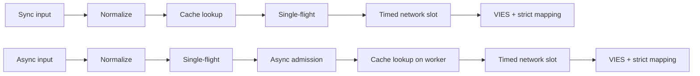
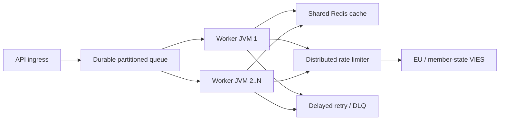

# Nederlands (nl) — TECHNICAL

> [Alle talen](../../LANGUAGES.md) · Informatieve vertaling. Bij verschillen is de canonieke Engelse technische of juridische bron leidend. Alleen `LICENSE` en `NOTICE` in de hoofdmap zijn juridisch gezaghebbend; deze vertaling vervangt ze niet.

## Doel en reikwijdte

`vies-client`is een Java 21-clientbibliotheek zonder runtime-afhankelijkheden van EU VIES
voor uw REST-service. Het kan een verwerkingscomponent van een groot systeem zijn; vervangt niet
permanente berichtenwachtrij, gedistribueerde snelheidsbegrenzer of gedeelde cache.

`vies-client`is een Java 21-client zonder runtime-afhankelijkheid voor de EU VIES REST
dienst. Het kan een verwerkingscomponent in een groot systeem zijn; het vervangt niet a
duurzame wachtrij, gedistribueerde snelheidsbegrenzer of gedeelde cache.

## Module en pakketten / Module en pakketten

```text
module vies.client
├── exports vies.client
│   ├── ViesClient          public synchronous/asynchronous facade
│   ├── ViesResponse        sealed result hierarchy
│   ├── ViesError           stable bilingual error catalog
│   ├── VatFormat           offline normalization/format validation
│   ├── ViesRequester       requester VAT value object
│   ├── ViesAvailability    service/member-state health snapshot
│   ├── ViesCache           external cache extension point
│   └── ViesException       availability diagnostic exception
└── vies.client.internal
    ├── MiniJson            bounded-purpose JSON parser
    └── TtlCache            default concurrent in-memory TTL cache
```

De binnenverpakking wordt niet geëxporteerd; alleen compatibiliteitsovereenkomst a
Geldt voor het openbare pakket`vies.client`.

Het interne pakket wordt niet geëxporteerd. Compatibiliteitsgaranties zijn alleen van toepassing op de
openbaar`vies.client`-pakket.

## Resultaatmodel

| Typ              | Betekenis                                                                           |  Opnieuw | Cache |
| ---------------- | ----------------------------------------------------------------------------------- | -------: | ----: |
| `Valid`          | VIES bevestigd als geldig / VIES bevestigd als geldig                               |      nee | ja/ja |
| `Invalid`        | VIES heeft het niet als geldig bevestigd / VIES heeft het niet als geldig bevestigd |      nee |   nee |
| `Unavailable`    | Geen geldigheidsbeslissing / Geen geldigheidsbeslissing                             | per code |   nee |
| `MalformedInput` | Ongeldige invoer                                                                    |      nee |   nee |

Kritieke invariant:`Unavailable`kan nooit worden geconverteerd naar`Invalid`.
Kritieke invariant:`Unavailable`mag nooit worden omgezet naar`Invalid`.

Beschikbaar voor alle technische/invoerproblemen:

```java
response.error().ifPresent(error -> {
    error.code();       // stable machine code
    error.messageHu();  // Hungarian user message
    error.messageEn();  // English user message
    error.retryable();  // external delayed-retry recommendation
});
```

## Levenscyclus aanvragen / Levenscyclus aanvragen



1.`VatFormat`verwijdert toegestane scheidingstekens, maakt hoofdletters en
controleert op landspecifiek formaat. 2. Het synchronisatiepad leest de cache op de thread van de beller; de asynchrone manier is alleen in een begrensde werker. 3. De cache slaat alleen resultaten`Valid`op. 4. De tabel`inFlight`voegt aanvragen met dezelfde belastingcode + query samen binnen een JVM. 5. Een unieke async leading request wordt alleen gestart met een gratis`asyncSlots`-vergunning; ook cachehit
gebruik deze locatie voor een korte periode. 6. De echte HTTP-aanroep wacht op een`requestSlots`-vergunning met een tijdslimiet. 7. Het antwoord is alleen expliciete Booleaanse validiteit en een interpreteerbaar audittijdstempel
kan resulteren in`Valid`of`Invalid`.

In het Engels: synchronisatie leest cache op de bellerthread; async brengt een enkele vlucht tot stand
en eerst begrensde toegang, en leest vervolgens de cache op zijn werker. Beide maken gebruik van een begrensd netwerk
toelating en strikte responsmapping.

## Multithreading / gelijktijdigheidsmodel

- De openbare clientinstantie is veilig en moet worden gedeeld.
- De openbare clientinstantie is thread-safe en moet worden gedeeld.
- Az alap async-uitvoerder virtuele thread-per-taak-uitvoerder.
- De standaard asynchrone uitvoerder maakt één virtuele thread per geaccepteerde taak.
- `maxPendingSyncRequests`beperkt onmiddellijk gelijktijdige synchronisatie-bellers.
- `maxPendingSyncRequests`begrenst onmiddellijk gelijktijdige synchrone bellers.
- `maxPendingAsyncRequests`telt unieke asynchrone leiders, ook in het geval van een cachehit.
- `maxPendingAsyncRequests`telt unieke asynchrone leiders, inclusief cachehits.
- Het annuleren van de toekomst van een beller annuleert niet de gezamenlijke enkele vluchtoperatie.
- Het annuleren van de toekomst van één beller kan de gedeelde enkele vluchtoperatie niet annuleren.
- `maxConcurrentRequests`beperkt actieve HTTP-verzoeken per exemplaar.
- `maxConcurrentRequests`beperkt actieve HTTP-oproepen per clientinstantie.
- `admissionTimeout`voorkomt oneindig wachten op de seinpaal.
- `admissionTimeout`voorkomt onbeperkt wachten op de semafoor.

Single-flight, semafoor en geheugencache worden **niet gedistribueerd**. Meerdere JVM's
gemeenschappelijke Redis, een globale limiter en een persistente wachtrij zijn vereist.

Single-flight, semaforen en de cache in het geheugen worden **niet gedistribueerd**.
Meerdere JVM's vereisen gedeelde Redis, een globale limiter en een duurzame wachtrij.

## Regel voor opnieuw proberen/beleid voor opnieuw proberen

De client staat 0-5 lokale nieuwe pogingen toe. De vertraging is exponentieel en omvat jitter:

```text
delay ~= retryDelay × 2^(attempt-1) + random(0 .. delay/2)
```

De client staat 0-5 lokale nieuwe pogingen toe met exponentiële uitstel en jitter.
Jitter voorkomt gesynchroniseerde stormen van nieuwe pogingen in werkthreads.

Lokale nieuwe pogingen worden alleen uitgevoerd bij een tijdelijke netwerk-/VIES-fout.`CLIENT_OVERLOADED`,
`CLIENT_CLOSED`, invoerfout en blokkering start niet lokaal opnieuw. Het is op grote schaal
primair mechanisme voor nieuwe pogingen persistente wachtrij + vertraging + maximale pogingen + DLQ.

Gebruik op grote schaal duurzame vertraagde nieuwe pogingen met een maximaal aantal pogingen en een dode letter
wachtrij. Lokale nieuwe pogingen zijn opzettelijk klein.

## Cache-semantiek / Cache-semantiek

- Basiscache: gelijktijdig geheugen TTL, 10.000 elementen, 24 uur.
- Standaardcache: gelijktijdige TTL in het geheugen, 10.000 vermeldingen, 24 uur.
- Alleen`Valid`is inbegrepen;`Invalid`en foutennr.
- Alleen`Valid`wordt in de cache opgeslagen;`Invalid`en fouten niet.
- De sleutel bevat tevens het belastingnummer en het belastingnummer van de aanvrager.
- De sleutel omvat zowel de doel-BTW als de BTW-aanvrager.
- De cachehit is gemarkeerd als`fromCache=true`.
- Cachehits zijn gemarkeerd met`fromCache=true`.
- `requestDate`/`consultationNumber`in de cache zijn de gegevens van het oorspronkelijke consult.
- In de cache opgeslagen`requestDate`/`consultationNumber`behoort tot de oorspronkelijke consultatie.

Leesfout in gedeelde cache`CACHE_ERROR`, niet-automatische VIES-fallback.
Dit is opzettelijk anti-stormloopgedrag. Cacheschrijffout na succesvol VIES-antwoord
het authentieke resultaat`Valid`wordt niet verwijderd.

Een leesfout in de gedeelde cache retourneert`CACHE_ERROR`in plaats van door te gaan naar a
VIES stormloop. Een schrijffout in de cache na een bevestigd antwoord wist het bestand niet
gezaghebbend`Valid`-resultaat.

## Antwoordvalidatie / Antwoordvalidatie

Externe JSON is geen betrouwbare data.`Valid`/`Invalid`kan alleen worden aangemaakt als:

- het root-JSON-object;
- `isValid`of`valid`echte booleaanse waarde;
- `requestDate`ISO-8601`Instant`of offset datum/tijd;
- geen dwingend besluit`userError`.

Externe JSON wordt niet vertrouwd. Een ontbrekende/verkeerde Booleaanse waarde of een ontbrekende/ongeldige tijdstempel
retourneert`MALFORMED_RESPONSE`, nooit een verzonnen`Invalid`of lokale tijdstempel.

## Stoppen / afsluiten

`close()`is idempotent, accepteert niet langer nieuwe verzoeken, onderbreekt interne asynchrone bewerkingen,
het wacht niet op zichzelf vanaf de callback en sluit de HTTP-client. Eigen, van buitenaf overgedragen
sluit de executeur niet; de beller is verantwoordelijk voor de levenscyclus ervan.

`close()`is idempotent, wijst nieuw werk af, annuleert interne asynchrone bewerkingen zonder
wacht op zichzelf en sluit de HTTP-client. Een door de beller verstrekte uitvoerder is niet gesloten.

Het beperkte aantal interne leiderfutures op afzonderlijke virtuele terminalthreads stoppen
close, zodat terugbellen van gebruikers de levenscyclusvergrendeling niet kan vasthouden, en nog veel meer
een open bewerking neemt ook niet per bewerking een native platformthread in beslag. Na`close()`
gelanceerd nieuwe synchronisatie of asynchrone oproep gooit synchrone`IllegalStateException`.

Shutdown terminaliseert de begrensde interne leiderstoekomst op afzonderlijke virtuele threads,
dus callbacks van gebruikers kunnen de levenscyclusvergrendeling niet behouden, en veel open bewerkingen kunnen dat ook niet
wijs elk één native platformthread toe. Nieuwe gesynchroniseerde of asynchrone oproepen gemaakt na`close()`
gooi`IllegalStateException`synchroon.

## Grootschalige topologie / Grootschalige topologie



De stroomopwaartse capaciteit is de harde limiet. Meer werknemers geven u geen recht op meer VIES-verkeer;
de lokale`32`-concurrency-waarde is geen EU-aanbeveling. De globale limiet was 429 en
Stemt af op basis van`MAX_CONCURRENT`-fouten, p95/p99-latentie en draaggolfgedrag.

De stroomopwaartse capaciteit is de harde grens. Meer werknemers betekent niet dat er meer is toegestaan
VIES-verkeer. Stem de globale snelheid af op basis van waargenomen beperking en latentie.

## Waarneembaarheid / Waarneembaarheid

Meet in een live omgeving minimaal deze / Meet minimaal:

- aantal reacties per resultaattype en`errorCode`;
- p50/p95/p99 totale en upstream latentie;
- cachehitratio en`CACHE_ERROR`-telling;
- lokale actieve/in behandeling zijnde telling en`CLIENT_OVERLOADED`-telling;
- nieuwe pogingen en uiteindelijke resultaten;
- duurzame wachtrijdiepte, leeftijd, vertraagde nieuwe poging en DLQ-telling;
- VIES-beschikbaarheid/foutpercentage per land;
- JVM-heap, GC-pauzes, aantal virtuele threads, CPU, sockets.

## Uitvoeringsgegevens / Uitvoeringsnoten

Lokale getallen gemeten in de repository op een ontwikkelmachine met een loopback-nepserver
worden voorbereid; geen SLA en geen VIES-doorvoerbelofte. De werkelijke prestaties van het netwerk,
Het wordt bepaald door TLS, Redis, Global Limiter en de backend van de lidstaat.

Repository-lokale benchmarks gebruiken een loopback-nepserver op een ontwikkelaarsmachine.
Ze zijn geen SLA of VIES-doorvoerbelofte.

Verificatiemeting 17-07-2026, JDK 21, mediaan van drie runs / Verificatierun,
JDK 21, mediaan van drie runs:

| Lokale bediening / Lokale bediening                                     |                          Mediaan / Mediaan |
| ----------------------------------------------------------------------- | -----------------------------------------: |
| Cachehit met volledig pad`check()`                                      |                   8,91 miljoen operaties/s |
| Lokale afwijzing van slecht formaat                                     |                   9,02 miljoen operaties/s |
| Sequentiële loopback-HTTP                                               |                          4.044 verzoeken/s |
| 5.000 verschillende asynchrone loopback-verzoeken, gelijktijdigheid 256 |                         21.640 verzoeken/s |
| Voltooi 10.000 bellers met dezelfde sleutel                             | 1,40 miljoen bellers/s, **1 HTTP-verzoek** |

Dit is een micrometing, geen JMH en geen productiebelastingstest. De enkele-vluchtlijn toont de
belangrijkste schaalfunctie: het aantal bellers verandert niet met dezelfde toets
in hetzelfde aantal upstream-verzoeken.

Dit is een micrometing, geen JMH of een productiebelastingstest. De enkele vlucht
row demonstreert de sleutelschaaleigenschap: bellers met dezelfde sleutel worden niet de
hetzelfde aantal upstream-aanvragen.

## Beveiliging / Beveiliging

- Gebruik alleen HTTPS officiële basis-URL live.
- Gebruik de officiële HTTPS-basis-URL in productie.
- Log niet onnodig uw volledige belastingnummer, naam of adres in.
- Vermijd onnodige registratie van BTW-nummers, namen en adressen.
- De`baseUrl`-override is bedoeld voor test-/mockdoeleinden; geen gebruikersinvoer.
- `baseUrl`-override is voor gecontroleerde test-/mockconfiguratie, niet voor gebruikersinvoer.
- Registreer de foutcode van de machine, ga naar gebruiker`messageHu`/`messageEn`.
- Log stabiele foutcodes; gelokaliseerde berichten terugsturen naar gebruikers.
