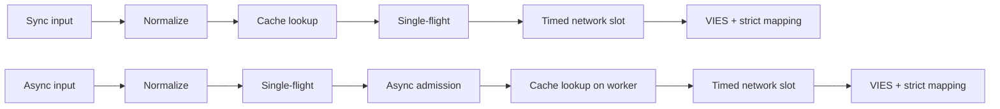
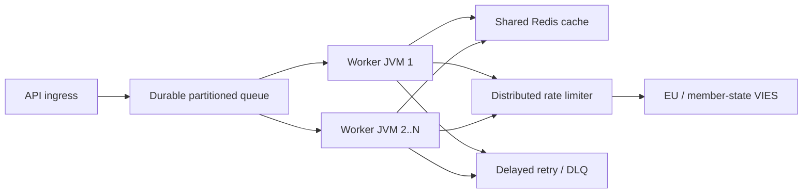

# Português (pt) — TECHNICAL

> [Todos os idiomas](../../LANGUAGES.md) · Tradução informativa. Em caso de divergência, prevalece a fonte técnica ou jurídica canónica em inglês. Apenas `LICENSE` e `NOTICE` na raiz têm valor jurídico; esta tradução não os substitui.

## Objetivo e escopo

`vies-client`é uma biblioteca cliente Java 21 com zero dependências de tempo de execução do EU VIES
para seu serviço REST. Pode ser um componente de processamento de um grande sistema; não substitui
fila de mensagens persistentes, limitador de taxa distribuída ou cache compartilhado.

`vies-client`é um cliente Java 21 com dependência de tempo de execução zero para EU VIES REST
serviço. Pode ser um componente de processamento em um sistema grande; não substitui um
fila durável, limitador de taxa distribuída ou cache compartilhado.

## Módulo e pacotes / Módulo e pacotes

```text
module vies.client
├── exports vies.client
│   ├── ViesClient          public synchronous/asynchronous facade
│   ├── ViesResponse        sealed result hierarchy
│   ├── ViesError           stable bilingual error catalog
│   ├── VatFormat           offline normalization/format validation
│   ├── ViesRequester       requester VAT value object
│   ├── ViesAvailability    service/member-state health snapshot
│   ├── ViesCache           external cache extension point
│   └── ViesException       availability diagnostic exception
└── vies.client.internal
    ├── MiniJson            bounded-purpose JSON parser
    └── TtlCache            default concurrent in-memory TTL cache
```

A embalagem interna não é exportada; acordo de compatibilidade apenas um
Aplica-se ao pacote público`vies.client`.

O pacote interno não é exportado. As garantias de compatibilidade aplicam-se apenas ao
pacote`vies.client` público.

## Modelo de resultado

| Tipo             | Significado                                                     | Tente novamente |   Cache |
| ---------------- | --------------------------------------------------------------- | --------------: | ------: |
| `Valid`          | VIES confirmado como válido / VIES confirmado como válido       |             não | sim/sim |
| `Invalid`        | VIES não confirmou como válido / VIES não confirmou como válido |             não |     não |
| `Unavailable`    | Nenhuma decisão de validade / Nenhuma decisão de validade       |      por código |     não |
| `MalformedInput` | Entrada inválida                                                |             não |     não |

Invariante crítico:`Unavailable`nunca pode ser convertido em`Invalid`.
Invariante crítico:`Unavailable`nunca deve ser convertido em`Invalid`.

Disponível para todos os problemas técnicos/de entrada:

```java
response.error().ifPresent(error -> {
    error.code();       // stable machine code
    error.messageHu();  // Hungarian user message
    error.messageEn();  // English user message
    error.retryable();  // external delayed-retry recommendation
});
```

## Ciclo de vida da solicitação / Ciclo de vida da solicitação



1.`VatFormat`remove separadores permitidos, coloca letras maiúsculas e
verifica o formato específico do país. 2. O caminho de sincronização lê o cache no thread do chamador; a forma assíncrona é apenas no trabalhador limitado. 3. O cache armazena apenas os resultados`Valid`. 4. A tabela`inFlight`mescla solicitações com o mesmo código tributário + consulta dentro de uma JVM. 5. Uma solicitação principal assíncrona exclusiva só é iniciada com uma licença`asyncSlots`gratuita; também acerto no cache
use este local por um curto período de tempo. 6. A chamada HTTP real aguarda uma permissão`requestSlots`com limite de tempo. 7. A resposta é apenas validade booleana explícita e carimbo de data/hora de auditoria interpretável
pode resultar em`Valid`ou`Invalid`.

Em inglês: sync lê cache no thread do chamador; async estabelece voo único
e o acesso local primeiro e depois lê o cache em seu trabalhador. Ambos usam rede limitada
admissão e mapeamento estrito de resposta.

## Modelo multithreading/simultaneidade

- A instância pública do cliente é segura e deve ser compartilhada.
- A instância pública do cliente é segura para threads e deve ser compartilhada.
- Executor assíncrono Az alap executor de thread virtual por tarefa.
- O executor assíncrono padrão cria um thread virtual por tarefa aceita.
- `maxPendingSyncRequests`limita imediatamente os chamadores sincronizados simultâneos.
- `maxPendingSyncRequests`limita imediatamente chamadores síncronos simultâneos.
- `maxPendingAsyncRequests`conta líderes assíncronos únicos, também em caso de acerto no cache.
- `maxPendingAsyncRequests`conta líderes assíncronos exclusivos, incluindo ocorrências de cache.
- O cancelamento do futuro de um chamador não cancela a operação conjunta de voo único.
- O cancelamento do futuro de um chamador não pode cancelar a operação compartilhada de voo único.
- `maxConcurrentRequests`limita solicitações HTTP ativas por instância.
- `maxConcurrentRequests`limita chamadas HTTP ativas por instância do cliente.
- `admissionTimeout`evita espera infinita de semáforos.
- `admissionTimeout`evita espera ilimitada de semáforo.

Single-flight, semáforo e cache de memória **não são distribuídos**. Múltiplas JVMs
Redis comum, um limitador global e uma fila persistente são necessários.

Voo único, semáforos e cache na memória **não são distribuídos**.
Múltiplas JVMs requerem Redis compartilhado, um limitador global e uma fila durável.

## Regra de nova tentativa/Política de nova tentativa

O cliente permite de 0 a 5 tentativas locais. O atraso é exponencial e inclui jitter:

```text
delay ~= retryDelay × 2^(attempt-1) + random(0 .. delay/2)
```

O cliente permite de 0 a 5 novas tentativas locais com espera e jitter exponenciais.
O jitter evita tempestades de novas tentativas sincronizadas em threads de trabalho.

A nova tentativa local é executada apenas para um erro temporário de rede/VIES.`CLIENT_OVERLOADED`,
`CLIENT_CLOSED`, erro de entrada e bloqueio não reinicia localmente. Está em grande escala
mecanismo primário de nova tentativa fila persistente + atraso + máximo de tentativas + DLQ.

Em escala, use tentativas atrasadas duráveis ​​com contagem máxima de tentativas e mensagens mortas
fila. As novas tentativas locais são intencionalmente pequenas.

## Semântica de cache / Semântica de cache

- Cache básico: memória simultânea TTL, 10.000 elementos, 24 horas.
- Cache padrão: TTL simultâneo na memória, 10.000 entradas, 24 horas.
- Apenas`Valid`está incluído;`Invalid`e erros não.
- Somente`Valid`é armazenado em cache;`Invalid`e falhas não são.
- A chave contém também o número fiscal e o número fiscal do requerente.
- A chave inclui o IVA alvo e o IVA do solicitante.
- O acerto do cache está marcado como`fromCache=true`.
- Os acessos ao cache são marcados com`fromCache=true`.
- `requestDate`/`consultationNumber`no cache são os dados da consulta original.
- `requestDate`/`consultationNumber`armazenado em cache pertence à consulta original.

Erro de leitura de cache compartilhado`CACHE_ERROR`, fallback VIES não automático.
Este é um comportamento intencional anti-debandada. Falha na gravação do cache após resposta VIES bem-sucedida
isso não exclui o resultado autêntico`Valid`.

Uma falha de leitura de cache compartilhado retorna`CACHE_ERROR`em vez de passar para um
Debandada do VIES. Uma falha na gravação do cache após uma resposta confirmada não apaga o
resultado`Valid`oficial.

## Validação de resposta / Validação de resposta

JSON externo não é um dado confiável.`Valid`/`Invalid`só poderá ser criado se:

- o objeto JSON raiz;
- `isValid`ou`valid`verdadeiro booleano;
- `requestDate`ISO-8601`Instant`ou deslocamento de data e hora;
- nenhuma decisão prevalecente`userError`.

JSON externo não é confiável. Um booleano ausente/errado ou carimbo de data/hora ausente/inválido
retorna`MALFORMED_RESPONSE`, nunca um`Invalid`fabricado ou carimbo de data/hora local.

## Parar/Desligar

`close()`é idempotente, não aceita mais novas solicitações, interrompe operações assíncronas internas,
ele não espera pelo retorno de chamada e fecha o cliente HTTP. Próprio, entregue de fora
não fecha o executor; o chamador é responsável por seu ciclo de vida.

`close()`é idempotente, rejeita novo trabalho, cancela operações assíncronas internas sem
espera automaticamente e fecha o cliente HTTP. Um executor fornecido pelo chamador não está fechado.

Parando o número limitado de futuros líderes internos em threads de terminais virtuais separados
fechar, então o retorno de chamada do usuário não pode manter o bloqueio do ciclo de vida e muitos
uma operação aberta também não ocupa um thread de plataforma nativa por operação. Depois de`close()`
lançou uma nova sincronização ou chamada assíncrona lança`IllegalStateException`síncrono.

O desligamento terminaliza os futuros líderes internos limitados em threads virtuais separados,
portanto, os retornos de chamada do usuário não podem reter o bloqueio do ciclo de vida e muitas operações abertas não podem
alocar um thread de plataforma nativa para cada um. Novas chamadas sincronizadas ou assíncronas feitas após`close()`
lançar`IllegalStateException`de forma síncrona.

## Topologia em grande escala / Topologia em grande escala



A capacidade upstream é o limite rígido. Mais trabalhadores não lhe dão direito a mais tráfego VIES;
o valor de simultaneidade local`32`não é uma recomendação da UE. O limite global mediu 429 e
Ajustes baseados em erros`MAX_CONCURRENT`, latência p95/p99 e comportamento da operadora.

A capacidade upstream é o limite rígido. Mais trabalhadores não significam mais permissão
Tráfego VIES. Ajuste a taxa global a partir da limitação e da latência observadas.

## Observabilidade / Observabilidade

Em um ambiente ativo, meça pelo menos estes / Meça no mínimo:

- contagem de respostas por tipo de resultado e`errorCode`;
- latência total e upstream p50/p95/p99;
- taxa de acertos do cache e contagem de`CACHE_ERROR`;
- contagem local de ativos/pendentes e contagem`CLIENT_OVERLOADED`;
- novas tentativas e resultados finais;
- profundidade de fila durável, idade, novas tentativas atrasadas e contagem de DLQ;
- disponibilidade/taxa de erro do VIES por país;
- Heap JVM, pausas de GC, contagem de threads virtuais, CPU, soquetes.

## Dados de desempenho/Notas de desempenho

Números locais medidos no repositório em uma máquina de desenvolvimento com um servidor simulado de loopback
estão sendo preparados; sem SLA e sem promessa de taxa de transferência VIES. O desempenho real da rede,
É determinado por TLS, Redis, limitador global e back-end do estado membro.

Os benchmarks de repositório local usam um servidor simulado de loopback em uma máquina de desenvolvedor.
Eles não são um SLA ou uma promessa de rendimento do VIES.

Medição de verificação de 17/07/2026, JDK 21, mediana de três execuções/Execução de verificação,
JDK 21, mediana de três execuções:

| Operação local / Operação local                                           |                                  Mediana / Mediana |
| ------------------------------------------------------------------------- | -------------------------------------------------: |
| Cache atingido com caminho completo`check()`                              |                        8,91 milhões de operações/s |
| Rejeição local de formato incorreto                                       |                        9,02 milhões de operações/s |
| Loopback sequencial HTTP                                                  |                               4.044 solicitações/s |
| 5.000 solicitações de loopback assíncronas diferentes, simultaneidade 256 |                              21.640 solicitações/s |
| Complete 10.000 chamadas com a mesma chave                                | 1,40 milhões de chamadas/s, **1 solicitação HTTP** |

Esta é uma micromedição, não um JMH e não um teste de carga de produção. A linha de vôo único mostra o
recurso de escala mais importante: o número de chamadores não muda com a mesma tecla
no mesmo número de solicitações upstream.

Esta é uma micromedição, não JMH ou um teste de carga de produção. O voo único
linha demonstra a propriedade de escala de chave: os chamadores da mesma chave não se tornam os
mesmo número de solicitações upstream.

## Segurança / Segurança

- Use apenas URL base oficial HTTPS ativo.
- Use o URL base HTTPS oficial em produção.
- Não insira seu número fiscal completo, nome ou endereço desnecessariamente.
- Evite o registo desnecessário de números de IVA, nomes e endereços.
- A substituição de`baseUrl`é para fins de teste/simulação; nenhuma entrada do usuário.
- A substituição de`baseUrl`é para configuração de teste/simulação controlada, não para entrada do usuário.
- Registre o código de erro da máquina, acesse o usuário`messageHu`/`messageEn`.
- Registrar códigos de erro estáveis; retornar mensagens localizadas aos usuários.
