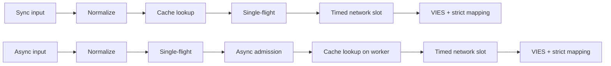
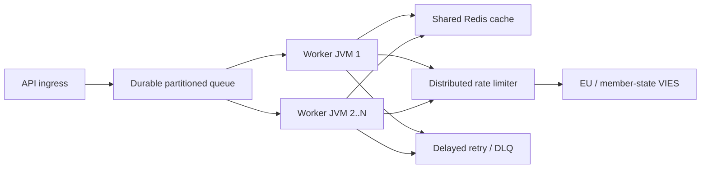

# Română (ro) — Documentație tehnică

> [Toate limbile](../../LANGUAGES.md) · Traducere informativă. În caz de diferență prevalează sursa canonică tehnică sau juridică în limba engleză. Numai `LICENSE` și `NOTICE` din rădăcină sunt texte juridice oficiale; traducerea nu le înlocuiește.

## Scopul și domeniul de aplicare

`vies-client` este o bibliotecă client Java 21 cu zero dependențe de rulare de la EU VIES
pentru serviciul dvs. REST. Poate fi o componentă de procesare a unui sistem mare; nu înlocuiește
coadă de mesaje persistentă, limitator de rată distribuită sau cache partajată.

`vies-client` este un client Java 21 cu dependență zero de rulare pentru EU VIES REST
serviciu. Poate fi o componentă de procesare într-un sistem mare; nu înlocuiește a
coadă durabilă, limitator de rată distribuită sau cache partajată.

## Modul și pachete

```text
module vies.client
├── exports vies.client
│   ├── ViesClient          public synchronous/asynchronous facade
│   ├── ViesResponse        sealed result hierarchy
│   ├── ViesError           stable bilingual error catalog
│   ├── VatFormat           offline normalization/format validation
│   ├── ViesRequester       requester VAT value object
│   ├── ViesAvailability    service/member-state health snapshot
│   ├── ViesCache           external cache extension point
│   └── ViesException       availability diagnostic exception
└── vies.client.internal
    ├── MiniJson            bounded-purpose JSON parser
    └── TtlCache            default concurrent in-memory TTL cache
```

Pachetul interior nu este exportat; acord de compatibilitate doar a
Se aplică pachetului public `vies.client`.

Pachetul intern nu este exportat. Garanțiile de compatibilitate se aplică numai pentru
pachet public `vies.client`.

## Model de rezultat

| Tip              | Înțeles                                                     | Reîncercați | Cache |
| ---------------- | ----------------------------------------------------------- | ----------: | ----: |
| `Valid`          | VIES confirmat ca valabil / VIES confirmat valid            |          nu | da/da |
| `Invalid`        | VIES nu a confirmat ca valid / VIES nu a confirmat valid    |          nu |    nu |
| `Unavailable`    | Fără decizie de valabilitate / Fără decizie de valabilitate |    prin cod |    nu |
| `MalformedInput` | Intrare nevalidă                                            |          nu |    nu |

Invariant critic:`Unavailable` nu poate fi niciodată convertit în`Invalid`.
Invariant critic:`Unavailable` nu trebuie niciodată convertit în`Invalid`.

Disponibil pentru toate problemele tehnice/de intrare:

```java
response.error().ifPresent(error -> {
    error.code();       // stable machine code
    error.messageHu();  // Hungarian user message
    error.messageEn();  // English user message
    error.retryable();  // external delayed-retry recommendation
});
```

## Ciclul de viață al solicitării



1.`VatFormat` elimină separatoarele permise, scrie cu majuscule și
verifică formatul specific țării. 2. Calea de sincronizare citește memoria cache pe firul apelantului; calea asincronă este numai în lucrător delimitat. 3. Cache-ul stochează doar rezultatele `Valid`. 4. Tabelul `inFlight`îmbină cererile cu același cod fiscal + interogare în cadrul unui JVM. 5. O solicitare unică de conducere asincronă este începută numai cu un permis `asyncSlots`gratuit; de asemenea, cache hit
utilizați această locație pentru o perioadă scurtă de timp. 6. Apelul HTTP real așteaptă un permis `requestSlots` cu o limită de timp. 7. Răspunsul este doar validitate booleană explicită și marcaj de timp al auditului interpretabil
poate avea ca rezultat `Valid` sau `Invalid`.

În engleză: sync citește memoria cache pe firul apelantului; async stabilește un singur zbor
și admiterea delimitată mai întâi, apoi citește memoria cache pe lucrătorul său. Ambele folosesc o rețea delimitată
admitere și cartografiere strictă a răspunsului.

## Model multithreading

- Instanța publică a clientului este sigură și trebuie partajată.
- Instanța publică a clientului este sigură pentru fire și ar trebui partajată.
- Az alap executor asincron executor virtual-thread-per-task.
- Executorul asincron implicit creează un fir virtual pentru fiecare sarcină acceptată.
- `maxPendingSyncRequests` limitează imediat apelanții de sincronizare simultană.
- `maxPendingSyncRequests` limitează imediat apelanții concurenți sincron.
- `maxPendingAsyncRequests` numără lideri asincron unici, și în cazul unei lovituri în cache.
- `maxPendingAsyncRequests` numără lideri asincroni unici, inclusiv accesări în cache.
- Anularea viitorului unui apelant nu anulează operațiunea comună cu un singur zbor.
- Anularea viitorului unui apelant nu poate anula operațiunea de zbor unic partajat.
- `maxConcurrentRequests` limitează solicitările HTTP active per instanță.
- `maxConcurrentRequests` limitează apelurile HTTP active pentru fiecare instanță client.
- `admissionTimeout` previne așteptarea infinită a semaforului.
- `admissionTimeout` previne așteptarea nelimitată a semaforului.

Single-flight, semafor și memorie cache sunt **nu sunt distribuite**. Mai multe JVM-uri
Redis comun, un limitator global și o coadă persistentă sunt necesare.

Un singur zbor, semaforele și memoria cache în memorie sunt **nu sunt distribuite**.
Mai multe JVM necesită Redis partajat, un limitator global și o coadă durabilă.

## Regulă Reîncercați

Clientul permite 0-5 reîncercări locale. Întârzierea este exponențială și include fluctuații:

```text
delay ~= retryDelay × 2^(attempt-1) + random(0 .. delay/2)
```

Clientul permite 0–5 reîncercări locale cu backoff exponențial și jitter.
Jitter previne furtunile de reîncercări sincronizate între firele de lucru.

Reîncercarea locală este efectuată numai pentru o eroare temporară de rețea/VIES.`CLIENT_OVERLOADED`,
`CLIENT_CLOSED`, eroare de intrare și blocare nu repornește local. Este la scară mare
mecanism primar de reîncercare coadă persistentă + întârziere + încercări maxime + DLQ.

La scară, utilizați reîncercări durabile întârziate cu un număr maxim de încercări și scrisori moarte
coadă. Reîncercările locale sunt în mod intenționat mici.

## Semantică cache

- Cache de bază: memorie simultană TTL, 10.000 de elemente, 24 de ore.
- Cache implicit: TTL simultan în memorie, 10.000 de intrări, 24 de ore.
- Este inclus doar `Valid`;`Invalid`și erorile nr.
- Doar `Valid` este stocat în cache;`Invalid` și eșecurile nu sunt.
- Cheia conține, de asemenea, numărul fiscal și numărul fiscal al solicitantului.
- Cheia include atât TVA-ul țintă, cât și TVA-ul solicitantului.
- Accesul în cache este marcat cu `fromCache=true`.
- Accesările din cache sunt marcate cu `fromCache=true`.
- `requestDate`/`consultationNumber`în cache sunt datele consultării originale.
- `requestDate`/`consultationNumber`în cache aparține consultației originale.

Eroare de citire a memoriei cache partajată `CACHE_ERROR`, alternativă VIES neautomată.
Acesta este un comportament intenționat anti-brudare. Eșec de scriere în cache după răspunsul VIES cu succes
nu șterge rezultatul autentic `Valid`.

O eroare de citire a cache-ului partajat returnează `CACHE_ERROR` în loc să cadă la a
Amploada VIES. Un eșec de scriere în cache după un răspuns confirmat nu șterge fișierul
rezultat autorizat `Valid`.

## Validare răspuns/Validare răspuns

JSON extern nu este date de încredere.`Valid`/`Invalid` poate fi creat numai dacă:

- obiectul JSON rădăcină;
- `isValid` sau`valid` boolean adevărat;
- `requestDate` ISO-8601`Instant` sau offset datetime;
- nicio decizie prevalentă `userError`.

JSON extern nu este de încredere. O marcaj de timp boolean lipsă/greșit sau lipsă/invalid
returnează `MALFORMED_RESPONSE`, niciodată un `Invalid`fabricat sau un marcaj de timp local.

## Oprire/Oprire

`close()` este idempotent, nu mai acceptă cereri noi, întrerupe operațiunile asincrone interne,
nu se așteaptă de la apel invers și închide clientul HTTP. Propriu, predat din exterior
nu închide executorul; apelantul este responsabil pentru ciclul său de viață.

`close()` este idempotent, respinge lucrări noi, anulează operațiunile asincrone interne fără
auto-așteptare și închide clientul HTTP. Un executor furnizat de apelant nu este închis.

Oprirea numărului limitat de futures lider intern pe fire de terminale virtuale separate
închideți, astfel încât apel invers utilizatorului nu poate menține blocarea ciclului de viață și multe
o operațiune deschisă, de asemenea, nu ocupă un fir nativ de platformă per operație. După `close()`
a lansat un nou apel sincronizat sau asincron aruncă `IllegalStateException` sincron.

Închiderea finalizează viitorul liderului intern delimitat pe fire virtuale separate,
astfel încât apelurile inverse ale utilizatorilor nu pot păstra blocarea ciclului de viață și multe operațiuni deschise nu pot
alocați câte un fir de execuție nativ de platformă. Apeluri noi sincronizate sau asincrone efectuate după `close()`
arunca `IllegalStateException` sincron.

## Topologie la scară mare



Capacitatea în amonte este limita grea. Mai mulți lucrători nu vă dau dreptul la mai mult trafic VIES;
valoarea concurenței locale `32` nu este o recomandare UE. Limita globală a măsurat 429 și
Melodii bazate pe erori `MAX_CONCURRENT`, latență p95/p99 și comportamentul operatorului.

Capacitatea în amonte este granița dură. Mai mulți lucrători nu înseamnă mai mult permis
Trafic VIES. Reglați rata globală de la limitarea și latența observate.

## Observabilitate

Într-un mediu viu, măsurați cel puțin acestea / Măsurați cel puțin:

- numărul de răspunsuri după tipul de rezultat și `errorCode`;
- latența totală și în amonte p50/p95/p99;
- rata de accesare în cache și numărul `CACHE_ERROR`;
- număr activ/în așteptare local și număr `CLIENT_OVERLOADED`;
- încercări de reîncercare și rezultate finale;
- adâncime durabilă a cozii, vârsta, reîncercarea întârziată și numărul DLQ;
- rata de disponibilitate/eroare VIES pe țară;
- Heap JVM, pauze GC, număr de fire virtuale, CPU, socket-uri.

## Date de performanță

Numerele locale măsurate în depozitul de pe o mașină de dezvoltare cu un server simulat de loopback
sunt în curs de pregătire; fără SLA și nicio promisiune de debit VIES. Performanța reală a rețelei,
Este determinat de TLS, Redis, limitatorul global și backend-ul statului membru.

Benchmark-urile locale ale depozitului folosesc un server simulat de loopback pe o mașină de dezvoltator.
Nu sunt un SLA sau o promisiune VIES-throughput.

Măsurătoare de verificare din 2026-07-17, JDK 21, mediană a trei rulări / cursă de verificare,
JDK 21, mediana a trei runde:

| Operare locală / Operare locală                               |                                Median / Median |
| ------------------------------------------------------------- | ---------------------------------------------: |
| Lovitură în cache cu calea completă `check()`                 |                            8,91 M operațiuni/s |
| Respingerea locală a formatului prost                         |                            9,02 M operațiuni/s |
| HTTP loopback secvenţial                                      |                                 4.044 cereri/e |
| 5.000 de cereri diferite de loopback asincron, concurență 256 |                                21.640 cereri/e |
| Completați 10.000 de apelanți cu aceeași cheie                | 1,40 milioane de apelanți/e, **1 cerere HTTP** |

Aceasta este o micromăsurare, nu un JMH și nu un test de sarcină de producție. Linia cu un singur zbor arată
cea mai importantă caracteristică de scalare: numărul apelanților nu se modifică cu aceeași tastă
în același număr de cereri din amonte.

Aceasta este o micromăsurare, nu JMH sau un test de sarcină de producție. Zborul unic
rândul demonstrează proprietatea de scalare a tastei: apelanții cu aceeași cheie nu devin
același număr de cereri în amonte.

## Securitate/Securitate

- Folosiți numai URL-ul de bază oficial HTTPS live.
- Utilizați URL-ul de bază oficial HTTPS în producție.
- Nu vă conectați în mod inutil numărul dvs. fiscal complet, numele sau adresa.
- Evitați înregistrarea inutilă a numerelor de TVA, a numelor și a adreselor.
- Anularea `baseUrl` este în scopuri de testare/simulare; nicio intrare de utilizator.
- Anularea `baseUrl` este pentru configurație controlată de testare/modificare, nu pentru intrarea utilizatorului.
- Înregistrați codul de eroare al mașinii, accesați utilizatorul `messageHu`/`messageEn`.
- Înregistrați coduri de eroare stabile; returnează utilizatorilor mesaje localizate.
