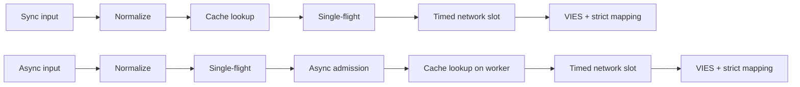
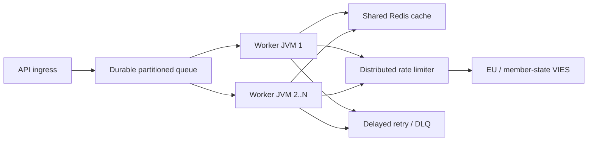

# Svenska (sv) — TECHNICAL

> [Alla språk](../../LANGUAGES.md) · Informativ översättning. Vid avvikelser gäller den kanoniska engelska tekniska eller juridiska källan. Endast `LICENSE` och `NOTICE` i roten är juridiskt auktoritativa; översättningen ersätter dem inte.

## Syfte och omfattning

`vies-client`är ett Java 21-klientbibliotek med noll körtidsberoenden från EU VIES
för din REST-tjänst. Det kan vara en bearbetningskomponent i ett stort system; ersätter inte
beständig meddelandekö, distribuerad hastighetsbegränsare eller delad cache.

`vies-client`är en Java 21-klient med noll körtidsberoende för EU VIES REST
service. Det kan vara en bearbetningskomponent i ett stort system; den ersätter inte en
hållbar kö, distribuerad hastighetsbegränsare eller delad cache.

## Modul och paket / Module och paket

```text
module vies.client
├── exports vies.client
│   ├── ViesClient          public synchronous/asynchronous facade
│   ├── ViesResponse        sealed result hierarchy
│   ├── ViesError           stable bilingual error catalog
│   ├── VatFormat           offline normalization/format validation
│   ├── ViesRequester       requester VAT value object
│   ├── ViesAvailability    service/member-state health snapshot
│   ├── ViesCache           external cache extension point
│   └── ViesException       availability diagnostic exception
└── vies.client.internal
    ├── MiniJson            bounded-purpose JSON parser
    └── TtlCache            default concurrent in-memory TTL cache
```

Innerpaketet exporteras inte; endast kompatibilitetsavtal a
Gäller offentligt paket`vies.client`.

Det interna paketet exporteras inte. Kompatibilitetsgarantier gäller endast för
offentligt`vies.client`-paket.

## Resultatmodell

| Skriv            | Betydelse                                                                           | Försök igen | Cache |
| ---------------- | ----------------------------------------------------------------------------------- | ----------: | ----: |
| `Valid`          | VIES bekräftat som giltigt / VIES bekräftat giltigt                                 |         nej | ja/ja |
| `Invalid`        | VIES bekräftade inte att det var giltigt / VIES bekräftade inte att det var giltigt |         nej |   nej |
| `Unavailable`    | Inget giltighetsbeslut / Inget giltighetsbeslut                                     |   efter kod |   nej |
| `MalformedInput` | Ogiltig inmatning                                                                   |         nej |   nej |

Kritisk invariant:`Unavailable`kan aldrig konverteras till`Invalid`.
Kritisk invariant:`Unavailable`får aldrig konverteras till`Invalid`.

Tillgängligt för alla tekniska/indataproblem:

```java
response.error().ifPresent(error -> {
    error.code();       // stable machine code
    error.messageHu();  // Hungarian user message
    error.messageEn();  // English user message
    error.retryable();  // external delayed-retry recommendation
});
```

## Begär livscykel / Begär livscykel



1.`VatFormat`tar bort tillåtna avgränsare, versaler och
kontrollerar för landsspecifikt format. 2. Synkroniseringsvägen läser cache på tråden för den som ringer; det asynkrona sättet är endast i bounded worker. 3. Cachen lagrar endast resultat`Valid`. 4. Tabellen`inFlight`slår samman förfrågningar med samma skattekod + fråga inom en JVM. 5. En unik asynkron ledande begäran startas endast med ett gratis`asyncSlots`-tillstånd; även cacheträff
använda denna plats under en kort tidsperiod. 6. Det riktiga HTTP-anropet väntar på ett`requestSlots`-tillstånd med en tidsgräns. 7. Svaret är endast explicit boolesk giltighet och tolkningsbar granskningstidsstämpel
kan resultera i`Valid`eller`Invalid`.

På engelska: sync läser cache på anropstråden; async etablerar enkelflyg
och begränsad tillträde först, läser sedan cache på sin arbetare. Båda använder begränsat nätverk
antagning och strikt responskartläggning.

## Multithreading / Concurrency-modell

– Den offentliga klientinstansen är säker och måste delas.
– Den offentliga klientinstansen är trådsäker och bör delas.

- Az alap async executor virtuell-tråd-per-uppgift executor.
- Standardasynkronexekveringsprogrammet skapar en virtuell tråd per accepterad uppgift.
- `maxPendingSyncRequests`begränsar omedelbart samtidiga synkroniseringsanropare.
- `maxPendingSyncRequests`begränsar omedelbart samtidiga synkrona uppringare.
- `maxPendingAsyncRequests`räknar unika asynkronledare, även vid en cacheträff.
- `maxPendingAsyncRequests`räknar unika asynkronledare, inklusive cacheträffar.
- Att avbryta en uppringares framtid avbryter inte den gemensamma enkelflygningen.
- Att avbryta en uppringares framtid kan inte avbryta den delade operationen för ett flyg.
- `maxConcurrentRequests`begränsar aktiva HTTP-förfrågningar per instans.
- `maxConcurrentRequests`begränsar aktiva HTTP-anrop per klientinstans.
- `admissionTimeout`förhindrar oändlig semafor väntan.
- `admissionTimeout`förhindrar obegränsad semaforväntning.

Enkelflyg, semafor och minnescache är **inte distribuerade**. Flera JVM
common Redis, en global limiter och en ihållande kö krävs.

Enkelflyg, semaforer och cachen i minnet är **inte distribuerade**.
Flera JVM:er kräver delade Redis, en global limiter och en hållbar kö.

## Försök regel / Försök igen policy

Klienten tillåter 0-5 lokala försök. Fördröjningen är exponentiell och inkluderar jitter:

```text
delay ~= retryDelay × 2^(attempt-1) + random(0 .. delay/2)
```

Klienten tillåter 0–5 lokala försök med exponentiell backoff och jitter.
Jitter förhindrar synkroniserade återförsök stormar över arbetartrådar.

Lokalt försök utförs endast för ett tillfälligt nätverk/VIES-fel.`CLIENT_OVERLOADED`,
`CLIENT_CLOSED`, inmatningsfel och blockering startar inte om lokalt. Det är i stor skala
primära försöksmekanismen ihållande kö + fördröjning + maximala försök + DLQ.

I stor skala, använd varaktiga fördröjda försök med maximalt antal försök och dödbokstav
kö. Lokala försök är avsiktligt små.

## Cache semantik / Cache semantik

- Grundläggande cache: samtidig minne TTL, 10 000 element, 24 timmar.
- Standardcache: samtidig TTL i minnet, 10 000 poster, 24 timmar.
- Endast`Valid`ingår;`Invalid`och fel nr.
- Endast`Valid`cachelagras;`Invalid`och fel är det inte.
  – Nyckeln innehåller även skattenummer och skattenummer för den som frågar.
  – Nyckeln inkluderar både målmoms och begärandemoms.
- Cacheträffen är märkt`fromCache=true`.
- Cacheträffar är markerade med`fromCache=true`.
- `requestDate`/`consultationNumber`i cachen är data från den ursprungliga konsultationen.
- Cachad`requestDate`/`consultationNumber`tillhör den ursprungliga konsultationen.

Läsfel för delat cache`CACHE_ERROR`, icke-automatisk VIES-återgång.
Detta är avsiktligt anti-stampede beteende. Cache-skrivfel efter lyckat VIES-svar
det tar inte bort det autentiska resultatet`Valid`.

Ett läsfel med delad cache returnerar`CACHE_ERROR`istället för att falla igenom till a
VIES stampede. Ett cache-skrivfel efter ett bekräftat svar raderar inte
auktoritativt`Valid`-resultat.

## Svarsvalidering / Svarsvalidering

Extern JSON är inte tillförlitlig data.`Valid`/`Invalid`kan bara skapas om:

- rot JSON-objektet;
- `isValid`eller`valid`true boolean;
- `requestDate`ISO-8601`Instant`eller offset datetime;
- inget övergripande beslut`userError`.

Extern JSON är otillförlitlig. En saknad/fel boolesk eller saknad/ogiltig tidsstämpel
returnerar`MALFORMED_RESPONSE`, aldrig en tillverkad`Invalid`eller lokal tidsstämpel.

## Stopp/avstängning

`close()`är idempotent, accepterar inte längre nya förfrågningar, avbryter interna asynkoperationer,
den väntar inte på sig själv från återuppringningen och stänger HTTP-klienten. Egen, överlämnad utifrån
stänger inte exekutor; den som ringer är ansvarig för dess livscykel.

`close()`är idempotent, avvisar nytt arbete, avbryter interna asynkoperationer utan
självväntande och stänger HTTP-klienten. En exekutor som tillhandahålls av anroparen är inte stängd.

Stoppar det begränsade antalet interna ledarterminer på separata virtuella terminaltrådar
stäng, så att användaråteruppringning inte kan hålla livscykellås, och många
en öppen operation upptar inte heller en inbyggd plattformstråd per operation. Efter`close()`
lanserade nya synkroniserings- eller async-anrop kastar synkrona`IllegalStateException`.

Shutdown terminaliserar de avgränsade interna ledarterminerna på separata virtuella trådar,
så att användaråteruppringningar inte kan behålla livscykellåset och många öppna operationer kan inte
tilldela en inbyggd plattformstråd vardera. Nya synkroniserings- eller asynkroniseringssamtal gjorda efter`close()`
kasta`IllegalStateException`synkront.

## Storskalig topologi / Storskalig topologi



Uppströms kapacitet är den hårda gränsen. Fler arbetare ger dig inte rätt till mer VIES-trafik;
det lokala`32`samtidighetsvärdet är inte en EU-rekommendation. Den globala gränsen mätte 429 och
Låtar baserade på`MAX_CONCURRENT`-fel, p95/p99-latens och bärarbeteende.

Uppströms kapacitet är den hårda gränsen. Fler arbetare innebär inte fler tillåtna
VIES trafik. Justera den globala hastigheten från observerad strypning och latens.

## Observerbarhet / Observerbarhet

I en levande miljö, mät åtminstone dessa / Mät minst:

- antal svar efter resultattyp och`errorCode`;
- p50/p95/p99 total och uppströms latens;
- cacheträffförhållande och`CACHE_ERROR`-antal;
- lokal aktiv/väntande räkning och`CLIENT_OVERLOADED`räkning;
- Försök igen och slutliga resultat;
- hållbart ködjup, ålder, fördröjt återförsök och DLQ-antal;
- VIES-tillgänglighet/felfrekvens per land;
- JVM-hög, GC-pauser, virtuellt trådantal, CPU, sockets.

## Prestandadata / Prestandanoteringar

Lokala nummer uppmätta i förvaret på en utvecklingsmaskin med en loopback-mock-server
håller på att förberedas; inget SLA och inget VIES genomströmningslöfte. Nätverkets verkliga prestanda,
Det bestäms av TLS, Redis, global limiter och medlemslandets backend.

Repository-lokala benchmarks använder en loopback mock-server på en utvecklarmaskin.
De är inte ett SLA eller ett VIES-genomströmningslöfte.

Verifieringsmätning 2026-07-17, JDK 21, median av tre körningar / Verifieringskörning,
JDK 21, median av tre körningar:

| Lokal drift / Lokal drift                                 |                           Median / Median |
| --------------------------------------------------------- | ----------------------------------------: |
| Cacheträff med full sökväg`check()`                       |                      8,91 M operationer/s |
| Lokalt avslag på dåligt format                            |                      9,02 M operationer/s |
| Sekventiell loopback HTTP                                 |                     4.044 förfrågningar/s |
| 5 000 olika async loopback-förfrågningar, samtidighet 256 |                    21 640 förfrågningar/s |
| Slutför 10 000 uppringare med samma nyckel                | 1,40 M uppringare/s, **1 HTTP-förfrågan** |

Detta är en mikromätning, inte ett JMH och inte ett produktionsbelastningstest. Enkelflygningslinjen visar
viktigaste skalningsfunktionen: antalet uppringare ändras inte med samma knapp
till samma antal uppströmsförfrågningar.

Detta är en mikromätning, inte JMH eller ett produktionsbelastningstest. Enkelflyget
rad visar nyckelskalningsegenskapen: uppringare med samma nyckel blir inte
samma antal uppströmsförfrågningar.

## Säkerhet / Säkerhet

- Använd endast HTTPS officiella bas-URL live.
- Använd den officiella HTTPS-basadressen i produktionen.
  – Logga inte in ditt fullständiga skattenummer, namn eller adress i onödan.
- Undvik onödig loggning av momsnummer, namn och adresser.
- Åsidosättningen av`baseUrl`är avsedd för test-/låtsasändamål; ingen användarinmatning.
- `baseUrl`åsidosättande är för kontrollerad test/mock-konfiguration, inte användarinmatning.
- Logga maskinens felkod, gå till användaren`messageHu`/`messageEn`.
- Logga stabila felkoder; returnera lokaliserade meddelanden till användarna.
